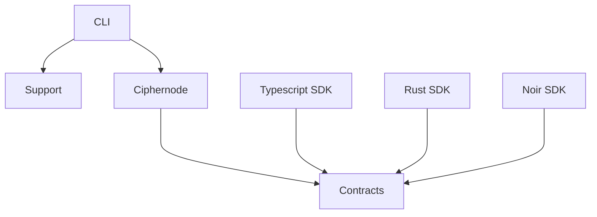

# Enclave Architecture Living Document

This is an Obsidian vault for the Enclave project architecture design. It is designed to help onboard and orient new team members to the project so that the structure and design decisions are understandable and accessible.

## Broad Structure

---

## Getting Started With Obsidian

### Prerequisites

- [Obsidian](https://obsidian.md/) installed on your system

### Opening the Vault

1. **Download/Clone the Repository**

   - Ensure you have access to the repository containing this architecture documentation

2. **Open in Obsidian**

   - Launch Obsidian
   - Click "Open folder as vault"
   - Navigate to and select the `./architecture/content/` directory
   - Click "Open"

3. **Enable Required Plugin**
   - Once the vault is open, go to Settings (gear icon in the bottom left)
   - Navigate to "Community plugins"
   - Search for and install the "Dataview" plugin
   - Enable the Dataview plugin after installation

### Navigation

All architecture documentation is contained within this vault. The content is organized to provide a logical flow from high-level concepts to detailed implementation specifics. Use Obsidian's graph view and linking features to explore relationships between different architectural components.

You can navigate through the documentation using:

- The file explorer on the left sidebar
- Internal links within documents (shown as `[[Page Name]]`)
- The graph view to visualize document relationships
- Search functionality (Ctrl/Cmd + Shift + F)

### Using the Vault

This vault leverages Obsidian's linking and graph capabilities to create an interconnected view of the Enclave architecture. The Dataview plugin enables dynamic content generation and querying across documents, making it easier to find related information and maintain consistency across the documentation.
