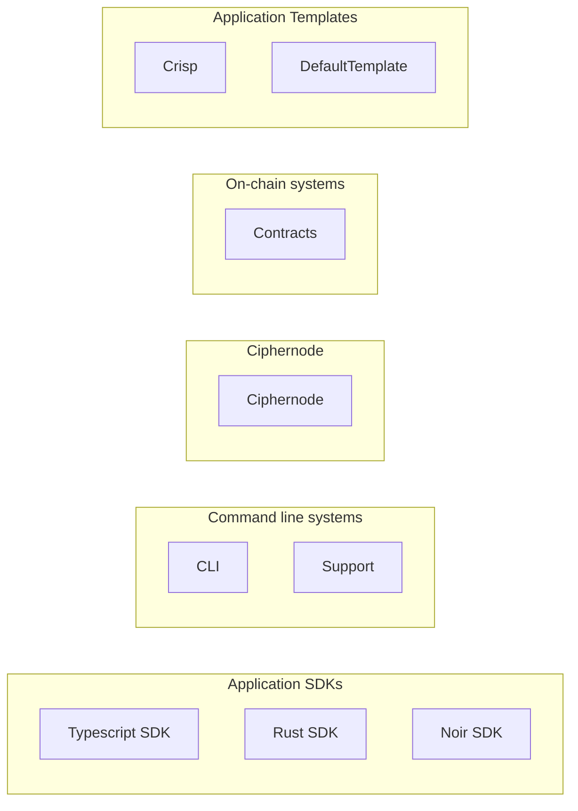

# Enclave Architecture Living Document

This is an Obsidian vault for the Enclave project architecture design. It is designed to help onboard and orient new team members to the project so that the structure and design decisions are understandable and accessible.

## Architecture

Links

[[CLI]]
[[Ciphernode]]
[[Contracts]]
[[Noir SDK]]
[[Rust SDK]]
[[Support]]
[[Typescript SDK]]

## Getting Started With Obsidian

### Prerequisites

- [Obsidian](https://obsidian.md/) installed on your system

### Opening the Vault

1. **Download/Clone the Repository**
2. **Open in Obsidian**

   - Launch Obsidian
   - Click "Open folder as vault"
   - Navigate to and select the main monorepo root.
   - Click "Open"

3. **Enable Required Plugin**
   - Once the vault is open you will be prompted to Trust the author of the repo. You can choose to do and have the plugin self install so or deny and install the Dataview plugin yourself. Inspect source code [here](https://github.com/blacksmithgu/obsidian-dataview)
   - 

### Using the Vault

This vault leverages Obsidian's linking and graph capabilities to create an interconnected view of the Enclave architecture. The Dataview plugin enables dynamic content generation and querying across documents, making it easier to find related information and maintain consistency across the documentation.
