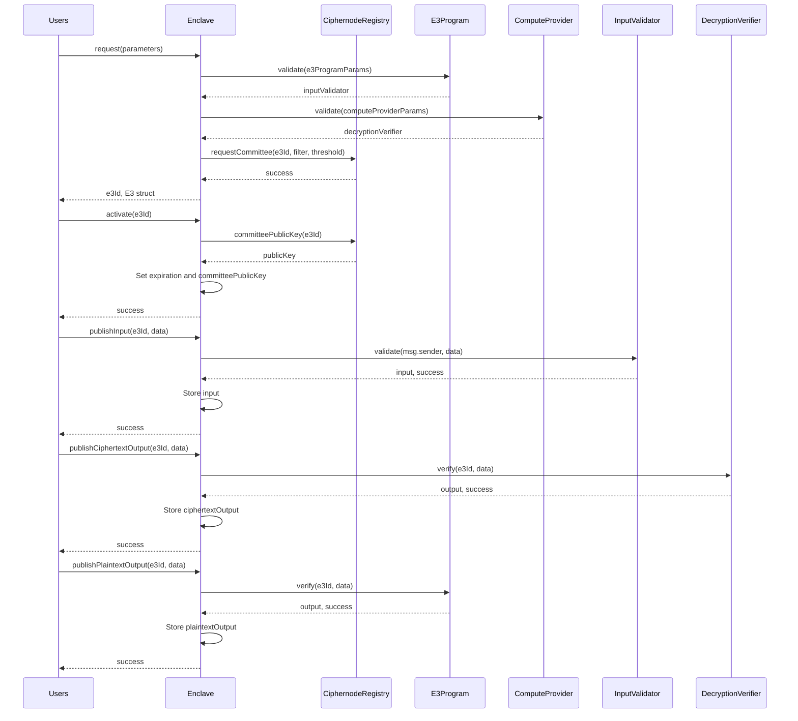

<div align="center">
  <picture>
    
  </picture>

[![Docs][docs-badge]][docs] [![Github Actions][gha-badge]][gha] [![Hardhat][hardhat-badge]][hardhat] [![License: LGPL v3][license-badge]][license]

</div>

# Enclave

This is the monorepo for Enclave, an open-source protocol for Collaborative Confidential Compute. Enclave leverages the combination of Fully Homomorphic Encryption (FHE), Zero Knowledge Proofs (ZKPs), and Multi-Party Computation (MPC) to enable Encrypted Execution Environments (E3) with integrity and privacy guarantees rooted in cryptography and economics, rather than hardware and attestations.

## Quick Start

Follow instructions in the [quick start][quick-start] section of the [Enclave docs][docs].

See the [CRISP example][crisp] for a fully functioning example application.

## Getting Help

Join the Enclave [Telegram group][telegram].

## Contributing

See [CONTRIBUTING.md][contributing].

## Development

This section covers the essential commands for setting up and working with the Enclave codebase locally.

```bash
# Install dependencies
pnpm i

# Build the project
pnpm build

# Run tests
pnpm test

# Clean build artifacts
pnpm clean
```

### Contributors

<!-- readme: contributors -start -->
<table>
	<tbody>
		<tr>
            <td align="center">
                <a href="https://github.com/ryardley">
                    
                    <br />
                    <sub><b>гλ</b></sub>
                </a>
            </td>
            <td align="center">
                <a href="https://github.com/auryn-macmillan">
                    
                    <br />
                    <sub><b>Auryn Macmillan</b></sub>
                </a>
            </td>
            <td align="center">
                <a href="https://github.com/hmzakhalid">
                    
                    <br />
                    <sub><b>Hamza Khalid</b></sub>
                </a>
            </td>
            <td align="center">
                <a href="https://github.com/samepant">
                    
                    <br />
                    <sub><b>samepant</b></sub>
                </a>
            </td>
            <td align="center">
                <a href="https://github.com/cristovaoth">
                    
                    <br />
                    <sub><b>Cristóvão</b></sub>
                </a>
            </td>
            <td align="center">
                <a href="https://github.com/ctrlc03">
                    
                    <br />
                    <sub><b>ctrlc03</b></sub>
                </a>
            </td>
		</tr>
		<tr>
            <td align="center">
                <a href="https://github.com/nginnever">
                    
                    <br />
                    <sub><b>Nathan Ginnever</b></sub>
                </a>
            </td>
            <td align="center">
                <a href="https://github.com/0xjei">
                    
                    <br />
                    <sub><b>Giacomo</b></sub>
                </a>
            </td>
            <td align="center">
                <a href="https://github.com/cedoor">
                    
                    <br />
                    <sub><b>Cedoor</b></sub>
                </a>
            </td>
            <td align="center">
                <a href="https://github.com/Subhasish-Behera">
                    
                    <br />
                    <sub><b>SUBHASISH BEHERA</b></sub>
                </a>
            </td>
            <td align="center">
                <a href="https://github.com/ozgurarmanc">
                    
                    <br />
                    <sub><b>Armanc</b></sub>
                </a>
            </td>
		</tr>
	<tbody>
</table>
<!-- readme: contributors -end -->

## Minimum Rust version

This workspace's minimum supported rustc version is 1.86.0.

## Architecture

Enclave employs a modular architecture involving numerous actors and participants. The sequence diagram below offers a high-level overview of the protocol, but necessarily omits most detail.



## 🚀 Release Process

### Overview

Enclave uses a unified versioning strategy where all packages (Rust crates and npm packages) share the same version number. Releases are triggered by git tags and follow semantic versioning.

### Quick Release

```bash
# One command to release! 🎉
pnpm bump:versions 1.0.0

# This automatically:
# - Bumps all versions
# - Generates changelog
# - Commits changes
# - Creates tag
# - Pushes to GitHub
# - Triggers release workflow
```

### Detailed Release Workflow

#### 1. Development Phase

Developers work on features and fixes, committing with [conventional commits](https://www.conventionalcommits.org/):

```bash
git commit -m "feat: add new encryption module"
git commit -m "fix: resolve memory leak in SDK"
git commit -m "docs: update API documentation"
git commit -m "BREAKING CHANGE: redesign configuration API"
```

#### 2. Release Execution

When ready to release, maintainers run a single command:

```bash
# For stable release
pnpm bump:versions 1.0.0

# For pre-release
pnpm bump:versions 1.0.0-beta.1
```

This command automatically:

- ✅ Validates working directory is clean
- ✅ Updates version in `Cargo.toml` (workspace version)
- ✅ Updates version in all npm `package.json` files
- ✅ Updates lock files (`Cargo.lock`, `pnpm-lock.yaml`)
- ✅ Generates/updates `CHANGELOG.md` from commit history
- ✅ Commits changes: `chore(release): bump version to X.Y.Z`
- ✅ Creates annotated tag: `vX.Y.Z`
- ✅ Pushes commits and tag to GitHub
- ✅ **Triggers automated release workflow**

#### 3. Alternative: Manual Review Before Push

If you prefer to review changes before pushing:

```bash
# Prepare release locally (no push)
pnpm bump:versions --no-push 1.0.0

# Review the changes
git diff HEAD~1
cat CHANGELOG.md

# If everything looks good, push
git push && git push --tags
```

#### 4. Automated Release Pipeline

Once the tag is pushed, GitHub Actions automatically:

1. **Validates** version consistency across all packages
2. **Builds** binaries for all platforms:
   - Linux (x86_64)
   - macOS (x86_64, aarch64)
3. **Runs** all tests
4. **Publishes** packages:
   - All versions (stable and pre-release):
     - ✅ Publishes to crates.io
     - ✅ Publishes to npm
   - Tag differences:
     - Stable (`v1.0.0`): npm `latest` tag, updates `stable` git tag
     - Pre-release (`v1.0.0-beta.1`): npm `next` tag, no `stable` tag update
5. **Creates** GitHub Release with:
   - Binary downloads for all platforms
   - Release notes from CHANGELOG.md
   - SHA256 checksums
   - Installation instructions

## 🏷️ Version Strategy

### Version Format

Enclave follows [Semantic Versioning](https://semver.org/):

- **Stable**: `v1.0.0` - Production ready
- **Pre-release**: `v1.0.0-beta.1` - Testing/preview versions
  - `-alpha.X` - Early development, may have breaking changes
  - `-beta.X` - Feature complete, testing for bugs
  - `-rc.X` - Release candidate, final testing

### Which Version Should I Use?

#### For Production (Mainnet)

Use stable versions only:

```bash
enclaveup install              # Latest stable
enclaveup install v1.0.0       # Specific stable version
```

#### For Testing (Testnet)

You can use pre-release versions:

```bash
enclaveup install --pre-release # Latest pre-release
enclaveup install v1.0.0-beta.1 # Specific pre-release
```

#### For Development

Build from source:

```bash
git clone https://github.com/gnosisguild/enclave.git
cd enclave
cargo build --release
```

## 🌿 Branch and Tag Strategy

### Current Setup

- **`main`** - Primary development branch
- **`v*.*.*`** - Version tags for releases
- **`stable`** - Always points to the latest stable release

### Installation Sources

```bash
# Latest stable release (recommended for production)
curl -fsSL https://raw.githubusercontent.com/gnosisguild/enclave/stable/install | bash

# Latest development version (may be unstable)
curl -fsSL https://raw.githubusercontent.com/gnosisguild/enclave/main/install | bash
```

### Future Branch Strategy

We plan to implement a three-tier branch strategy:

1. **`develop`** - Bleeding edge, experimental features
2. **`testnet`** - Stable features for testnet deployment
3. **`mainnet`** - Production-ready for mainnet deployment

## 📋 Release Checklist

For maintainers doing a release:

- [ ] Ensure all tests pass on `main`
- [ ] Review commits since last release for proper conventional format
- [ ] Decide version number (major/minor/patch)
- [ ] Run: `pnpm bump:versions X.Y.Z`
- [ ] Monitor GitHub Actions for successful deployment
- [ ] Verify packages on [npm](https://www.npmjs.com/org/enclave) and [crates.io](https://crates.io/search?q=enclave)
- [ ] Check GitHub release page for binaries and changelog
- [ ] Announce release (Discord/Twitter/etc)

## 🔧 Script Options

The `bump:versions` script supports several options:

```bash
# Full automatic release (default)
pnpm bump:versions 1.0.0

# Local only - don't push
pnpm bump:versions --no-push 1.0.0

# Skip git operations entirely
pnpm bump:versions --skip-git 1.0.0

# Dry run - see what would happen
pnpm bump:versions --dry-run 1.0.0

# Show help
pnpm bump:versions --help
```

## 🔄 Rollback Procedure

If a release has issues:

1. **Mark as deprecated on npm**:

   ```bash
   npm deprecate @enclave/sdk@1.0.0 "Critical bug, use 1.0.1"
   ```

2. **Yank from crates.io** (if critical):

   ```bash
   cargo yank --version 1.0.0 enclave
   ```

3. **Fix and release patch**:
   ```bash
   pnpm bump:versions 1.0.1
   ```

## 📊 Version History

Check our [Releases page](https://github.com/gnosisguild/enclave/releases) for full version history and changelogs.

## Security and Liability

This repo is provided WITHOUT ANY WARRANTY; without even the implied warranty of MERCHANTABILITY or FITNESS FOR A PARTICULAR PURPOSE.

## License

This repo created under the [LGPL-3.0+ license](LICENSE).

[gha]: https://github.com/gnosisguild/enclave/actions
[gha-badge]: https://github.com/gnosisguild/enclave/actions/workflows/ci.yml/badge.svg
[hardhat]: https://hardhat.org/
[hardhat-badge]: https://img.shields.io/badge/Built%20with-Hardhat-FFDB1C.svg
[license]: https://opensource.org/license/lgpl-3-0
[license-badge]: https://img.shields.io/badge/License-LGPLv3.0-blue.svg
[docs]: https://docs.enclave.gg
[docs-badge]: https://img.shields.io/badge/Documentation-blue.svg
[quick-start]: https://docs.enclave.gg/quick-start
[crisp]: https://docs.enclave.gg/CRISP/introduction
[telegram]: https://t.me/+raYAZgrwgOw2ODJh
[contributing]: CONTRIBUTING.md
