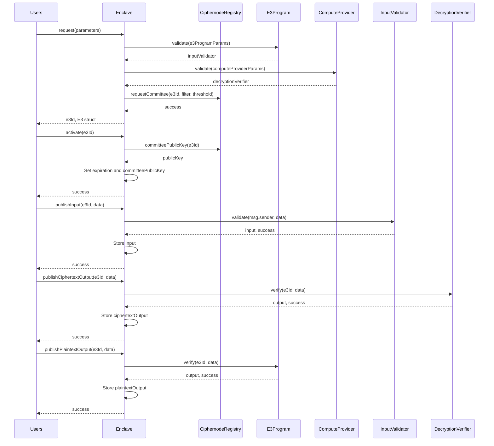

<div align="center">
  <picture>
    
  </picture>

[![Docs][docs-badge]][docs] [![Github Actions][gha-badge]][gha] [![Hardhat][hardhat-badge]][hardhat] [![License: LGPL v3][license-badge]][license]

</div>

# Enclave

This is the monorepo for Enclave, an open-source protocol for Collaborative Confidential Compute. Enclave leverages the combination of Fully Homomorphic Encryption (FHE), Zero Knowledge Proofs (ZKPs), and Multi-Party Computation (MPC) to enable Encrypted Execution Environments (E3) with integrity and privacy guarantees rooted in cryptography and economics, rather than hardware and attestations.

## Quick Start

Follow instructions in the [quick start][quick-start] section of the [Enclave docs][docs].

See the [CRISP example][crisp] for a fully functioning example application.

## Getting Help

Join the Enclave [Telegram group][telegram].

## Contributing

See [CONTRIBUTING.md][contributing].

### Contributors

<!-- readme: contributors -start -->
<table>
	<tbody>
		<tr>
            <td align="center">
                <a href="https://github.com/ryardley">
                    
                    <br />
                    <sub><b>гλ</b></sub>
                </a>
            </td>
            <td align="center">
                <a href="https://github.com/auryn-macmillan">
                    
                    <br />
                    <sub><b>Auryn Macmillan</b></sub>
                </a>
            </td>
            <td align="center">
                <a href="https://github.com/hmzakhalid">
                    
                    <br />
                    <sub><b>Hamza Khalid</b></sub>
                </a>
            </td>
            <td align="center">
                <a href="https://github.com/samepant">
                    
                    <br />
                    <sub><b>samepant</b></sub>
                </a>
            </td>
            <td align="center">
                <a href="https://github.com/cristovaoth">
                    
                    <br />
                    <sub><b>Cristóvão</b></sub>
                </a>
            </td>
            <td align="center">
                <a href="https://github.com/nginnever">
                    
                    <br />
                    <sub><b>Nathan Ginnever</b></sub>
                </a>
            </td>
		</tr>
		<tr>
            <td align="center">
                <a href="https://github.com/ctrlc03">
                    
                    <br />
                    <sub><b>ctrlc03</b></sub>
                </a>
            </td>
            <td align="center">
                <a href="https://github.com/0xjei">
                    
                    <br />
                    <sub><b>Giacomo</b></sub>
                </a>
            </td>
            <td align="center">
                <a href="https://github.com/cedoor">
                    
                    <br />
                    <sub><b>Cedoor</b></sub>
                </a>
            </td>
            <td align="center">
                <a href="https://github.com/Subhasish-Behera">
                    
                    <br />
                    <sub><b>SUBHASISH BEHERA</b></sub>
                </a>
            </td>
		</tr>
	<tbody>
</table>
<!-- readme: contributors -end -->

## Minimum Rust version

This workspace's minimum supported rustc version is 1.86.0.

## Architecture

Enclave employs a modular architecture involving numerous actors and participants. The sequence diagram below offers a high-level overview of the protocol, but necessarily omits most detail.



## 🚀 Release Process

### Overview

Enclave uses a unified versioning strategy where all packages (Rust crates and npm packages) share the same version number. Releases are triggered by git tags and follow semantic versioning.

### Release Workflow

#### 1. Development Phase

Developers work on features and fixes, committing with [conventional commits](https://www.conventionalcommits.org/):

```bash
git commit -m "feat: add new encryption module"
git commit -m "fix: resolve memory leak in SDK"
git commit -m "docs: update API documentation"
git commit -m "BREAKING CHANGE: redesign configuration API"
```

#### 2. Version Bump
When ready to release, maintainers bump the version across all packages:

```bash
# Bump version and generate changelog
pnpm bump:versions 1.0.0

# For pre-releases
pnpm bump:versions 1.0.0-beta.1
```

#### 3. Commit and Tag
```bash
# Review changes
git diff

# Commit the version bump
git add .
git commit -m "chore(release): bump version to 1.0.0"

# Push to a release branch
git push origin chore/release/v1.0.0

# Then open a PR to main 

# Create and push tag (this triggers the release!)
git tag v1.0.0
git push origin v1.0.0
```

This script:
- Updates version in `Cargo.toml` (workspace version)
- Updates version in all npm `package.json` files
- Updates lock files (`Cargo.lock`, `package-lock.json`)
- Generates/updates `CHANGELOG.md` from commit history

#### 4. Automated Release
Once the tag is pushed, GitHub Actions automatically:

1. **Validates** version consistency across all packages
2. **Builds** binaries for all platforms:
   - Linux (x86_64)
   - macOS (x86_64, aarch64)
3. **Runs** all tests
4. **Publishes** packages:
    * All versions (stable and pre-release):
        * ✅ Publishes to crates.io
        * ✅ Publishes to npm
    * Tag differences:
        * Stable (v1.0.0): npm latest tag, updates stable git tag
        * Pre-release (v1.0.0-beta.1): npm next tag, no stable tag update
5. **Creates** GitHub Release with:
   - Binary downloads for all platforms
   - Release notes from CHANGELOG.md
   - SHA256 checksums
   - Installation instructions

## 🏷️ Version Strategy

### Version Format

Enclave follows [Semantic Versioning](https://semver.org/):

- **Stable**: `v1.0.0` - Production ready
- **Pre-release**: `v1.0.0-beta.1` - Testing/preview versions
  - `-alpha.X` - Early development, may have breaking changes
  - `-beta.X` - Feature complete, testing for bugs
  - `-rc.X` - Release candidate, final testing

### Which Version Should I Use?

#### For Production (Mainnet)
Use stable versions only:
```bash
enclaveup install              # Latest stable
enclaveup install v1.0.0       # Specific stable version
```

#### For Testing (Testnet)
You can use pre-release versions:
```bash
enclaveup install --pre-release # Latest pre-release
enclaveup install v1.0.0-beta.1 # Specific pre-release
```

#### For Development
Build from source:
```bash
git clone https://github.com/gnosisguild/enclave.git
cd enclave
cargo build --release
```

## 🌿 Branch and Tag Strategy

### Current Setup

- **`main`** - Primary development branch
- **`v*.*.*`** - Version tags for releases
- **`stable`** - Always points to the latest stable release

### Installation Sources

```bash
# Latest stable release (recommended for production)
curl -fsSL https://raw.githubusercontent.com/gnosisguild/enclave/stable/install | bash

# Latest development version (may be unstable)
curl -fsSL https://raw.githubusercontent.com/gnosisguild/enclave/main/install | bash
```

### Future Branch Strategy

We plan to implement a three-tier branch strategy:

1. **`develop`** - Bleeding edge, experimental features
2. **`testnet`** - Stable features for testnet deployment
3. **`mainnet`** - Production-ready for mainnet deployment


## Security and Liability

This repo is provided WITHOUT ANY WARRANTY; without even the implied warranty of MERCHANTABILITY or FITNESS FOR A PARTICULAR PURPOSE.

## License

This repo created under the [LGPL-3.0+ license](LICENSE).

[gha]: https://github.com/gnosisguild/enclave/actions
[gha-badge]: https://github.com/gnosisguild/enclave/actions/workflows/ci.yml/badge.svg
[hardhat]: https://hardhat.org/
[hardhat-badge]: https://img.shields.io/badge/Built%20with-Hardhat-FFDB1C.svg
[license]: https://opensource.org/license/lgpl-3-0
[license-badge]: https://img.shields.io/badge/License-LGPLv3.0-blue.svg
[docs]: https://docs.enclave.gg
[docs-badge]: https://img.shields.io/badge/Documentation-blue.svg
[quick-start]: https://docs.enclave.gg/quick-start
[crisp]: https://docs.enclave.gg/CRISP/introduction
[telegram]: https://t.me/+raYAZgrwgOw2ODJh
[contributing]: CONTRIBUTING.md

