[![Github Actions][gha-badge]][gha] [![Hardhat][hardhat-badge]][hardhat] [![License: MIT][license-badge]][license]

# Enclave

[gha]: https://github.com/gnosisguild/enclave/actions
[gha-badge]: https://github.com/gnosisguild/enclave/actions/workflows/ci.yml/badge.svg
[hardhat]: https://hardhat.org/
[hardhat-badge]: https://img.shields.io/badge/Built%20with-Hardhat-FFDB1C.svg
[license]: https://opensource.org/license/lgpl-3-0
[license-badge]: https://img.shields.io/badge/License-LGPLv3.0-blue.svg

This is the monorepo for Enclave, an open-source protocol for Encrypted Execution Environments (E3).

## Architecture

Enclave employs a modular architecture involving numerous actors and participants. The sequence diagram below offers a high-level overview of the protocol, but necessarily omits most detail.

```mermaid
sequenceDiagram
    actor Requester
    actor Data Providers
    participant Enclave
    participant Ciphernode Registry
    participant Ciphernodes
    participant E3 Program
    participant Compute Provider

    loop Each computation request
        Requester ->> Enclave: Request computation
        activate Enclave
            Enclave ->> Ciphernode Registry: Select Committee
            activate Ciphernode Registry
                Ciphernode Registry -->> Ciphernodes: Key Setup
                activate Ciphernodes
                    Ciphernodes -->> Ciphernode Registry: Publish shared keys
                deactivate Ciphernodes
                Ciphernode Registry -->> Enclave: Publish Committee
            deactivate Ciphernode Registry

            loop Each input
                Data Providers ->> Enclave: Publish inputs
                Enclave ->> E3 Program: Validate inputs
                activate E3 Program
                    E3 Program -->> Enclave: 👌
                deactivate E3 Program
            end

            Enclave ->> Compute Provider: Request execution
            activate Compute Provider
            Compute Provider -->> Enclave: Publish ciphertext output
            deactivate Compute Provider

            Enclave -->> Ciphernodes: Request plaintext output
            activate Ciphernodes
                Ciphernodes ->> Enclave: Publish plaintext output
            deactivate Ciphernodes

            Requester -->> Enclave: Get plaintext
            Enclave -->> Requester: Returns plaintext
        deactivate Enclave
    end

```

---

---

## Security and Liability

This repo is provided WITHOUT ANY WARRANTY; without even the implied warranty of MERCHANTABILITY or FITNESS FOR A PARTICULAR PURPOSE.

## License

This repo created under the [LGPL-3.0+ license](LICENSE).
