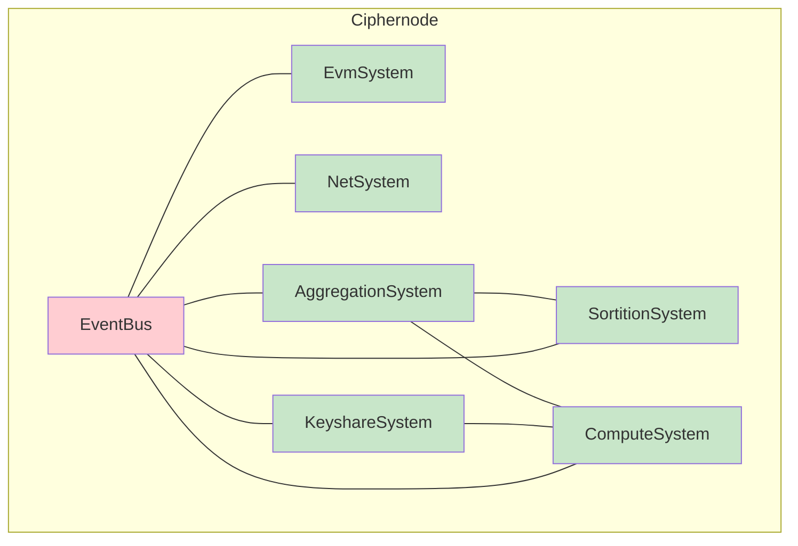

```mermaid
flowchart TB
    subgraph s1["Ciphernode"]
        EVM["EvmSystem"]
        EB["EventBus"]
        NET["NetSystem"]
        KS["KeyshareSystem"]
        COM["ComputeSystem"]
        AS["AggregationSystem"]
        SS["SortitionSystem"]
    end
    EB --- EVM
    EB --- NET
    EB --- AS
    EB --- KS
    SS --- EB
    COM --- EB
    AS --- COM
    KS --- COM
    AS --- SS

    EVM:::internal-link
    EB:::internal-link
    NET:::internal-link
    COM:::internal-link
    AS:::internal-link
    KS:::internal-link
    SS:::internal-link

    style EVM fill:#C8E6C9
    style EB fill:#FFCDD2
    style NET fill:#C8E6C9
    style KS fill:#C8E6C9
    style COM fill:#C8E6C9
    style AS fill:#C8E6C9
    style SS fill:#C8E6C9
```

### Systems

```dataview
TABLE description as Description
WHERE type = "system"
```
