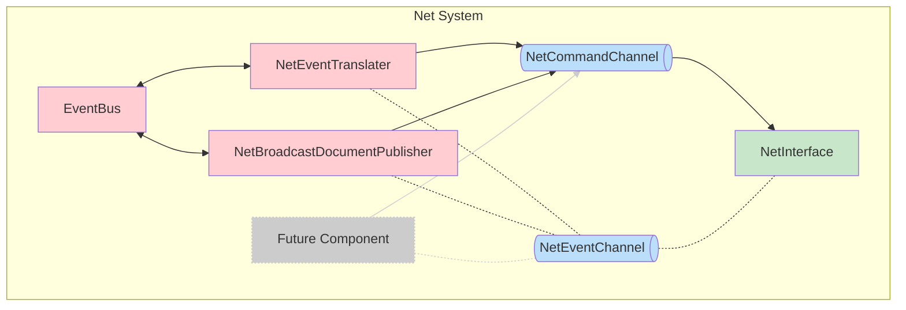

## `=this.file.name`

`=this.description`

### Description
- **[[EventBus]]** is the central application event bus
- **[[NetCommandChannel]]** is an mpsc channel for sending `NetCommand`s to the `NetInterface`
- **[[NetEventChannel]]** is an broadcast channel for broadcasting `NetEvent`s from the `NetInterface`
- **[[NetEventTranslator]]** works bidirectionally converting `EnclaveEvent`s to the appropriate `NetCommand` for the network peer and `NetEvent`s to the appropriate `EnclaveEvent`s
- **[[NetBroadcastDocumentPublisher]]** listens for specific `PublishDocumentRequested` events and will send appropriate events to the `NetInterface` in order to publish the document payload to the DHT as well as publish a libp2p gossipsub `DocumentPublished` event on the `NetInterface`
- **[[NetInterface]]** exposes two channels for control: `NetEventChannel` and `NetCommandChannel` 
### Benefits

- Extensive: Can use channels to control the network interface from multiple actors.
- Separates Domain Logic (EventBus) from lower level implementation (Net System)
- [[NetInterface]] is a dumb component that exposes libp2p functionality and can be called using channel commands.