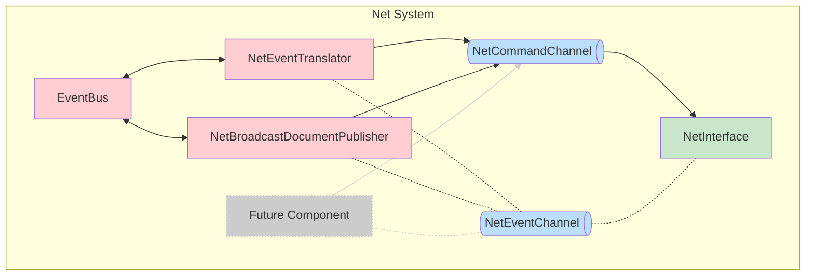

## `=this.file.name`

`=this.description`



```dataview
TABLE description as Description
FROM #net
```
### Benefits

- Extensive: Can use channels to control the network interface from multiple actors.
- Separates Domain Logic (EventBus) from lower level implementation (Net System)
- [[NetInterface]] is a dumb component that exposes libp2p functionality and can be called using channel commands.