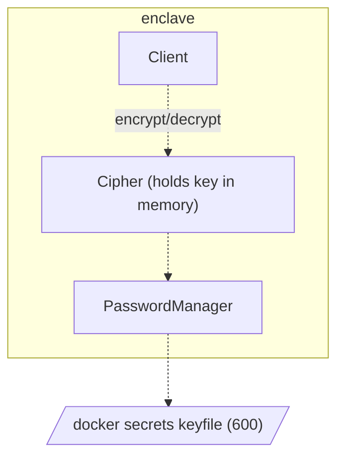

- We store the secret key in the keyfile which is configurable.
- It is recommended you use secure configuration infrastructure to manage this keyfile. For more information see the following:
  - https://docs.docker.com/engine/swarm/secrets/
  - https://kubernetes.io/docs/concepts/configuration/secret/
  - https://developer.hashicorp.com/vault/docs/platform/k8s/injector
- Actors snapshot and store state (see [[PersistenceSystem]] and the [Persistable Container](https://github.com/gnosisguild/enclave/blob/main/crates/data/src/persistable.rs))
- When sensitive data is stored in memory on an actor's persistable container you must ensure it is encrypted using the [[Cipher]]
- You must NEVER store sensitive information in plaintext on an [[Events|Event]] ideally you would use an encrypted version to the data until you need to use it or decrypt it.

#todo #trbfv
We should create an `Sensitive<T>` for sensitive data. The data is stored in memory encrypted symmetrically using the `Cipher` and decrypted upon access. This will come in handy when working with large security sensitive data such as `TrBfvBroadcastShares` in anycase the container must be `ZeroizeOnDrop`
