# Configuration Verification Circuit (Phase 0)

The Configuration Verification circuit runs once per deployment to verify all cryptographic
parameters used across both BFV (for DKG share encryption) and Threshold BFV (for user data
encryption) schemes. It provides public proof that the mathematical foundation is correct before any
key generation or encryption occurs.

Rather than trusting parameter configuration, this circuit verifies dozens of mathematical
relationships: CRT moduli products, error bounds, scaling factors, Reed-Solomon parity matrices, and
cross-scheme consistency.

```mermaid
flowchart TD
    subgraph P0["P0<br>Configuration Verification"]
        ConfigCircuit["Configuration Circuit<br/><i>Verify crypto configs</i>"]
    end

    %% External connections
    ConfigCircuit -.->|"verified parameters"| NextPhase["→ P1-P4<br>(trusted configs for all circuits)"]

    style P0 fill:#2B3BD5,stroke:#2E75B6,stroke-width:3px
    style NextPhase fill:#000000,stroke:#999,stroke-width:2px,stroke-dasharray: 5 5
    linkStyle 0 stroke:#808080,stroke-width:2px
```

## Metadata

- **Phase**: P0 (Configuration Verification).
- **Runs**: 1 x Ciphernode (one-time program verification).
- **Requires**: Configured parameter sets from [`configs/secure`](../../../lib/src/configs/secure).
- **Output(s)**: Single proof that all parameters are valid, consumed by all P1-P4 circuits.
- **Data Flow**: `Parameter Sets → P0 → Verified Configs → All Circuits (P1-P4)`
- **Verification Categories**:
  - DKG (BFV) Parameters: [`configs/secure/dkg.nr`](../../../lib/src/configs/secure/dkg.nr)
  - Threshold BFV Parameters:
    [`configs/secure/threshold.nr`](../../../lib/src/configs/secure/threshold.nr)
  - Cross-Configuration Consistency
- **Related Circuits**: All circuits in P1-P4 assume these parameters are correct.
