# [C2b] Smudging Noise Share Computation (`share_computation`)

The Smudging Noise Share Computation circuit (C2b) verifies that smudging noise shares were
correctly computed using Shamir Secret Sharing. After generating smudging noise `e_sm` in C1, each
ciphernode must split it into shares and prove the sharing was done correctly.

This circuit uses identical verification logic to C2a but operates on smudging noise instead of the
secret key. The smudging noise is critical for Phase 4 (threshold decryption)—it masks decryption
shares to prevent secret key leakage while allowing correct reconstruction of the plaintext.

```mermaid
flowchart TD
    %% Input from C1
    Input1["C1<br>pk-generation"] -.->|"commit(e_sm)"| C2b

    subgraph Focus["C2b"]
        C2b["<i>Verify smudging noise shares</i>"]
    end

    %% Outputs to C3b and C4b
    C2b -->|"commit(e_sm_share[i][j])"| Output1["→ C3b<br>share-encryption-e-sm"]
    C2b -->|"commit(e_sm_share)"| Output2["→ C4b<br>share-decryption-e-sm"]

    style Focus fill:#5B9BD5,stroke:#2E75B6,stroke-width:3px
    style Input1 fill:#000000,stroke:#999,stroke-width:2px,stroke-dasharray: 5 5
    style Output1 fill:#000000,stroke:#999,stroke-width:2px,stroke-dasharray: 5 5
    style Output2 fill:#000000,stroke:#999,stroke-width:2px,stroke-dasharray: 5 5

    linkStyle 0 stroke:#808080,stroke-width:2px
    linkStyle 1 stroke:#808080,stroke-width:2px
    linkStyle 2 stroke:#808080,stroke-width:2px
```

### Metadata

- **Phase**: P1 (DKG).
- **Runs**: (N_PARTIES -1) × Ciphernode (after threshold key generation in C1).
- **Requires**: `commit(e_sm)` from C1 ([`threshold/pk_generation`](../../threshold/pk_generation))
- **Output(s)**:
  - `commit(e_sm_share[party_idx][mod_idx])` for each party and modulus → C3b
    ([`dkg/share_encryption`](../share_encryption))
  - `commit(e_sm_share)` → C4b ([`dkg/share_decryption`](../share_decryption))
- **Data Flow**: `C1 → C2b → {C3b (encryption), C4b (decryption)}`
- **Secret Structure**: `e_sm` is in CRT representation (one polynomial per modulus, varies across
  moduli)
- **Commitment Functions**: [`math/commitments.nr`](../../../lib/src/math/commitments.nr) -
  `compute_share_computation_e_sm_commitment()`, `compute_share_encryption_commitment_from_shares()`
- **Related Circuits**:
  - C1 [`threshold/pk_generation`](../../threshold/pk_generation)
  - C2a [`dkg/sk_share_computation`](../sk_share_computation) (parallel circuit for secret key)
  - C3b [`dkg/share_encryption`](../share_encryption)
  - C4b [`dkg/share_decryption`](../share_decryption)
