# [C0] BFV Public Key Commitment (`pk`)

The BFV Public Key Commitment circuit (C0) is the first circuit executed in Phase 1 (Distributed Key
Generation). Each ciphernode creates a cryptographic commitment to their BFV public key, which will
be used exclusively for encrypting secret shares during DKG.

Rather than verifying the key generation process, this circuit establishes a _binding commitment_
that prevents key substitution attacks. The commitment acts as an immutable reference—any attempt to
use a different key in later encryption or decryption steps will be cryptographically detected.

```mermaid
flowchart TD
    %% Input from Phase 0
    Input0["P0<br>Configs Verification"] -.->|"verified configs"| C0

    subgraph Focus["C0"]
        C0["<i>Commit to BFV public key</i>"]
    end

    %% Output to C3a and C3b
    C0 -->|"commit(pk_bfv)"| Output1["→ C3a<br>share-encryption-sk"]
    C0 -->|"commit(pk_bfv)"| Output2["→ C3b<br>share-encryption-e-sm"]

    style Focus fill:#E8A87C,stroke:#C97A4A,stroke-width:3px
    style Input0 fill:#000000,stroke:#999,stroke-width:2px,stroke-dasharray: 5 5
    style Output1 fill:#000000,stroke:#999,stroke-width:2px,stroke-dasharray: 5 5
    style Output2 fill:#000000,stroke:#999,stroke-width:2px,stroke-dasharray: 5 5

    linkStyle 0 stroke:#808080,stroke-width:2px
    linkStyle 1 stroke:#808080,stroke-width:2px
    linkStyle 2 stroke:#808080,stroke-width:2px
```

- **Phase**: P1 (DKG).
- **Runs**: 1 x Ciphernode (at the start of key generation).
- **Requires**: [`config`](../../config) circuit from P0 (Configs Verification).
- **Output(s)**: `commit(pk_bfv)` consumed by C3a / C3b
  ([`dkg/share_encryption`](../share_encryption))
- **Data Flow**: `P0 (configs) → C0 → commit(pk_bfv) → C3a, C3b`
- **Commitment Function**: [`math/commitments.nr`](../../../lib/src/math/commitments.nr) -
  `compute_dkg_pk_commitment()`
