# [C4a & C4b] Share Decryption & Aggregation (`share_decryption`)

The Share Decryption circuit verifies that each ciphernode correctly decrypted the shares they
received, and that those shares were honestly aggregated into a single combined value. This closes
the DKG loop: shares were committed in _C2_, encrypted in _C3_, and are now verified upon decryption
and aggregated here.

This is a single circuit used for both variants: **C4a** handles secret key (`sk`) shares, consuming
commitments from _C2a_; **C4b** handles smudging noise (`e_sm`) shares, consuming commitments from
_C2b_. The verification logic and all input types are identical — only the source of
`expected_commitments` differs between the two instantiations.

```mermaid
flowchart TD
    Input2a["C2a<br>share-computation-sk"] -.->|"commit(sk_share[i][j])"| C4
    Input2b["C2b<br>share-computation-e-sm"] -.->|"commit(e_sm_share[i][j])"| C4

    subgraph Focus["C4a & C4b"]
        C4["<i>Verify decrypted shares & aggregate</i>"]
    end

    C4 -->|"commit(agg_sk)"| Output1["→ C6<br>threshold-share-decryption"]
    C4 -->|"commit(agg_e_sm)"| Output1

    style Focus fill:#5B9BD5,stroke:#2E75B6,stroke-width:3px
    style Input2a fill:#000000,stroke:#999,stroke-width:2px,stroke-dasharray: 5 5
    style Input2b fill:#000000,stroke:#999,stroke-width:2px,stroke-dasharray: 5 5
    style Output1 fill:#000000,stroke:#999,stroke-width:2px,stroke-dasharray: 5 5

    linkStyle 0 stroke:#808080,stroke-width:2px
    linkStyle 1 stroke:#808080,stroke-width:2px
    linkStyle 2 stroke:#808080,stroke-width:2px
    linkStyle 3 stroke:#808080,stroke-width:2px
```

### Metadata

- **Phase**: P1 (DKG).
- **Runs**: (N_PARTIES - 1) × Ciphernode per variant (once per recipient per share type).
- **Requires**:
  - C4a: `commit(sk_share[party_idx][mod_idx])` from C2a
    ([`dkg/sk_share_computation`](../sk_share_computation))
  - C4b: `commit(e_sm_share[party_idx][mod_idx])` from C2b
    ([`dkg/e_sm_share_computation`](../e_sm_share_computation))
- **Output(s)**:
  - C4a: `commit(agg_sk)` → C6 ([`threshold/share_decryption`](../../threshold/share_decryption))
  - C4b: `commit(agg_e_sm)` → C6 ([`threshold/share_decryption`](../../threshold/share_decryption))
- **Data Flow**: `C2a → C4a → commit(agg_sk) → C6` and `C2b → C4b → commit(agg_e_sm) → C6`
- **Commitment Functions**: [`math/commitments.nr`](../../../lib/src/math/commitments.nr) -
  `compute_share_encryption_commitment_from_message()`, `compute_aggregated_shares_commitment()`
- **Related Circuits**:
  - C2a [`dkg/sk_share_computation`](../sk_share_computation)
  - C2b [`dkg/e_sm_share_computation`](../e_sm_share_computation)
  - C6 [`threshold/share_decryption`](../../threshold/share_decryption)
