# [C3a & C3b] Share Encryption (`share_encryption`)

The Share Encryption circuit verifies that each ciphernode correctly encrypted a secret share under
the recipient's BFV public key. After shares are verified in _C2a/C2b_, they must be encrypted for
secure peer-to-peer transmission — this circuit proves the encryption was formed correctly without
revealing the plaintext share or the encryption randomness.

This is a single circuit used for both variants: **C3a** encrypts secret key (`sk`) shares, taking
its message commitment from _C2a_; **C3b** encrypts smudging noise (`e_sm`) shares, taking its
message commitment from _C2b_. The verification logic and all input types are identical — only the
value of `expected_message_commitment` differs between the two instantiations.

```mermaid
flowchart TD
    Input0["C0<br>pk"] -.->|"commit(pk_bfv)"| C3
    Input2a["C2a<br>share-computation-sk"] -.->|"commit(sk_share[i][j])"| C3
    Input2b["C2b<br>share-computation-e-sm"] -.->|"commit(e_sm_share[i][j])"| C3

    subgraph Focus["C3a & C3b"]
        C3["<i>Encrypt share under BFV pk</i>"]
    end

    C3 -->|"ct(sk_share)"| Output1["→ C4a<br>share-decryption-sk"]
    C3 -->|"ct(e_sm_share)"| Output2["→ C4b<br>share-decryption-e-sm"]

    style Focus fill:#5B9BD5,stroke:#2E75B6,stroke-width:3px
    style Input0 fill:#000000,stroke:#999,stroke-width:2px,stroke-dasharray: 5 5
    style Input2a fill:#000000,stroke:#999,stroke-width:2px,stroke-dasharray: 5 5
    style Input2b fill:#000000,stroke:#999,stroke-width:2px,stroke-dasharray: 5 5
    style Output1 fill:#000000,stroke:#999,stroke-width:2px,stroke-dasharray: 5 5
    style Output2 fill:#000000,stroke:#999,stroke-width:2px,stroke-dasharray: 5 5

    linkStyle 0 stroke:#808080,stroke-width:2px
    linkStyle 1 stroke:#808080,stroke-width:2px
    linkStyle 2 stroke:#808080,stroke-width:2px
    linkStyle 3 stroke:#808080,stroke-width:2px
    linkStyle 4 stroke:#808080,stroke-width:2px
```

### Metadata

- **Phase**: P1 (DKG).
- **Runs**: (N_PARTIES - 1) × Ciphernode per variant (once per recipient per share type).
- **Requires**:
  - `commit(pk_bfv)` from C0 ([`dkg/pk`](../pk))
  - C3a: `commit(sk_share[party_idx][mod_idx])` from C2a
    ([`dkg/sk_share_computation`](../sk_share_computation))
  - C3b: `commit(e_sm_share[party_idx][mod_idx])` from C2b
    ([`dkg/e_sm_share_computation`](../e_sm_share_computation))
- **Output(s)**:
  - C3a: encrypted SK share ciphertexts `ct(sk_share)` → C4a
    ([`dkg/share_decryption`](../share_decryption))
  - C3b: encrypted noise share ciphertexts `ct(e_sm_share)` → C4b
    ([`dkg/share_decryption`](../share_decryption))
- **Data Flow**: `C0 + C2a → C3a → ct(sk_share) → C4a` and `C0 + C2b → C3b → ct(e_sm_share) → C4b`
- **Challenge Generation**: [`math/commitments.nr`](../../../lib/src/math/commitments.nr) -
  `compute_share_encryption_challenge()`
- **Commitment Functions**: [`math/commitments.nr`](../../../lib/src/math/commitments.nr) -
  `compute_dkg_pk_commitment()`, `compute_share_encryption_commitment_from_message()`
- **Related Circuits**:
  - C0 [`dkg/pk`](../pk)
  - C2a [`dkg/sk_share_computation`](../sk_share_computation)
  - C2b [`dkg/e_sm_share_computation`](../e_sm_share_computation)
  - C4a, C4b [`dkg/share_decryption`](../share_decryption)
