# [C2a] Secret Key Share Computation (`share_computation`)

The Secret Key Share Computation circuit (C2a) verifies that secret key shares were correctly
computed using Shamir Secret Sharing. After generating their threshold key contribution in C1, each
ciphernode must split the secret key `sk` into shares and prove the sharing was done correctly.

This _prove-then-encrypt_ approach ensures that shares are correct before they're encrypted for
distribution. The Reed-Solomon parity check is the cryptographic core: it proves that shares form a
valid codeword, guaranteeing both reconstruction (any T+1 shares suffice) and security (T or fewer
reveal nothing).

```mermaid
flowchart TD
    %% Input from C1
    Input1["C1<br>pk-generation"] -.->|"commit(sk)"| C2a

    subgraph Focus["C2a"]
        C2a["<i>Verify secret key shares</i>"]
    end

    %% Outputs to C3a and C4a
    C2a -->|"commit(sk_share[i][j])"| Output1["→ C3a<br>share-encryption-sk"]
    C2a -->|"commit(sk_share)"| Output2["→ C4a<br>share-decryption-sk"]

    style Focus fill:#5B9BD5,stroke:#2E75B6,stroke-width:3px
    style Input1 fill:#000000,stroke:#999,stroke-width:2px,stroke-dasharray: 5 5
    style Output1 fill:#000000,stroke:#999,stroke-width:2px,stroke-dasharray: 5 5
    style Output2 fill:#000000,stroke:#999,stroke-width:2px,stroke-dasharray: 5 5

    linkStyle 0 stroke:#808080,stroke-width:2px
    linkStyle 1 stroke:#808080,stroke-width:2px
    linkStyle 2 stroke:#808080,stroke-width:2px
```

### Metadata

- **Phase**: P1 (DKG).
- **Runs**: N_PARTIES × Ciphernode (after threshold key generation in C1).
- **Requires**: `commit(sk)` from C1 ([`threshold/pk_generation`](../../threshold/pk_generation))
- **Output(s)**:
  - `commit(sk_share[party_idx][mod_idx])` for each party and modulus → C3a
    ([`dkg/share_encryption`](../share_encryption))
  - `commit(sk_share)` → C4a ([`dkg/share_decryption`](../share_decryption))
- **Data Flow**: `C1 → C2a → {C3a (encryption), C4a (decryption)}`
- **Secret Structure**: `sk` is trinary (uniform across all CRT moduli)
- **Commitment Functions**: [`math/commitments.nr`](../../../lib//src/math/commitments.nr) -
  `compute_share_computation_sk_commitment()`, `compute_share_encryption_commitment_from_shares()`
- **Related Circuits**:
  - C1 [`threshold/pk_generation`](../../threshold/pk_generation)
  - C2b [`dkg/e_sm_share_computation`](../e_sm_share_computation) (parallel circuit for smudging
    noise)
  - C3a [`dkg/share_encryption`](../share_encryption)
  - C4a [`dkg/share_decryption`](../share_decryption)
