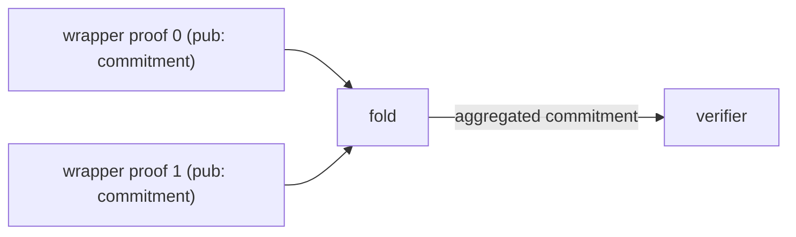

# Fold

Aggregates two non-ZK UltraHonk proofs into a single recursive commitment.

This sits at the top of the aggregation stack: it takes two wrapper proofs (stripped of ZK
randomness) and combines their public commitments into one field element that a verifier can check
cheaply in place of the original pair.

## Inputs

| Name               | Visibility | Type                       | Description                              |
| ------------------ | ---------- | -------------------------- | ---------------------------------------- |
| `verification_key` | private    | `UltraHonkVerificationKey` | Shared VK for both proofs                |
| `proofs`           | private    | `[UltraHonkProof; 2]`      | The two non-ZK proofs to aggregate       |
| `commitments`      | public     | `[Field; 2]`               | Public commitment output from each proof |
| `key_hash`         | private    | `Field`                    | Hash of the verification key             |

## Output

`pub Field` — aggregated recursive commitment computed over both input commitments.

## Verification

1. Verify `proofs[0]` non-ZK against `verification_key` with public input `commitments[0]`.
2. Verify `proofs[1]` non-ZK against `verification_key` with public input `commitments[1]`.
3. Return `compute_recursive_aggregation_commitment([commitments[0], commitments[1]])`.

Both proofs must share the same verification key.

## Data Flow

## Notes

- Uses **non-ZK** proof verification (`verify_honk_proof_non_zk`) — the ZK layer is handled inside
  the wrapper circuits that feed into this one.
- Hardcoded to aggregate exactly **2** proofs per invocation.

## Related

- [../wrapper/](../wrapper/README.md) — produces the wrapper proofs consumed here
