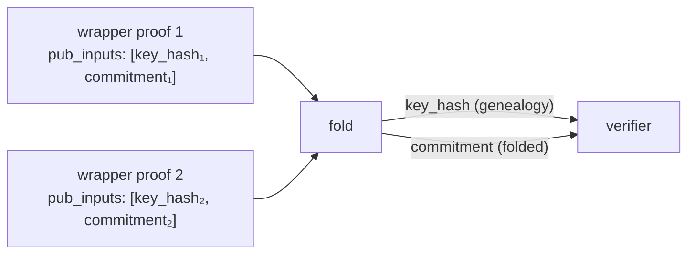

# Fold

Aggregates two non-ZK UltraHonk proofs into a single recursive commitment and a proof-genealogy
fingerprint.

This sits at the top of the aggregation stack: it takes two wrapper proofs (stripped of ZK
randomness), verifies them under their respective verification keys, and folds their public outputs
into a single `(key_hash, commitment)` tuple that a verifier can check cheaply in place of the
original pair.

## Inputs

All parameters are private witnesses.

| Name                      | Type                       | Description                                  |
| ------------------------- | -------------------------- | -------------------------------------------- |
| `proof1_verification_key` | `UltraHonkVerificationKey` | VK for proof 1                               |
| `proof1_proof`            | `UltraHonkProof`           | First non-ZK proof to aggregate              |
| `proof1_public_inputs`    | `[Field; 2]`               | `[key_hash, commitment]` attested by proof 1 |
| `proof1_key_hash`         | `Field`                    | Hash of the VK that verified proof 1         |
| `proof2_verification_key` | `UltraHonkVerificationKey` | VK for proof 2                               |
| `proof2_proof`            | `UltraHonkProof`           | Second non-ZK proof to aggregate             |
| `proof2_public_inputs`    | `[Field; 2]`               | `[key_hash, commitment]` attested by proof 2 |
| `proof2_key_hash`         | `Field`                    | Hash of the VK that verified proof 2         |

`proof*_public_inputs[0]` carries the key_hash propagated upward by the inner proof (encoding its
own circuit genealogy); `proof*_public_inputs[1]` carries its aggregation commitment.

## Output

`pub (Field, Field)` — `(key_hash, commitment)` where:

- `key_hash` is a single fingerprint encoding the full proof genealogy (see below).
- `commitment` is
  `compute_recursive_aggregation_commitment([proof1_public_inputs[1], proof2_public_inputs[1]])`.

## Verification

1. `verify_honk_proof_non_zk(proof1_verification_key, proof1_proof, proof1_public_inputs, proof1_key_hash)`
2. `verify_honk_proof_non_zk(proof2_verification_key, proof2_proof, proof2_public_inputs, proof2_key_hash)`
3. Compute
   `commitment = compute_recursive_aggregation_commitment([proof1_public_inputs[1], proof2_public_inputs[1]])`.
4. Compute
   `key_hash = compute_vk_hash([proof1_public_inputs[0], proof2_public_inputs[0], proof1_key_hash, proof2_key_hash])`.
5. Return `(key_hash, commitment)`.

### Key genealogy

`key_hash` is computed by hashing four values in order:

| Position | Value                     | Meaning                                             |
| -------- | ------------------------- | --------------------------------------------------- |
| 0        | `proof1_public_inputs[0]` | key_hash attested by proof 1 (from its inner folds) |
| 1        | `proof2_public_inputs[0]` | key_hash attested by proof 2 (from its inner folds) |
| 2        | `proof1_key_hash`         | VK hash of the circuit that produced proof 1        |
| 3        | `proof2_key_hash`         | VK hash of the circuit that produced proof 2        |

This combined fingerprint lets the verifier check the entire proof genealogy: which circuits were
folded and which VK verified each level, without re-running any inner proof.

## Data Flow

```mermaid
flowchart LR
    W0["wrapper proof 1\npub_inputs: [key_hash₁, commitment₁]"] --> F["fold"]
    W1["wrapper proof 2\npub_inputs: [key_hash₂, commitment₂]"] --> F
    F -->|"key_hash (genealogy)"| Out["verifier"]
    F -->|"commitment (folded)"| Out
```

## Notes

- Uses **non-ZK** proof verification (`verify_honk_proof_non_zk`) — the ZK layer is handled inside
  the wrapper circuits that feed into this one.
- Each proof has its **own** verification key; there is no shared VK constraint between the two.
- Hardcoded to aggregate exactly **2** proofs per invocation.

## Related

- [../wrapper/](../wrapper/README.md) — produces the wrapper proofs consumed here
