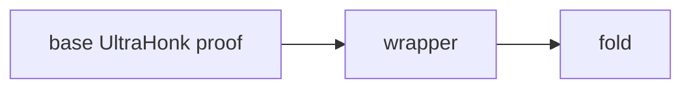

# Wrapper circuits

Re-verify **UltraHonk** proofs inside Noir (`verify_honk_proof` / `verify_honk_proof_non_zk`) and
compress public inputs to a **recursive aggregation commitment** (and usually a **key hash** chain)
for folding or cheap verification.

## Dimensions

Each subdirectory under `wrapper/dkg/` and `wrapper/threshold/` sets `N_PROOFS` and
`N_PUBLIC_INPUTS` in its `src/main.nr`. Values below match the sources as of this tree; symbols come
from `lib::configs::default` (`L`, `N`, `H`, `T`, `L_THRESHOLD`, `MAX_MSG_NON_ZERO_COEFFS`, etc.).

| Wrapper path                             | `N_PROOFS` | `N_PUBLIC_INPUTS` (per proof)                                                                 |
| ---------------------------------------- | ---------- | --------------------------------------------------------------------------------------------- |
| `dkg/pk`                                 | 1          | `1`                                                                                           |
| `dkg/share_computation`                  | 1          | `3` (batch key hash + inner proof’s public outputs; final C2 proof wrapped **one at a time**) |
| `dkg/share_encryption`                   | 1          | `(2 × L × N) + 2`                                                                             |
| `dkg/share_decryption`                   | 1          | `(H × L_THRESHOLD) + 1`                                                                       |
| `threshold/pk_generation`                | 1          | `3` (`sk_commitment`, `pk_commitment`, `e_sm_commitment`)                                     |
| `threshold/pk_aggregation`               | 1          | `H + 1`                                                                                       |
| `threshold/share_decryption`             | 1          | `2 + 2 × L × N + 1`                                                                           |
| `threshold/decrypted_shares_aggregation` | 1          | `(T + 1) + MAX_MSG_NON_ZERO_COEFFS + (T + 1)`                                                 |

### P3 user encryption (different path)

The user-encryption wrapper (ct0 + ct1, shared `u_commitment`) is **not** under
`recursive_aggregation/wrapper/`. It lives at
[`bin/threshold/user_data_encryption`](../../threshold/user_data_encryption): two inner proofs with
**4** public inputs (ct0) and **3** (ct1), `verify_honk_proof_non_zk`, and a **three-field** public
return tuple. See that crate’s `src/main.nr`.

## Flow

```mermaid
flowchart LR
  Base["base UltraHonk proof"] --> W["wrapper"]
  W --> Fold["fold"]
```

|                 |                                                                       |
| --------------- | --------------------------------------------------------------------- |
| **Fold**        | [../fold/README.md](../fold/README.md)                                |
| **Commitments** | [`lib/src/math/commitments.nr`](../../../lib/src/math/commitments.nr) |
| **Index**       | [Circuit package index](../../../README.md#circuit-package-index)     |
| **Docs**        | [Noir Circuits](../../../../docs/pages/noir-circuits.mdx)             |
