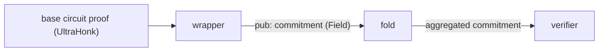

# Wrapper Circuits

Each wrapper circuit takes one or more UltraHonk proofs from a base circuit, re-verifies them
in-circuit with `verify_honk_proof_non_zk`, and computes a single recursive aggregation commitment
over all public inputs (or a tuple for the user_data_encryption wrapper). This converts a proof with
many public inputs into one or a few `Field` values that downstream aggregation steps (fold, or an
on-chain verifier) can process cheaply.

## Common Pattern

Every wrapper follows the same structure. What varies between circuits:

- `N_PROOFS` — how many proofs the wrapper verifies in one invocation
- `N_PUBLIC_INPUTS` — how many public field elements each proof exposes, derived from config
  parameters resolved at compile time from `lib::configs::default`

## Circuit Index

| Circuit                                  | `N_PROOFS` | `N_PUBLIC_INPUTS`                                                           |
| ---------------------------------------- | ---------- | --------------------------------------------------------------------------- |
| `dkg/pk`                                 | 1          | `1`                                                                         |
| `dkg/share_computation`                  | 2          | `(L_THRESHOLD × N_PARTIES) + 1`                                             |
| `dkg/share_encryption`                   | 2          | `(2 × L × N) + 2`                                                           |
| `dkg/share_decryption`                   | 2          | `(H × L_THRESHOLD) + 1`                                                     |
| `threshold/pk_generation`                | 1          | `(L × N) + 3`                                                               |
| `threshold/pk_aggregation`               | 1          | `H + 1`                                                                     |
| `threshold/share_decryption`             | 1          | `2 + (3 × L × N)`                                                           |
| `threshold/decrypted_shares_aggregation` | 1          | `((T+1) × L × MAX_MSG_NON_ZERO_COEFFS) + (T + 1 + MAX_MSG_NON_ZERO_COEFFS)` |
| `threshold/user_data_encryption`         | 2          | 4 (ct0) · 3 (ct1) — asymmetric, see below                                   |

## Special Case: `threshold/user_data_encryption`

This wrapper departs from the standard pattern in two ways:

1. **Cross-proof constraint** — asserts that the `u_commitment` is identical across the ct0 and ct1
   proofs, binding the two ciphertexts to the same encryption randomness.
2. **Tuple output** — returns `(Field, Field, Field)` instead of a single commitment: the public-key
   commitment, the ciphertext commitment, and the k1_commitment (in that order).

## Data Flow

```mermaid
flowchart LR
    Base["base circuit proof (UltraHonk)"] --> W["wrapper"]
    W -->|"pub: commitment (Field)"| F["fold"]
    F -->|"aggregated commitment"| Out["verifier"]
```

## Related

- [../fold/](../fold/README.md) — aggregates two wrapper outputs into a single commitment
- [../../../../lib/src/math/commitments.nr](../../../../lib/src/math/commitments.nr) —
  `compute_recursive_aggregation_commitment` implementation
