# [C7] Decrypted Shares Aggregation - Modular Variant (`decrypted_shares_aggregation_mod`)

The Decryption Share Aggregation circuit combines T+1 verified decryption shares into the final
plaintext. It performs Lagrange interpolation per CRT basis, reconstructs the global decryption
value, and decodes it into the output message. This is the last circuit in the protocol — its output
is the plaintext result of the encrypted computation.

This variant uses `ModU128` arithmetic for the decoding step and is suited for parameter sets where
Q (the product of all CRT moduli) fits within 128 bits. For cryptographically secure parameter sets
where Q exceeds 128 bits, use the BigNum variant (`decrypted_shares_aggregation_bn`).

```mermaid
flowchart TD
    Input1["C6<br>dec-share-trbfv (×T+1)"] -.->|"d[l] per party"| C7

    subgraph Focus["C7 — Modular"]
        C7["<i>Lagrange interpolation,<br/>CRT reconstruction, decoding</i>"]
    end

    C7 -->|"message"| Output1["Final plaintext"]

    style Focus fill:#E06666,stroke:#C00000,stroke-width:3px
    style Input1 fill:#000000,stroke:#999,stroke-width:2px,stroke-dasharray: 5 5
    style Output1 fill:#000000,stroke:#999,stroke-width:2px,stroke-dasharray: 5 5

    linkStyle 0 stroke:#808080,stroke-width:2px
    linkStyle 1 stroke:#808080,stroke-width:2px
```

**Phase:** P4 (Decryption)

**Runs:** 1 × Aggregator (once after T+1 valid C6 proofs are collected)

**Requires:**

- `d[l]` — public decryption share polynomials from C6 (`threshold/share_decryption`), one set per
  party, T+1 parties total

**Output(s):**

- `message` — the final plaintext polynomial

**Data Flow:** C6 (×T+1) → C7 → plaintext

**Commitment Functions:** none — the output message is the final result, not committed to any
downstream circuit

**Use when:** Q fits within 128 bits (non-production / smaller parameter sets)

**Related Circuits:**

- C6 [`threshold/share_decryption`](../share_decryption)
- BigNum variant [`threshold/decrypted_shares_aggregation_bn`](../decrypted_shares_aggregation_bn)
