# [C5] Public Key Aggregation (`pk_aggregation`)

The Public Key Aggregation circuit combines the threshold BFV public key shares from all honest
ciphernodes into a single aggregated public key that users will encrypt to. It verifies both that
the individual shares match their commitments from _C1_ and that the aggregation was computed
correctly, before committing to the result.

```mermaid
flowchart TD
    Input1["C1<br>pk-generation (×H)"] -.->|"commit(pk_trbfv[h])"| C5

    subgraph Focus["C5"]
        C5["<i>Verify pk shares & aggregate</i>"]
    end

    C5 -->|"commit(pk_agg)"| Output1["→ P3<br>User Encryption"]

    style Focus fill:#70AD47,stroke:#548235,stroke-width:3px
    style Input1 fill:#000000,stroke:#999,stroke-width:2px,stroke-dasharray: 5 5
    style Output1 fill:#000000,stroke:#999,stroke-width:2px,stroke-dasharray: 5 5

    linkStyle 0 stroke:#808080,stroke-width:2px
    linkStyle 1 stroke:#808080,stroke-width:2px
```

## Metadata

- **Phase**: P2 (Aggregation).
- **Runs**: 1 × Aggregator (once after all honest parties' pk shares are collected).
- **Requires**: `commit(pk_trbfv[h])` from C1 ([`threshold/pk_generation`](../pk_generation)) for
  each honest party `h ∈ H`.
- **Output(s)**: `commit(pk_agg)` → user-data-encryption
  ([`threshold/user_data_encryption`](../user_data_encryption))
- **Data Flow**: `C1 (×H) → C5 → commit(pk_agg) → P3`
- **Commitment Functions**: [`math/commitments.nr`](../../../lib/src/math/commitments.nr) -
  `compute_pk_aggregation_commitment()`
- **Related Circuits**:
  - C1 [`threshold/pk_generation`](../pk_generation)
  - user-data-encryption [`threshold/user_data_encryption`](../user_data_encryption)
