# [C1] Threshold Public Key Generation (`pk_generation`)

The Threshold Public Key Generation circuit (C1) is where each ciphernode generates their
contribution to the threshold BFV key. This circuit proves that the public key `(pk0, pk1)` was
generated correctly from a secret key `sk`, error term `eek`, and smudging noise `e_sm`, without
revealing any of these secret values.

This _commit-then-verify_ approach uses the Schwartz-Zippel lemma: rather than checking every
coefficient of the key generation equations (expensive), the circuit verifies the equations hold at
random challenge points. If they hold at these points, they hold everywhere with overwhelming
probability.

```mermaid
flowchart TD
    %% Input from Phase 0
    Input0["P0<br>Configs Verification"] -.->|"verified configs"| C1

    subgraph Focus["C1"]
        C1["<i>Generate TRBFV key pair</i>"]
    end

    %% Outputs to C2a, C2b, and C5
    C1 -->|"commit(sk)"| Output1["→ C2a<br>share-computation-sk"]
    C1 -->|"commit(e_sm)"| Output2["→ C2b<br>share-computation-e-sm"]
    C1 -->|"commit(pk_trbfv)"| Output3["→ C5<br>pk-aggregation"]

    style Focus fill:#5B9BD5,stroke:#2E75B6,stroke-width:3px
    style Input0 fill:#000000,stroke:#999,stroke-width:2px,stroke-dasharray: 5 5
    style Output1 fill:#000000,stroke:#999,stroke-width:2px,stroke-dasharray: 5 5
    style Output2 fill:#000000,stroke:#999,stroke-width:2px,stroke-dasharray: 5 5
    style Output3 fill:#000000,stroke:#999,stroke-width:2px,stroke-dasharray: 5 5

    linkStyle 0 stroke:#808080,stroke-width:2px
    linkStyle 1 stroke:#808080,stroke-width:2px
    linkStyle 2 stroke:#808080,stroke-width:2px
    linkStyle 3 stroke:#808080,stroke-width:2px
```

### Metadata

- **Phase**: P1 (DKG).
- **Runs**: N_PARTIES = 1 x Ciphernode (after BFV key commitment).
- **Requires**: [`config`](../../config) circuit from P0 (Configs Verification).
- **Output(s)**:
  - `commit(sk)` → C2a ([`dkg/share_computation`](../../dkg/sk_share_computation))
  - `commit(e_sm)` → C2b ([`dkg/share_computation`](../../dkg/e_sm_share_computation))
  - `commit(pk_trbfv)` → C5 ([`threshold/pk_aggregation`](../../threshold/pk_aggregation/))
- **Data Flow**: `P0 → C1 → {commit(sk) → C2a, commit(pk_trbfv) → C5, commit(e_sm) → C2b}`
- **Challenge Generation**: [`math/commitments.nr`](../../../lib/src/math/commitments.nr) -
  `compute_threshold_pk_challenge()`
- **Commitment Functions**: [`math/commitments.nr`](../../../lib/src/math/commitments.nr) -
  `compute_share_computation_sk_commitment()`, `compute_share_computation_e_sm_commitment()`,
  `compute_threshold_pk_commitment()`
