# [C6] Decryption Share (`share_decryption`)

The Decryption Share circuit proves that a ciphernode correctly computed its decryption share from
the homomorphic result ciphertext, using the aggregated secret key share and smudging noise produced
in P1. It runs once per ciphernode per decryption request; T+1 valid proofs are required before C7
can proceed.

```mermaid
flowchart TD
    Input1["P1<br>C4a / C4b"] -.->|"commit(agg_sk)<br/>commit(agg_e_sm)"| C6
    Input2["P3<br>homomorphic result"] -.->|"(ct0, ct1)"| C6

    subgraph Focus["C6"]
        C6["<i>Verify sk & e_sm commitments,<br/>verify decryption share computation</i>"]
    end

    C6 -->|"d[l] (public)"| Output1["→ C7<br>decrypted-shares-agg"]

    style Focus fill:#E06666,stroke:#C00000,stroke-width:3px
    style Input1 fill:#000000,stroke:#999,stroke-width:2px,stroke-dasharray: 5 5
    style Input2 fill:#000000,stroke:#999,stroke-width:2px,stroke-dasharray: 5 5
    style Output1 fill:#000000,stroke:#999,stroke-width:2px,stroke-dasharray: 5 5

    linkStyle 0 stroke:#808080,stroke-width:2px
    linkStyle 1 stroke:#808080,stroke-width:2px
    linkStyle 2 stroke:#808080,stroke-width:2px
```

**Phase:** P4 (Decryption)

**Runs:** 1 × Ciphernode (once per ciphernode per decryption request; T+1 valid proofs required)

**Requires:**

- `commit(agg_sk)` from C4a ([`dkg/share_decryption`](../../dkg/share_decryption))
- `commit(agg_e_sm)` from C4b ([`dkg/share_decryption`](../../dkg/share_decryption))
- `(ct0, ct1)` — homomorphic result ciphertext from P3

**Output(s):**

- `d[l]` — public decryption share polynomial per CRT basis, consumed by C7

**Data Flow:** C4a/C4b + P3 result → C6 → `d` → C7

**Commitment Functions:** `math/commitments.nr` — `compute_aggregated_shares_commitment()`,
`compute_threshold_share_decryption_challenge()`

**Related Circuits:**

- C4a [`dkg/share_decryption`](../../dkg/share_decryption)
- C4b [`dkg/share_decryption`](../../dkg/share_decryption)
- C7 [`threshold/decrypted_shares_aggregation_bn`](../decrypted_shares_aggregation_bn) /
  [`threshold/decrypted_shares_aggregation_mod`](../decrypted_shares_aggregation_mod)
