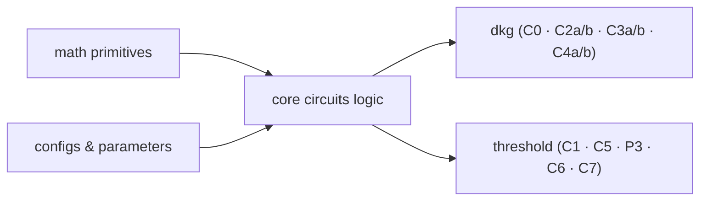

# Enclave ZK Library

Noir library shared by all circuits in the Enclave protocol. It provides the mathematical
primitives, cryptographic circuit logic, and parameter configurations that the binary circuits
(`circuits/bin/`) compose and instantiate.

```text
lib/src/
├── math/       — polynomial arithmetic, hashing, modular arithmetic
├── core/       — circuit logic for DKG and threshold protocols
└── configs/    — cryptographic parameter presets
```



## math

Low-level building blocks used throughout all circuits.

### polynomial

Fixed-degree polynomial with `N` coefficients (degree `N-1`), stored in descending order
`[a_{N-1}, ..., a_0]`. Core operations:

| Method                               | Description                                               |
| ------------------------------------ | --------------------------------------------------------- |
| `eval(x)`                            | Evaluate at point `x` via Horner's method                 |
| `eval_mod(x, m)`                     | Evaluate with modular reduction to prevent field overflow |
| `add(other)` / `mul_scalar(c)`       | Coefficient-wise arithmetic                               |
| `range_check_2bounds::<BIT>(lo, hi)` | Constrain coefficients to `[-lo, hi]`                     |
| `range_check_standard::<BIT>(bound)` | Constrain coefficients to `[0, bound)`                    |

### safe

Full implementation of the [SAFE](https://hackmd.io/@7dpNYqjKQGeYC7wMlPxHtQ/ByIbpfX9c) sponge
framework on top of Poseidon2. Rate 3, capacity 1. Used for all commitment and challenge
computations, providing domain separation between circuit types.

### helpers

Utilities for preparing witness data for hashing:

| Function                              | Description                                             |
| ------------------------------------- | ------------------------------------------------------- |
| `flatten(inputs, polys)`              | Pack `L` polynomials into field carriers for the sponge |
| `pack(values, ...)`                   | Pack raw coefficient arrays with deterministic padding  |
| `compute_safe(inputs, n_squeeze, ds)` | One-shot absorb → squeeze → finish wrapper              |

### ModU128

Fully constrained modular arithmetic over `u128` values, used wherever field arithmetic alone is
insufficient (e.g. Lagrange reconstruction, Reed-Solomon parity checks).

| Method                    | Description                                    |
| ------------------------- | ---------------------------------------------- |
| `reduce_mod(v)`           | `v mod m`                                      |
| `mul_mod(a, b)`           | `a * b mod m`                                  |
| `div_mod(a, b)`           | `a * b⁻¹ mod m` — `b` must be coprime with `m` |
| `add(a, b)` / `sub(a, b)` | Modular add / sub with underflow handling      |

Unconstrained oracle helpers live in `modulo/unconstrained_U128.nr` and are called internally.

### commitments

Domain separators and typed wrappers over `SafeSponge`. Each circuit family has its own domain
separator constant (`DS_PK`, `DS_SHARE_ENCRYPTION`, `DS_CIPHERTEXT`, …) ensuring that commitments
produced by different circuits are never interchangeable. High-level functions:

| Function                                                    | Used by               |
| ----------------------------------------------------------- | --------------------- |
| `compute_dkg_pk_commitment()`                               | C0                    |
| `compute_threshold_pk_commitment()`                         | C1                    |
| `compute_share_computation_sk/e_sm_commitment()`            | C1 → C2a/b            |
| `compute_share_encryption_commitment_from_shares/message()` | C2 ↔ C3, C4          |
| `compute_aggregated_shares_commitment()`                    | C4 → C6               |
| `compute_threshold_pk/share_decryption_challenge()`         | Fiat-Shamir in C1, C6 |

## core

Circuit structs and verification logic. Each struct maps 1-to-1 to a binary circuit in
`circuits/bin/`. Circuits call `execute()` which returns commitments consumed by downstream
circuits.

### DKG

Circuits for the Distributed Key Generation phase (P1).

| File                   | Circuit   | Role                                                                |
| ---------------------- | --------- | ------------------------------------------------------------------- |
| `pk.nr`                | C0        | Commit to a ciphernode's BFV public key                             |
| `share_computation.nr` | C2a / C2b | Verify Shamir shares of `sk` / `e_sm` via Reed-Solomon parity check |
| `share_encryption.nr`  | C3a / C3b | Verify BFV encryption of each share for its recipient               |
| `share_decryption.nr`  | C4a / C4b | Verify share decryption and aggregate across honest parties         |

**C2 share matrix layout** — `y[coeff_idx][mod_idx][party_idx]`:

- `y[i][j][0]` — the secret itself (evaluation at 0), exempt from range checks (validated via C1
  commitment)
- `y[i][j][k]` for `k = 1..N_PARTIES` — shares distributed to each party, range-checked to
  `[0, q_j)`

### Threshold

Circuits for threshold key generation (P1/P2) and threshold decryption (P4), plus user data
encryption (P3).

| File                              | Circuit | Role                                                                        |
| --------------------------------- | ------- | --------------------------------------------------------------------------- |
| `pk_generation.nr`                | C1      | Prove correct BFV threshold key contribution + smudging noise generation    |
| `pk_aggregation.nr`               | C5      | Verify aggregation of honest parties' public key contributions              |
| `user_data_encryption_ct0/ct1.nr` | P3      | Prove correct BFV encryption of user data (GRECO)                           |
| `share_decryption.nr`             | C6      | Prove correct decryption share `d[l] = ct0[l] + ct1[l]·sk[l] + e_sm[l] + …` |
| `decrypted_shares_aggregation.nr` | C7      | Lagrange interpolation + CRT lift + BFV decode to recover plaintext         |

**C7 variants** — two implementations of the final decoding step:

| Struct                              | When to use                                          |
| ----------------------------------- | ---------------------------------------------------- |
| `DecryptedSharesAggregationBigNum`  | `Q` exceeds 128 bits — production parameter sets     |
| `DecryptedSharesAggregationModular` | `Q` fits in 128 bits — smaller / test parameter sets |

## configs

Cryptographic parameter presets. All binary circuits import from `configs::default`, which is the
single place to switch between parameter sets.

```text
configs/
├── default/mod.nr      ← change this to switch preset
├── committee/
│   └── small.nr        N_PARTIES = 5 · T = 2 · H = 5
├── insecure/
│   ├── dkg.nr          N = 512 · L = 1 · q = 2251799813554177
│   └── threshold.nr
└── secure/
    ├── dkg.nr          production-grade parameters
    └── threshold.nr
```

### Switching presets

Edit `configs/default/mod.nr`:

```rust
// switch to production parameters:
pub use super::secure::dkg;
pub use super::secure::threshold;
```

### Parameters

Each preset file defines bit-width constants and `Configs` struct instances for each circuit,
organised by circuit:

| Category            | Examples                                                                |
| ------------------- | ----------------------------------------------------------------------- |
| Polynomial degree   | `N`, `L`                                                                |
| CRT moduli          | `QIS: [Field; L]`                                                       |
| Plaintext modulus   | `PLAINTEXT_MODULUS`, `Q_MOD_T`, `Q_MOD_T_CENTERED`                      |
| Bit bounds          | `PK_BIT_PK`, `SHARE_COMPUTATION_BIT_SHARE`, `SHARE_ENCRYPTION_BIT_*`, … |
| Quotient bounds     | `R1_BOUNDS`, `R2_BOUNDS`, `P1_BOUNDS`, `P2_BOUNDS`                      |
| Reed-Solomon matrix | `PARITY_MATRIX: [[[Field; N_PARTIES+1]; N_PARTIES-T]; L]`               |
| Circuit configs     | `SHARE_COMPUTATION_SK_CONFIGS`, `SHARE_ENCRYPTION_CONFIGS`, …           |

The `MAX_MSG_NON_ZERO_COEFFS` is defined in `default/mod.nr` (currently `80`). Controls the maximum
number of non-zero coefficients in the plaintext polynomial accepted by C7. Shared across all
parameter presets.
