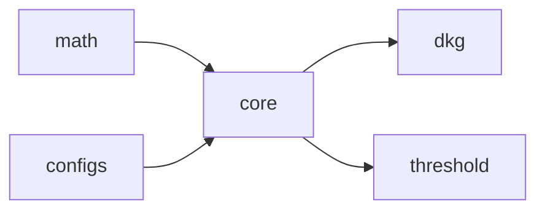

# Noir library (`circuits/lib/src/`)

Every Nargo package under `circuits/bin/` depends on this library containing the shared **PVSS /
BFV** constraint logic: polynomials, commitments, SAFE hashing, modular arithmetic, and the
`core/dkg` and `core/threshold` circuit bodies that binaries wrap.

For **which** binary package maps to **C0–C7** and **`CircuitName`**, see the
[**circuit package index**](../../README.md#circuit-package-index) in
[`circuits/README.md`](../../README.md); for protocol phases and the PV-TBFV picture, read
[Cryptography](https://docs.theinterfold.com/cryptography)
([`docs/pages/cryptography.mdx`](../../../docs/pages/cryptography.mdx)).

```text
lib/src/
├── math/       # polynomials, SAFE sponge, helpers, ModU128, commitments
├── core/       # dkg/ and threshold/ circuit structs (`execute()` entry points)
└── configs/    # BFV / CRT presets; wired via `configs::default` (see `default/mod.nr`)
```


```mermaid
flowchart LR
  math["math"] --> core["core"]
  configs["configs"] --> core
  core --> dkg["dkg"]
  core --> threshold["threshold"]
```

## math

| Area            | Contents                                                                                                                                                                             |
| --------------- | ------------------------------------------------------------------------------------------------------------------------------------------------------------------------------------ |
| **polynomial**  | Coefficients in descending order; `eval` / `eval_mod`, range checks                                                                                                                  |
| **safe**        | [SAFE](https://hackmd.io/@7dpNYqjKQGeYC7wMlPxHtQ/ByIbpfX9c) sponge in `safe.nr`: **Poseidon2** permutation + **Keccak256** as required by the construction; commitments & challenges |
| **helpers**     | `flatten`, `pack`, `compute_safe` for witness hashing                                                                                                                                |
| **modulo**      | `ModU128` constrained modular arithmetic                                                                                                                                             |
| **commitments** | Domain-separated `DS_*`; `compute_dkg_pk_commitment`, `compute_threshold_pk_commitment`, share encryption/computation helpers, etc.                                                  |

## core

| Module                                       | Circuits | Role                                       |
| -------------------------------------------- | -------- | ------------------------------------------ |
| `dkg/pk`                                     | C0       | Individual pk commitment                   |
| `dkg/share_computation/`                     | C2       | Base + chunk + parity; `execute()` layouts |
| `dkg/share_encryption`                       | C3       | Encrypt share under recipient pk           |
| `dkg/share_decryption`                       | C4       | Decrypt and aggregate                      |
| `threshold/pk_generation`                    | C1       | TrBFV contribution                         |
| `threshold/pk_aggregation`                   | C5       | Aggregate pk shares                        |
| `threshold/user_data_encryption_ct0` / `ct1` | P3       | User encryption legs                       |
| `threshold/share_decryption`                 | C6       | Threshold decryption share                 |
| `threshold/decrypted_shares_aggregation`     | C7       | Final plaintext                            |

## configs

Switch presets in `configs/default/mod.nr` (`pub use super::secure::dkg` / `threshold`). Each preset
defines `N`, `L`, `QIS`, bounds, `PARITY_MATRIX`, per-circuit `Configs`, and
`MAX_MSG_NON_ZERO_COEFFS` (C7 plaintext sparsity).

## Related documentation

| Topic                                          | Location                                                                                                       |
| ---------------------------------------------- | -------------------------------------------------------------------------------------------------------------- |
| Binary packages, `CircuitName`, build and test | [`circuits/README.md`](../../README.md)                                                                        |
| Phases, PV-TBFV, circuit identifiers           | [Cryptography](https://docs.theinterfold.com/cryptography) · [source](../../../docs/pages/cryptography.mdx)    |
| Toolchain, `enclave noir`, compile scripts     | [Noir Circuits](https://docs.theinterfold.com/noir-circuits) · [source](../../../docs/pages/noir-circuits.mdx) |
