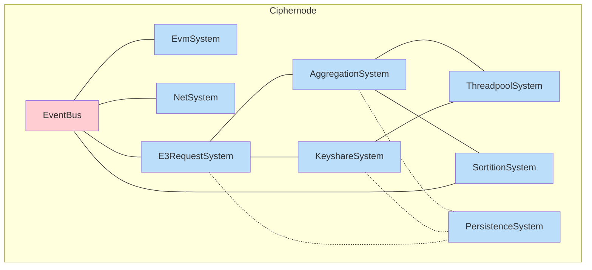

## `=this.file.name`

`=this.description`

## Ciphernode Map


<details>
<summary>Links</summary>

[[AggregationSystem]]
[[E3RequestSystem]]
[[EventBus]]
[[EvmSystem]]
[[KeyshareSystem]]
[[NetSystem]]
[[PersistenceSystem]]
[[SortitionSystem]]
[[ThreadpoolSystem]]
</details>

## Design

A ciphernode is designed as an event driven actor model system. Some key considerations around this design decision are listed below.

- [[The Actor Model]]
- [[Event Driven Architecture]]
- [[PersistenceSystem|On Persistence]]
- [[Data Security]]

## Bootstrap

When you run `enclave start`, the CLI establishes an actor configuration based on your requirements. For a concrete implementation example, [see the start configuration](https://github.com/gnosisguild/enclave/blob/main/crates/entrypoint/src/start/start.rs)

This process instantiates several key components:

- An [[EventBus]] for system-wide message coordination
- [[EvmSystem]] actors that handle blockchain connectivity
- [[NetSystem]] components for peer-to-peer network communication
- Core E3 business logic components essential for proper system operation

The configuration ensures all necessary subsystems are properly initialized and can communicate effectively within the enclave architecture.

### Systems

```dataview
TABLE description as Description
WHERE type = "system"
```

### Resources

- [[Actors]]
- [[Events]]
