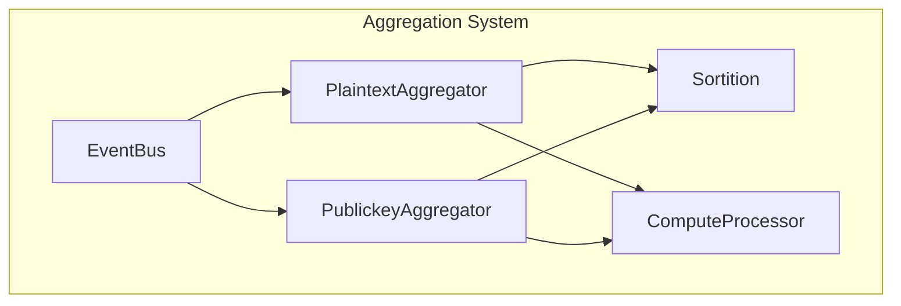

## `=this.file.name`

`=this.description`


<details>
<summary>Links</summary>

[[ComputeProcessor]]
[[EventBus]]
[[PlaintextAggregator]]
[[PublickeyAggregator]]
[[Sortition]]
</details>

```dataview
TABLE type, description as Description
FROM #aggregator
```
