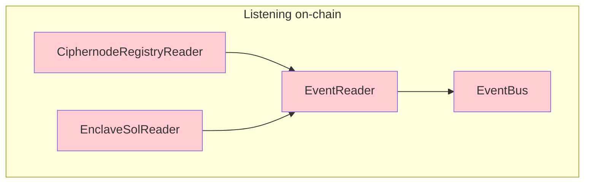
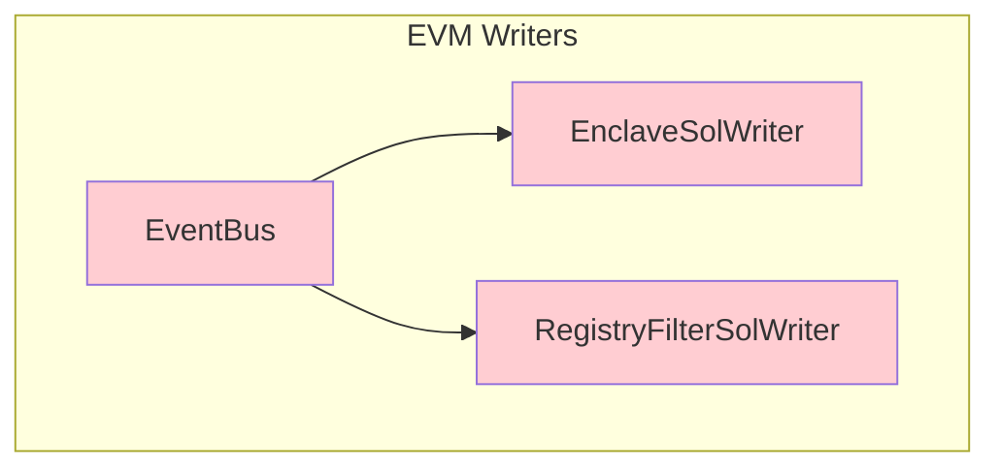

## `=this.file.name`

`=this.description`



```mermaid
flowchart TB
    subgraph evm["Listening on-chain"]
		EB["EventBus"]
        ESR["EnclaveSolReader"]
        ER["EventReader"]
        CRR["CiphernodeRegistryReader"]
    end
	CRR --> ER
	ESR --> ER
	ER --> EB
    
    ESR:::internal-link
    ER:::internal-link
    CRR:::internal-link
    EB:::internal-link
	style ESR fill:#FFCDD2
	style ER fill:#FFCDD2
	style CRR fill:#FFCDD2
	style EB fill:#FFCDD2

    click ESR "http://github.com/gnosisguild/enclave/tree/main/crates/evm/docs/EnclaveSolReader.md"
    click ER "http://github.com/gnosisguild/enclave/tree/main/crates/evm/docs/EventReader.md"
    click CRR "http://github.com/gnosisguild/enclave/tree/main/crates/evm/docs/CiphernodeRegistryReader.md"
    click EB "http://github.com/gnosisguild/enclave/tree/main/crates/events/docs/EventBus.md"
```


```mermaid
flowchart TB
    subgraph evm["EVM Writers"]
		EB["EventBus"]
		ESW["EnclaveSolWriter"]
        RFW["RegistryFilterSolWriter"]
    end

	EB --> ESW
	EB --> RFW
	
    ESW:::internal-link
    EB:::internal-link
	RFW:::internal-link
	style ESW fill:#FFCDD2
	style EB fill:#FFCDD2
	style RFW fill:#FFCDD2

    click ESW "http://github.com/gnosisguild/enclave/tree/main/crates/evm/docs/EnclaveSolWriter.md"
    click EB "http://github.com/gnosisguild/enclave/tree/main/crates/events/docs/EventBus.md"
    click RFW "http://github.com/gnosisguild/enclave/tree/main/crates/evm/docs/RegistryFilterSolWriter.md"
```

```dataview
TABLE type, description as Description
FROM #evm
```
