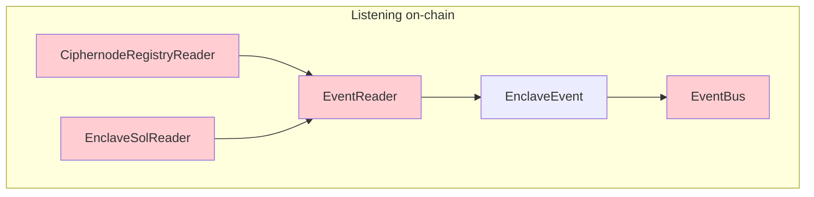
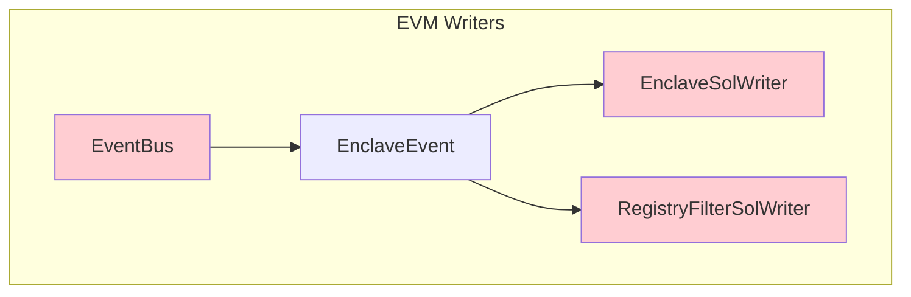

## `=this.file.name`

`=this.description`



<details>
<summary><i>Links</i></summary>

[[CiphernodeRegistryReader]]
[[EnclaveEvent]]
[[EnclaveSolReader]]
[[EventBus]]
[[EventReader]]
</details>
<details>
<summary><i>Links</i></summary>

[[CiphernodeRegistryReader]]
[[EnclaveSolReader]]
[[EventBus]]
[[EventReader]]
</details>


<details>
<summary><i>Links</i></summary>

[[EnclaveEvent]]
[[EnclaveSolWriter]]
[[EventBus]]
[[RegistryFilterSolWriter]]
</details>

```dataview
TABLE type, description as Description
FROM #evm
```
