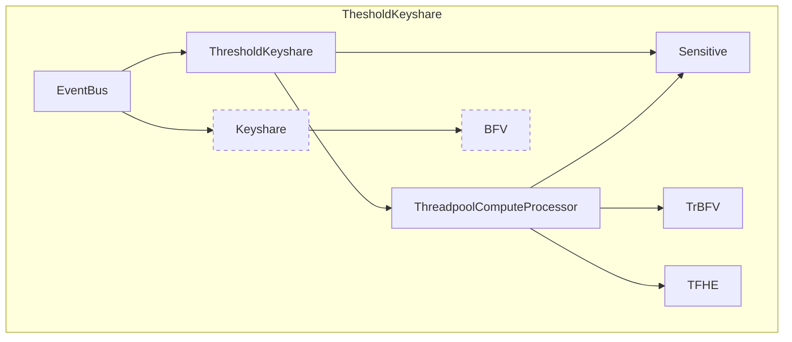

## `=this.file.name`

`=this.description`

_note: in the following diagram dotted components are deprecated_

Links

[[BFV]]
[[EventBus]]
[[Keyshare]]
[[Sensitive]]
[[TFHE]]
[[ThreadpoolComputeProcessor]]
[[ThresholdKeyshare]]
[[TrBFV]]

