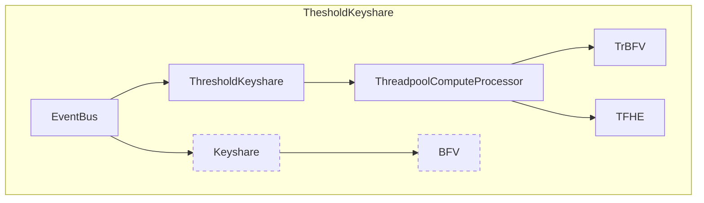

## `=this.file.name`

`=this.description`

```mermaid
flowchart TB
	subgraph subGraph0["ThesholdKeyshare"]
	    KS["ThresholdKeyshare"]
	    KSL["Keyshare"]
	    EB["EventBus"]
	    C["ThreadpoolComputeProcessor"]
	    TRB["TrBFV"]
	    TFHE["TFHE"]
	    BFV["BFV"]
	end
    EB --> KS & KSL
    KS --> C
    KSL --> BFV
    C --> TRB
	C --> TFHE
		
	KS:::internal-link
	KSL:::internal-link
	EB:::internal-link
	C:::internal-link
	TRB:::internal-link
	TFHE:::internal-link
	BFV:::internal-link
	
    style KSL stroke-width:1px,stroke-dasharray: 5
    style BFV stroke-width:1px,stroke-dasharray: 5

    click KS "http://github.com/gnosisguild/enclave/tree/main/crates/keyshare/docs/ThresholdKeyshare.md"
    click KSL "http://github.com/gnosisguild/enclave/tree/main/crates/keyshare/docs/Keyshare.md"
    click EB "http://github.com/gnosisguild/enclave/tree/main/crates/events/docs/EventBus.md"
    click C "http://github.com/gnosisguild/enclave/tree/main/crates/threadpool/docs/ThreadpoolComputeProcessor.md"
    click TRB "http://github.com/gnosisguild/enclave/tree/main/crates/fhe/docs/TrBFV.md"
    click TFHE "http://github.com/gnosisguild/enclave/tree/main/crates/fhe/docs/TFHE.md"
    click BFV "http://github.com/gnosisguild/enclave/tree/main/crates/fhe/docs/Bfv.md"
```

Links

[[BFV]]
[[EventBus]]
[[Keyshare]]
[[TFHE]]
[[ThreadpoolComputeProcessor]]
[[ThresholdKeyshare]]
[[TrBFV]]

