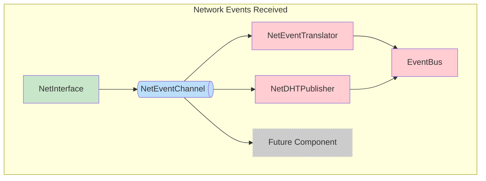
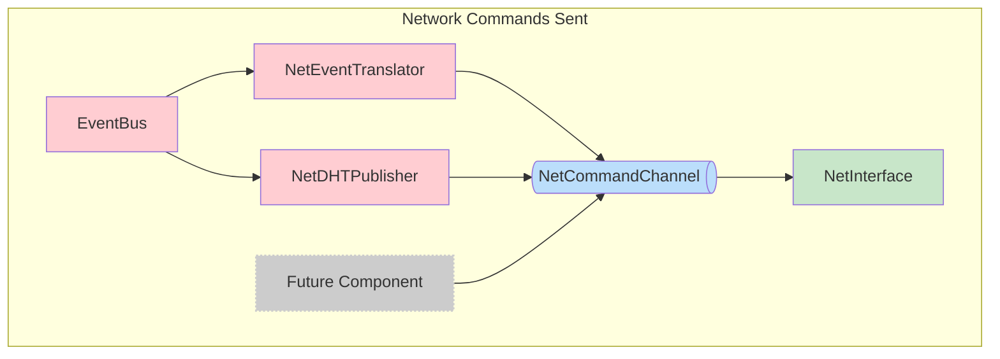

## `=this.file.name`

`=this.description`


Here we separate command and query according to the principle of [CQRS](https://cqrs.wordpress.com/wp-content/uploads/2010/11/cqrs_documents.pdf): 




This we can easily extend to a future networking component by listening to the [[EventBus]] and sending to the [[NetCommandChannel]] or reading from the [[NetEventChannel]] and publishing to the [[EventBus]]

```dataview
TABLE type, description as Description
FROM #net
```
### Benefits

- Extensive: Can use channels to control the network interface from multiple actors.
- Separates Domain Logic (EventBus) from lower level implementation (Net System)
- [[NetInterface]] should remain a dumb component that exposes libp2p functionality and can be called using channel commands.