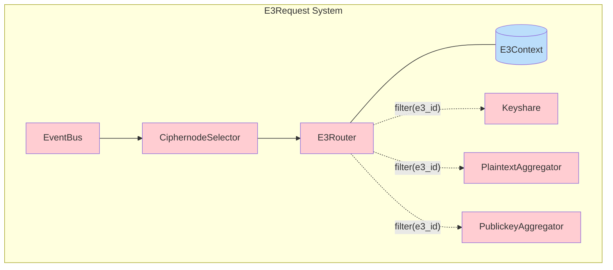

<details>
<summary><i>Links</i></summary>

[[CiphernodeSelector]]
[[E3Context]]
[[E3Router]]
[[EventBus]]
[[Keyshare]]
[[PlaintextAggregator]]
[[PublickeyAggregator]]
</details>
<details>
<summary><i>Links</i></summary>

[[CiphernodeSelector]]
[[E3Context]]
[[E3Router]]
[[EventBus]]
[[Keyshare]]
[[PlaintextAggregator]]
[[PublickeyAggregator]]
</details>

```dataview
TABLE type, description as Description
FROM #e3request
```
