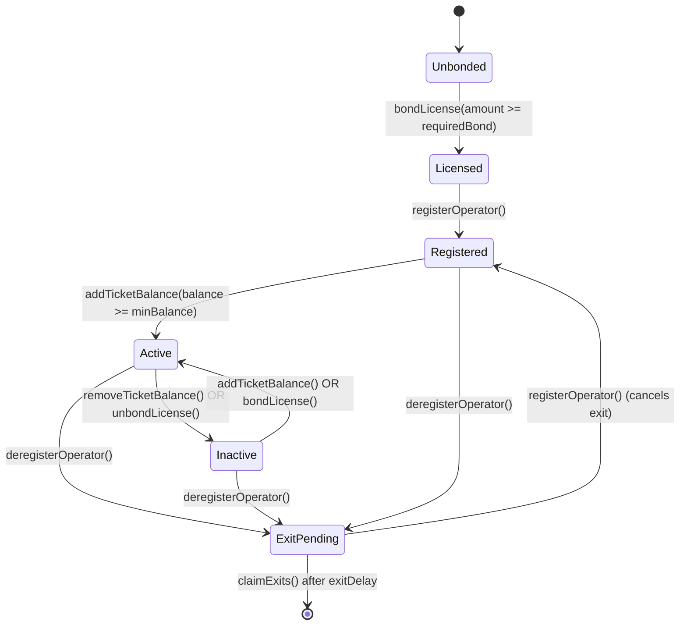
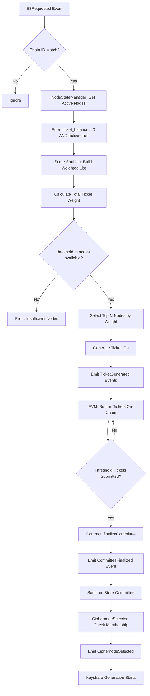
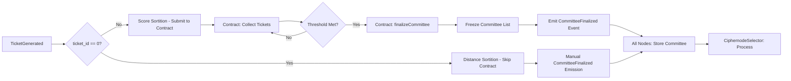

# Sortition and E3 Complete Flow

This document describes the complete flow of the Enclave system, from operator registration through E3 computation request, sortition, committee selection, keyshare generation, public key aggregation, encryption, and decryption.

## Overview

The Enclave system uses a score-based sortition mechanism to select a committee of ciphernodes to perform threshold homomorphic encryption operations. The flow involves:

1. **Operator Setup** - Bonding license tokens and ticket balance
2. **Registration** - Registering as a ciphernode operator
3. **E3 Request** - A computation request triggers sortition
4. **Score Sortition** - Nodes are selected based on ticket balances
5. **Committee Finalization** - Selected nodes form a committee
6. **Keyshare Generation** - Committee nodes generate threshold keyshares
7. **Public Key Aggregation** - Keyshares are aggregated into a public key
8. **Encryption & Decryption** - Data is encrypted and threshold-decrypted

## Complete System Flow

```mermaid
sequenceDiagram
    participant Operator
    participant BondingRegistry
    participant CiphernodeRegistry
    participant EventBus
    participant NodeStateManager
    participant Sortition
    participant CiphernodeSelector
    participant Keyshare
    participant PublicKeyAggregator
    participant PlaintextAggregator

    Note over Operator,BondingRegistry: Phase 1: Operator Setup & Registration

    Operator->>BondingRegistry: bondLicense(amount)
    BondingRegistry->>BondingRegistry: Transfer ENCL tokens
    BondingRegistry->>EventBus: LicenseBondUpdated

    Operator->>BondingRegistry: registerOperator()
    BondingRegistry->>BondingRegistry: Check isLicensed()
    BondingRegistry->>CiphernodeRegistry: addCiphernode(operator)
    CiphernodeRegistry->>EventBus: CiphernodeAdded(operator, index, numNodes, chainId)
    EventBus->>NodeStateManager: CiphernodeAdded
    NodeStateManager->>NodeStateManager: Register operator in nodes HashMap

    Operator->>BondingRegistry: addTicketBalance(amount)
    BondingRegistry->>BondingRegistry: Mint ticket tokens
    BondingRegistry->>EventBus: TicketBalanceUpdated(operator, delta, newBalance, chainId)
    EventBus->>NodeStateManager: TicketBalanceUpdated
    NodeStateManager->>NodeStateManager: Update operator ticket balance

    BondingRegistry->>BondingRegistry: Check if balance >= minTicketBalance
    BondingRegistry->>EventBus: OperatorActivationChanged(operator, active=true, chainId)
    EventBus->>NodeStateManager: OperatorActivationChanged
    NodeStateManager->>NodeStateManager: Set operator active status

    Note over Operator,PlaintextAggregator: Phase 2: E3 Request & Sortition

    Operator->>EventBus: E3Requested(e3Id, thresholdM, thresholdN, seed, params, chainId)
    EventBus->>Sortition: E3Requested
    Sortition->>NodeStateManager: GetNodeState(chainId)
    NodeStateManager-->>Sortition: NodeStateStore { nodes, ticketPrice }
    Sortition->>Sortition: Build sortition list from active nodes
    Sortition->>Sortition: Run score sortition algorithm
    Sortition->>Sortition: Generate tickets for selected nodes

    loop For each selected node
        Sortition->>EventBus: TicketGenerated(e3Id, node, ticketId, chainId)
    end

    Note over CiphernodeRegistry,EventBus: Phase 3: On-Chain Ticket Submission

    EventBus->>CiphernodeRegistry: TicketGenerated (if ticketId != 0)
    CiphernodeRegistry->>CiphernodeRegistry: Submit ticket to contract
    CiphernodeRegistry->>CiphernodeRegistry: Wait for threshold tickets
    CiphernodeRegistry->>CiphernodeRegistry: Call finalizeCommittee()
    CiphernodeRegistry->>EventBus: CommitteeFinalized(e3Id, committee[], chainId)

    Note over EventBus,Sortition: Phase 4: Committee Storage

    EventBus->>Sortition: CommitteeFinalized
    Sortition->>Sortition: Store committee in finalized_committees HashMap
    Sortition->>Sortition: Persist to disk

    Note over EventBus,CiphernodeSelector: Phase 5: Node Selection

    EventBus->>CiphernodeSelector: CommitteeFinalized
    CiphernodeSelector->>CiphernodeSelector: Check if node address in committee
    alt Node is in committee
        CiphernodeSelector->>EventBus: CiphernodeSelected(e3Id, node, chainId)
    end

    Note over EventBus,Keyshare: Phase 6: Keyshare Generation

    EventBus->>Keyshare: CiphernodeSelected
    Keyshare->>Keyshare: fhe.generate_keyshare()
    Keyshare->>Keyshare: Generate secret key (random)
    Keyshare->>Keyshare: Generate public key share (sk + CRP)
    Keyshare->>Keyshare: Persist secret key
    Keyshare->>EventBus: KeyshareCreated(e3Id, node, pubkey, chainId)

    Note over EventBus,PublicKeyAggregator: Phase 7: Public Key Aggregation

    EventBus->>PublicKeyAggregator: KeyshareCreated
    PublicKeyAggregator->>Sortition: GetNodesForE3(e3Id, chainId)
    Sortition-->>PublicKeyAggregator: committee[]
    PublicKeyAggregator->>PublicKeyAggregator: Verify node in committee
    PublicKeyAggregator->>PublicKeyAggregator: Add keyshare to OrderedSet

    alt Threshold reached (all keyshares collected)
        PublicKeyAggregator->>PublicKeyAggregator: fhe.get_aggregate_public_key(keyshares)
        PublicKeyAggregator->>PublicKeyAggregator: Aggregate public key shares
        PublicKeyAggregator->>EventBus: PublicKeyAggregated(e3Id, pubkey, nodes, chainId)
        PublicKeyAggregator->>CiphernodeRegistry: publishPublicKey(e3Id, pubkey, nodes)
    end

    Note over Operator,PlaintextAggregator: Phase 8: Encryption & Computation

    Operator->>Operator: Encrypt input data with aggregated pubkey
    Operator->>EventBus: CiphertextOutputPublished(e3Id, ciphertext, chainId)

    Note over EventBus,PlaintextAggregator: Phase 9: Threshold Decryption

    EventBus->>Keyshare: CiphertextOutputPublished
    Keyshare->>Keyshare: Load secret key from storage
    Keyshare->>Keyshare: fhe.decrypt_ciphertext(secret, ciphertext)
    Keyshare->>Keyshare: Generate decryption share
    Keyshare->>EventBus: DecryptionshareCreated(e3Id, node, decryptionShare, chainId)

    EventBus->>PlaintextAggregator: DecryptionshareCreated
    PlaintextAggregator->>Sortition: GetNodesForE3(e3Id, chainId)
    Sortition-->>PlaintextAggregator: committee[]
    PlaintextAggregator->>PlaintextAggregator: Verify node in committee
    PlaintextAggregator->>PlaintextAggregator: Add decryption share to OrderedSet

    alt Threshold reached (all shares collected)
        PlaintextAggregator->>PlaintextAggregator: fhe.get_aggregate_plaintext(shares, ciphertext)
        PlaintextAggregator->>PlaintextAggregator: Aggregate decryption shares
        PlaintextAggregator->>PlaintextAggregator: Decode plaintext
        PlaintextAggregator->>EventBus: PlaintextAggregated(e3Id, plaintext, nodes, chainId)
    end
```

## State Diagram: Node Lifecycle

## Sortition Data Flow

## Committee Finalization Flow

## Key Concepts

### 1. Score Sortition

- **Purpose**: Select committee based on ticket balance (stake-weighted)
- **Algorithm**:
  - Build list of eligible nodes (active + ticket_balance > 0)
  - Calculate weight for each node based on ticket balance
  - Select top `threshold_n` nodes by weight
  - Generate unique ticket IDs for selected nodes
- **On-Chain Integration**: Tickets submitted to contract for verification
- **Committee Finalization**: Contract finalizes committee when threshold tickets received

### 2. Distance Sortition (Deprecated)

- **Purpose**: Select committee based on cryptographic distance
- **Status**: Deprecated - does not work with on-chain contracts
- **Indicator**: Uses `ticket_id = 0` to prevent contract submission

### 3. NodeStateManager

- **Purpose**: Track state of all registered ciphernodes
- **State Per Node**:
  - `ticket_balance`: Current ticket balance
  - `active`: Whether node is active (has min ticket balance)
  - `num_jobs`: Number of active E3 jobs
- **Persistence**: State survives node restarts
- **Events**:
  - `CiphernodeAdded` / `CiphernodeRemoved`
  - `TicketBalanceUpdated`
  - `OperatorActivationChanged`
  - `ConfigurationUpdated` (for ticketPrice)

### 4. Sortition Actor

- **Purpose**: Manage sortition algorithm and committee state
- **Persistent State**:
  - `list`: Current sortition list (backend-specific)
  - `finalized_committees`: HashMap of E3id → committee members
- **Messages**:
  - `GetNodesForE3`: Query committee members for an E3
  - `GetCommittee`: Query full sortition list
  - `GetNodeState`: Get current node state
- **Event Handlers**:
  - `E3Requested`: Trigger sortition
  - `CommitteeFinalized`: Store committee
  - `TicketBalanceUpdated`, `OperatorActivationChanged`, etc.

### 5. Committee Query Pattern

- **Old Approach**: Store committee in EVM contract, query from there
- **New Approach**: Query `Sortition` actor via `GetNodesForE3`
  - Benefits: Single source of truth, no EVM storage cost
  - Used by: `PublicKeyAggregator`, `PlaintextAggregator`
  - Validation: Ensures nodes are in finalized committee

### 6. Event Deduplication

- **Purpose**: Prevent processing same event multiple times
- **Mechanism**: EventBus with deduplication enabled
- **Hash-based**: Events with same content have same EventId
- **Important**: Allows safe event replay on restart

### 7. Historical Event Synchronization

- **Purpose**: Nodes can restart and catch up
- **Mechanism**: Fetch historical events from contracts on startup
- **Events**:
  - `CiphernodeAdded` / `CiphernodeRemoved`
  - `TicketBalanceUpdated`
  - `OperatorActivationChanged`
  - `ConfigurationUpdated`
  - `CommitteeFinalized`
- **Deduplication**: EventBus ignores already-seen events

### 8. Threshold Cryptography

- **Scheme**: BFV Threshold Homomorphic Encryption
- **Parameters**:
  - `threshold_m`: Minimum shares needed for decryption
  - `threshold_n`: Total committee size
- **Common Random Polynomial (CRP)**: Shared randomness from E3 seed
- **Keyshare Generation**:
  - Secret key: Random polynomial
  - Public key share: Secret key + CRP
- **Aggregation**: Combining shares into single public key / plaintext

### 9. Party IDs

- **Purpose**: Identify position in threshold scheme
- **Assignment**: Based on order in `CommitteeFinalized.committee` array
- **Range**: `0..threshold_n`
- **Critical**: Order must be consistent across all nodes
- **Used In**: Keyshare creation, decryption share verification

### 10. OrderedSet

- **Purpose**: Maintain insertion order for aggregation
- **Usage**:
  - Keyshares collected by `PublicKeyAggregator`
  - Decryption shares collected by `PlaintextAggregator`
- **Critical**: Order affects aggregation result
- **Implementation**: Preserves order in which shares arrive

## Event Reference

### Bonding Registry Events

| Event                       | Parameters                                   | Purpose                      |
| --------------------------- | -------------------------------------------- | ---------------------------- |
| `LicenseBondUpdated`        | operator, delta, newBalance, reason          | Track license token bonding  |
| `TicketBalanceUpdated`      | operator, delta, newBalance, reason, chainId | Track ticket balance changes |
| `OperatorActivationChanged` | operator, active, chainId                    | Node activation status       |
| `ConfigurationUpdated`      | parameter, oldValue, newValue                | System parameter changes     |

### Ciphernode Registry Events

| Event               | Parameters                        | Purpose           |
| ------------------- | --------------------------------- | ----------------- |
| `CiphernodeAdded`   | address, index, numNodes, chainId | Node registration |
| `CiphernodeRemoved` | address, index, numNodes, chainId | Node removal      |

### Enclave Events

| Event                       | Parameters                                          | Purpose               |
| --------------------------- | --------------------------------------------------- | --------------------- |
| `E3Requested`               | e3Id, thresholdM, thresholdN, seed, params, chainId | Computation request   |
| `TicketGenerated`           | e3Id, node, ticketId, chainId                       | Sortition ticket      |
| `CommitteeFinalized`        | e3Id, committee[], chainId                          | Committee selected    |
| `CiphernodeSelected`        | e3Id, node, chainId                                 | Node is in committee  |
| `KeyshareCreated`           | e3Id, node, pubkey, chainId                         | Keyshare generated    |
| `PublicKeyAggregated`       | e3Id, pubkey, nodes, chainId                        | Public key ready      |
| `CiphertextOutputPublished` | e3Id, ciphertext, chainId                           | Encrypted computation |
| `DecryptionshareCreated`    | e3Id, node, partyId, decryptionShare, chainId       | Decryption share      |
| `PlaintextAggregated`       | e3Id, plaintext, nodes, chainId                     | Decryption complete   |

## Testing Flow

The integration tests follow this pattern:

1. **Setup**: Create ciphernodes with shared event bus
2. **Register**: Use `setup_score_sortition_environment` to:
   - Set ticket price via `ConfigurationUpdated`
   - Add nodes via `CiphernodeAdded`
   - Give nodes tickets via `TicketBalanceUpdated`
   - Activate nodes via `OperatorActivationChanged`
3. **Request**: Send `E3Requested` event
4. **Finalize**: Send `CommitteeFinalized` event (manual in tests)
5. **Aggregate**: Wait for `PublicKeyAggregated` event
6. **Verify**: Check aggregated pubkey matches expected value

## Persistence

### What Gets Persisted?

- **NodeStateManager**: `nodes` HashMap (ticket balances, activation status)
- **Sortition**: `list` (backend-specific), `finalized_committees` HashMap
- **Keyshare**: Secret keys per E3

### Where?

- Default: In-memory (for tests)
- Production: RocksDB or other repository implementation
- Path: Configured via `RepositoriesFactory`

### Restart Behavior

1. Actor starts
2. Loads persisted state from repository
3. Subscribes to events
4. Processes new events
5. Event deduplication prevents re-processing old events

## Chain ID Handling

- **Purpose**: Support multiple chains simultaneously
- **Isolation**: Each chain has independent:
  - Node state
  - Committees
  - E3 processes
- **Validation**: All operations validate chain ID matches
- **Critical**: Prevents cross-chain confusion
