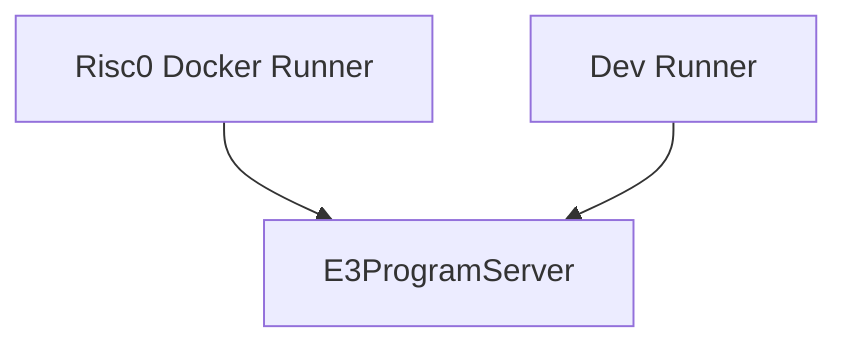

## `=this.file.name`

`=this.description`

```mermaid
flowchart TB
    RDR["Risc0 Docker Runner"]
    DR["Dev Runner"]
    PS["E3ProgramServer"]

    RDR --> PS
    DR --> PS

    RDR:::internal-link
    DR:::internal-link
    PS:::internal-link
```
