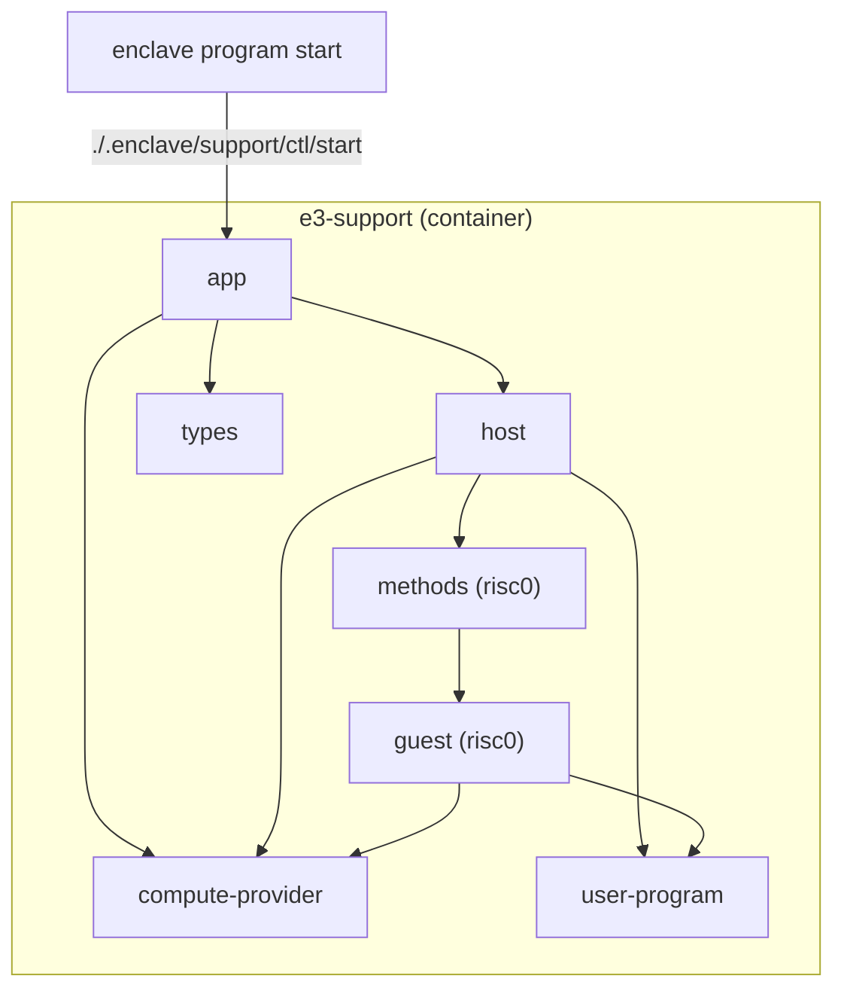

This is a project to build the support container to allow risc0 to be run within docker by `enclave program start`

The conatiner is built using the github workflow [here](../../.github/workflows/support-docker.yml)
You can also build it locally by using the `./scripts/build.sh` script.

To develop on this you should log into the container by running `./scripts/dev.sh` and then you can run `cargo build` with access to the risc0 environment.

NOTE: This is outside of the main workspace because it needs to be run within it's own context in order to isolate risc0.

NOTE: We are attempting to isolate risc0 - it is anticipated that we will have to use feature flags to tody this up so that we can compile more of the code and enable rust-analyzer to work outside of the risc0 environment for this project.
