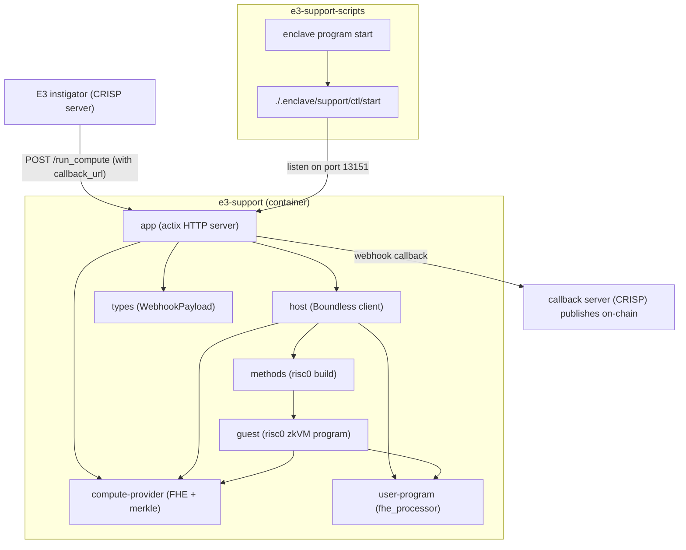

# E3 Support — RISC Zero + Boundless Compute Provider

Docker-based compute provider that runs FHE homomorphic computations and proves them via
[Boundless](https://boundless.network) (a decentralized ZK proving market). The container exposes an
HTTP API on port 13151 that receives encrypted ciphertexts, runs the FHE computation, submits a
proof request to Boundless, and sends the result back via webhook callback.


```mermaid
graph TD
    subgraph N["e3-support-scripts"]
        A["enclave program start"]
        AA["./.enclave/support/ctl/start"]
        A --> AA
    end
    M["E3 instigator (CRISP server)"] --"POST /run_compute (with callback_url)"--> D
    D --"webhook callback"--> O["callback server (CRISP) publishes on-chain"]
    AA --listen on port 13151--> D
    subgraph C["e3-support (container)"]
        D["app (actix HTTP server)"]
        E["host (Boundless client)"]
        F["types (WebhookPayload)"]
        G["compute-provider (FHE + merkle)"]
        H["methods (risc0 build)"]
        I["guest (risc0 zkVM program)"]
        J["user-program (fhe_processor)"]

        D --> E
        D --> F
        D --> G
        E --> H
        E --> G
        E --> J
        H --> I
        I --> G
        I --> J
    end
```

## Architecture

- **`app/`** — Actix HTTP server (`e3-support-app` binary). Exposes `/run_compute` (POST) and
  `/health` (GET/HEAD).
- **`host/`** — Boundless SDK integration. Builds the client, submits proof requests, waits for
  fulfillment.
- **`types/`** — Shared types: `ComputeRequest` (what the server receives) and `WebhookPayload`
  (tagged enum sent back).
- **`methods/`** — RISC Zero build crate. Compiles the guest program.
- **`guest/`** — The RISC Zero zkVM guest program. Runs `fhe_processor` (homomorphic ciphertext
  summation) and commits the `ComputeResult`.
- **`program/`** — The FHE processor (`fhe_processor`): sums BFV ciphertexts homomorphically.

## Webhook Payload Format

The callback server receives a tagged-enum JSON payload:

**Success:**

```json
{ "status": "completed", "e3_id": 123, "ciphertext": "0x...", "proof": "0x..." }
```

**Failure:**

```json
{ "status": "failed", "e3_id": 123, "error": "Computation failed: ..." }
```

This matches the format expected by CRISP and `E3ProgramServer` in `crates/program-server`.

---

## Full E3 Flow — Step by Step

### Prerequisites

1. **RISC Zero toolchain** — `rzup install`
2. **Docker** — for the support container
3. **Pinata account** — for IPFS program uploads (get a JWT at https://pinata.cloud)
4. **Boundless wallet** — an Ethereum private key with ETH (for gas) and ZKC (for collateral) on the
   Boundless-supported chain
5. **Enclave CLI** — `cargo install --locked --path ./crates/cli --bin enclave -f`

### Step 1: Configure `enclave.config.yaml`

```yaml
program:
  dev: false
  risc0:
    risc0_dev_mode: 0 # 0 = production (Boundless), 1 = dev (fake proofs)
    boundless:
      rpc_url: 'https://sepolia.base.org' # or your RPC URL
      private_key: '${PRIVATE_KEY}' # use env var for secrets!
      pinata_jwt: '${PINATA_JWT}'
      program_url: 'https://gateway.pinata.cloud/ipfs/Qm...' # after upload (Step 3)
      onchain: true
      # Optional — custom auction params (defaults shown):
      # min_price_eth: 0.001
      # max_price_eth: 0.03
      # timeout_secs: 1200
      # lock_timeout_secs: 600
      # ramp_up_secs: 120
      # lock_collateral_zkc: 5.0
```

### Step 2: Compile the RISC Zero Guest Program

```bash
enclave program compile
```

This builds the guest ELF binary inside the Docker container. Output goes to
`./target/riscv-guest/methods/guests/riscv32im-risc0-zkvm-elf/release/program.bin`.

### Step 3: Upload Program to IPFS (Pinata)

```bash
enclave program upload
```

This uploads the compiled guest ELF to Pinata IPFS and caches the resulting URL at
`./target/.program_url`. Copy this URL into your `enclave.config.yaml` as
`program.risc0.boundless.program_url` to avoid re-uploading the program at runtime.

### Step 4: Deploy Enclave Contracts + Start Ciphernodes

```bash
# Deploy contracts to local Hardhat / testnet
pnpm evm:deploy

# Start the ciphernode network
enclave start
```

This boots the ciphernodes, which listen for E3 requests, perform DKG, and await ciphertext outputs.

### Step 5: Start the Program Server (Boundless-backed)

```bash
enclave program start
```

This starts the Docker container running `e3-support-app` on port 13151. If Boundless config is
present, it will submit proofs to the Boundless market. Otherwise it falls back to dev mode.

### Step 6: Submit an E3 Request

The E3 request is submitted on-chain by the instigator (e.g., CRISP coordination server):

```solidity
// On-chain: Enclave.request(params)
enclave.request(E3RequestParams({
    threshold: [M, N],
    inputWindow: [start, end],
    e3Program: crispProgramAddress,
    e3ProgramParams: encodedParams,
    computeProviderParams: "",
    customParams: ""
}));
```

This triggers:

1. Fee payment (1 USDC)
2. Committee selection via sortition
3. DKG (C0-C5 proofs) → committee public key published on-chain
4. Stage → `KeyPublished`

### Step 7: Encrypt Inputs & Submit to Compute Provider

The instigator encrypts data under the committee's aggregate public key, then POSTs to the program
server:

```bash
curl -X POST http://localhost:13151/run_compute \
  -H "Content-Type: application/json" \
  -d '{
    "e3_id": 1,
    "params": "0x...",
    "ciphertext_inputs": [["0x...", 0], ["0x...", 1]],
    "callback_url": "http://host.local:4000/state/add-result"
  }'
```

The program server:

1. Returns `{"status":"processing","e3_id":1}` immediately
2. Runs FHE computation (homomorphic sum) locally → ciphertext output
3. Submits proof request to Boundless market
4. Waits for a prover to fulfill the request
5. Sends webhook callback with
   `{"status":"completed","e3_id":1,"ciphertext":"0x...","proof":"0x..."}`

### Step 8: Webhook Handler Publishes On-Chain

The callback server (e.g., CRISP) receives the webhook and calls:

```solidity
enclave.publishCiphertextOutput(e3Id, ciphertextOutput, proof);
```

This transitions the E3 stage to `CiphertextReady`.

### Step 9: Decryption & Completion

The ciphernodes detect `CiphertextReady`, produce decryption shares (C6 proofs), the active
aggregator combines them (C7 proof), and publishes the plaintext on-chain. Stage → `Complete`,
rewards distributed.

---

## Boundless Offer Parameters

All parameters are configurable via environment variables (or `enclave.config.yaml`). Defaults:

| Parameter    | Env Var                         | Default   | Description                  |
| ------------ | ------------------------------- | --------- | ---------------------------- |
| Min price    | `BOUNDLESS_MIN_PRICE_ETH`       | `0.00005` | Starting price in ETH        |
| Max price    | `BOUNDLESS_MAX_PRICE_ETH`       | `0.002`   | Maximum price in ETH         |
| Timeout      | `BOUNDLESS_TIMEOUT_SECS`        | `600`     | Total request lifetime (sec) |
| Lock timeout | `BOUNDLESS_LOCK_TIMEOUT_SECS`   | `300`     | Prover lock duration (sec)   |
| Ramp-up      | `BOUNDLESS_RAMP_UP_SECS`        | `60`      | Price ramp-up period (sec)   |
| Collateral   | `BOUNDLESS_LOCK_COLLATERAL_ZKC` | `2.0`     | ZKC locked per request       |

These can also be set in `enclave.config.yaml` under `program.risc0.boundless`:

```yaml
boundless:
  min_price_eth: 0.002
  max_price_eth: 0.05
  timeout_secs: 1800
  # ...
```

---

## Building the Container

```bash
# Local build
./scripts/build.sh

# With push to registry
./scripts/build.sh --push
```

The container is also built by the GitHub workflow at `.github/workflows/support-docker.yml`.

## Development

To develop inside the container (with RISC Zero toolchain available):

```bash
./scripts/dev.sh
```

Inside the container:

```bash
cargo build --locked
cargo run --bin e3-support-app
```

## Testing

```bash
# Test the HTTP endpoint with a fixture payload
./curl_test.sh
```

NOTE: This is outside of the main workspace because it needs to be run within its own context in
order to isolate risc0.

NOTE: We are attempting to isolate risc0 - it is anticipated that we will have to use feature flags
to tidy this up so that we can compile more of the code and enable rust-analyzer to work outside of
the risc0 environment for this project.

**NOTE: currently this is an open relay which is a known issue**
