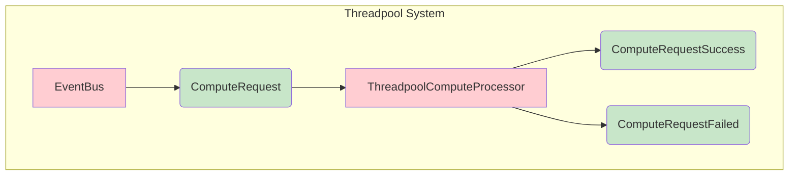

## `=this.file.name`

`=this.description`


<details>
<summary>Links</summary>

[[ComputeRequestFailed]]
[[ComputeRequestSuccess]]
[[ComputeRequest]]
[[EventBus]]
[[ThreadpoolComputeProcessor]]
</details>

```dataview
TABLE type, description as Description
FROM #compute
```
