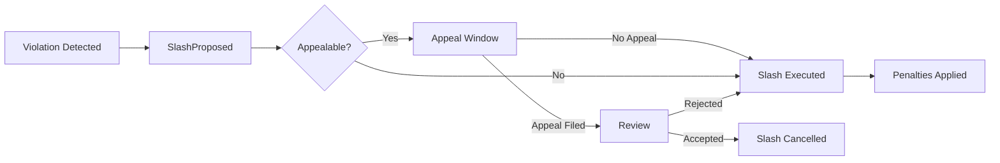

# Exits, Rewards & Slashing

This guide covers the end-of-lifecycle operations: collecting rewards, handling slashing proposals,
and safely exiting the registry.

## Rewards

Rewards are distributed through `BondingRegistry.distributeRewards` after successful E3 completions.

### How Rewards Work

1. E3 completes successfully with plaintext output published
2. Reward distributor calls `distributeRewards` with the reward token
3. Committee members receive payouts based on participation
4. `RewardsDistributed` event is emitted

### Monitoring Rewards

Watch for reward events and ensure your wallet can receive the reward token:

```bash
# Check your status including any pending rewards
enclave ciphernode status
```

> Keep your operator wallet funded with ETH for gas - claiming rewards through automation scripts
> still requires transaction fees.

## Slashing

Slashing penalizes operators who miss duties or behave maliciously. The `SlashingManager` contract
handles proposals, appeals, and execution.

### Slashing Lifecycle



### Slash Policy Structure

Each slash reason has an associated policy:

```solidity
struct SlashPolicy {
  uint256 ticketPenalty; // Tickets to burn
  uint256 licensePenalty; // ENCL to confiscate
  bool requiresProof; // Whether evidence is needed
  uint64 appealWindow; // Time to file appeal
  bool appealable; // Whether appeals are allowed
}
```

### Responding to Slashing

1. **Monitor for proposals**: Watch `SlashProposed` events targeting your address
2. **Review the policy**: Check if appeals are allowed and the window duration
3. **File appeal if applicable**:
   ```bash
   # Using cast (or implement in automation)
   cast send $SLASHING "fileAppeal(uint256,string,string)" $E3_ID "reason" "evidence_uri" \
     --rpc-url $RPC --private-key $OPERATOR_KEY
   ```
4. **Track resolution**: Watch for finalization events

### Slashing Penalties

| Penalty Type    | Effect                                           |
| --------------- | ------------------------------------------------ |
| Ticket penalty  | Burns ETK from your balance                      |
| License penalty | Confiscates ENCL from your bond                  |
| Ban             | Prevents re-registration until governance clears |

> Some policies skip the appeal process entirely. Always check the policy before assuming you can
> appeal.

## Exit Process

To safely exit the ciphernode registry:

### Step 1: Deregister

Request deregistration with your IMT proof siblings:

```bash
enclave ciphernode deregister --proof 0x123...,0x456...,0x789...
```

> Save your sibling proof from the `CiphernodeAdded` event when you first register. You'll need it
> to deregister.

### Step 2: Wait for Exit Delay

Assets enter a queue with a delay period (7 days on Sepolia):

| Asset   | Behavior                              |
| ------- | ------------------------------------- |
| Tickets | Burned immediately, USDC enters queue |
| License | ENCL enters exit queue                |

Check your exit status:

```bash
enclave ciphernode status
```

Look for "Exit pending" and "Pending exits" fields.

### Step 3: Claim Exits

After the delay period:

```bash
# Claim all pending exits
enclave ciphernode license claim

# Or specify maximum amounts
enclave ciphernode license claim --max-ticket 100 --max-license 50
```

### Cancel Exit

To cancel an exit and return to active status:

```bash
enclave ciphernode register
```

This clears the exit queue and re-registers you in the registry.

## CLI Commands Summary

| Command                                   | Description                        |
| ----------------------------------------- | ---------------------------------- |
| `enclave ciphernode status`               | Check registration and exit status |
| `enclave ciphernode deregister --proof X` | Start exit process                 |
| `enclave ciphernode license claim`        | Claim unlocked exits               |
| `enclave ciphernode register`             | Cancel exit and re-register        |
| `enclave ciphernode deactivate`           | Withdraw stakes to become inactive |

## Monitoring Checklist

| Check                 | Command / Event                             |
| --------------------- | ------------------------------------------- |
| Exit queue status     | `enclave ciphernode status`                 |
| Pending exits amounts | `pendingExits(address)` on BondingRegistry  |
| Exit unlock time      | `exitUnlocksAt(address)` on BondingRegistry |
| Slash proposals       | Watch `SlashProposed` events                |
| Rewards distribution  | Watch `RewardsDistributed` events           |

## Troubleshooting

| Issue                       | Cause                                | Solution                             |
| --------------------------- | ------------------------------------ | ------------------------------------ |
| `ExitNotReady` on claim     | Exit delay hasn't passed             | Wait until `exitUnlocksAt` timestamp |
| Appeal rejected immediately | Policy doesn't allow appeals         | Check `SlashPolicy.appealable`       |
| `isActive` suddenly false   | Slashing reduced stake below minimum | Add more tickets or license bond     |
| Missed reward payouts       | Deregistered or banned during E3     | Re-register before next request      |

## Post-Exit Cleanup

After successfully claiming exits:

1. **Wipe local secrets**:

   ```bash
   enclave purge-all
   ```

2. **Revoke access**:
   - RPC credentials
   - Firewall rules
   - Any automation keys

3. **Document for compliance**:
   - Exit timestamp
   - Final balances
   - Reason for exit

## Slashing Prevention

To minimize slashing risk:

1. **Stay online during active E3s** - Check for ongoing jobs before maintenance
2. **Monitor events** - Alert on `SlashProposed` targeting your address
3. **Archive logs** - You'll need evidence for appeals
4. **Verify `isActive` after changes** - Any stake modification could deactivate you

## Summary

| Phase          | Key Actions                                 |
| -------------- | ------------------------------------------- |
| **Active**     | Monitor rewards, watch for slash proposals  |
| **Slashing**   | Review policy, file appeal if allowed, wait |
| **Exit Start** | Call deregister with proof                  |
| **Exit Wait**  | Wait 7 days (check `exitUnlocksAt`)         |
| **Exit Claim** | Claim tickets and license                   |
| **Post-Exit**  | Purge secrets, revoke access, document      |
