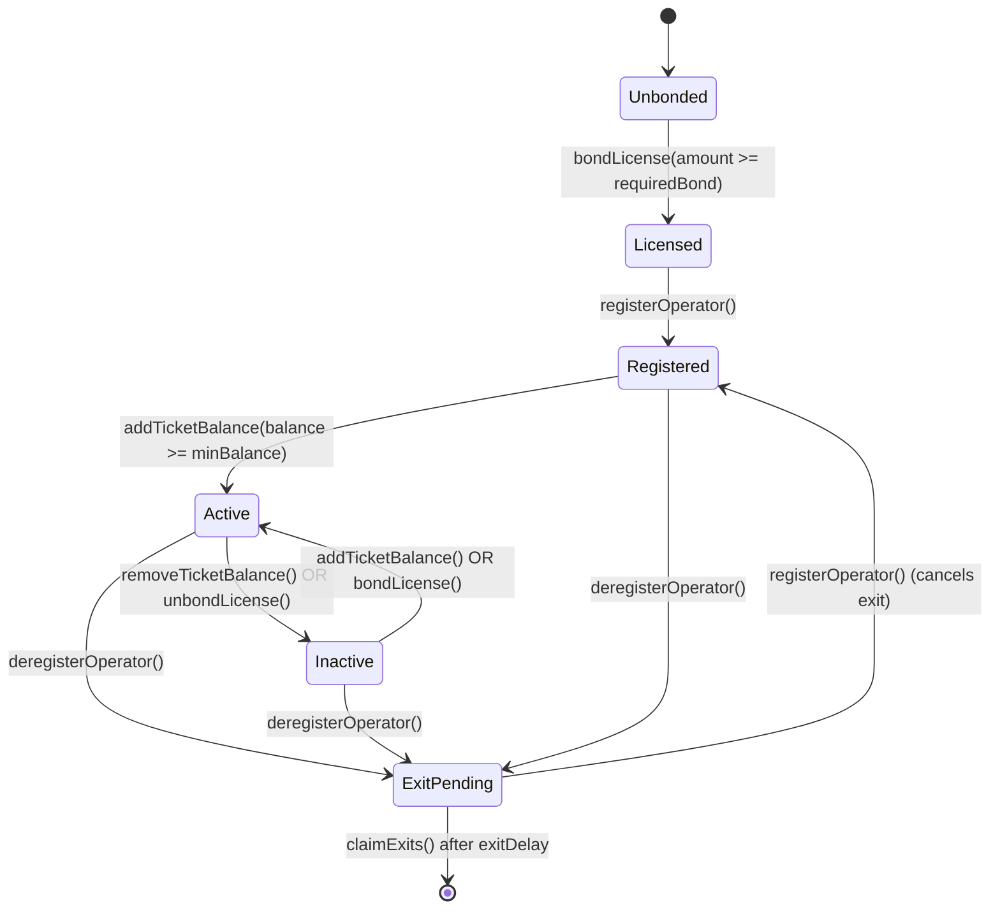

# Ciphernode Operators

Ciphernodes decrypt committee outputs, publish threshold key shares, and keep the Enclave request
pipeline moving. This section organizes everything operators need—from bonding requirements to exit
procedures—into focused guides.

## Responsibilities at a glance

Operators are expected to cover four concurrent tracks:

- **Key management**: generate PVSS shares, keep private key material encrypted at rest, and publish
  committee public keys once the threshold is met.
- **Decryption work**: watch for ciphertext outputs, craft decryption shares, and ensure plaintext
  gets relayed on-chain.
- **Network availability**: run a QUIC/libp2p endpoint that stays reachable, stay synced to the
  event bus, and keep RPC endpoints redundant.
- **Operational hygiene**: rotate secrets, snapshot configs, monitor sortition + job logs, and react
  to slashing proposals or bans quickly.

## Role overview

Operators are expected to:

- Maintain a QUIC/libp2p endpoint that stays reachable 24/7
- Bond license collateral (ENCL) and hold ticket balances (ETK) to remain eligible for committees
- Stay synced with the event bus so sortition submissions and key shares happen on time
- Produce decryption shares for every E3 assigned to their committee
- Monitor slashing proposals, appeals, and rewards distribution

Each node profile in `enclave.config.yaml` can point to a different network (mainnet, testnet, or
local dev). The CLI supervises all configured chains concurrently.

## Why operate a Ciphernode?

- **Rewards & upside**: committee participation and steady uptime translate to ERC20 payouts through
  `distributeRewards`.
- **Governance voice**: active operators are closest to the protocol and shape roadmap + policy
  discussions.
- **Visibility**: infra partners highlight high-performing nodes in working group updates and future
  customer routes.

Balance rewards against the capital tied up in ENCL bonds and ETK tickets plus infra costs. The
Scenarios page includes quick ROI checklists.

## Contract references

| Contract                 | Sepolia address                              | Notes                             |
| ------------------------ | -------------------------------------------- | --------------------------------- |
| Enclave                  | `0x1E8BD97F15Cd94f250a4dd567d2fd2114303FAa6` | Core coordinator                  |
| CiphernodeRegistry       | `0x11F647479bEd47cd0dd10276DDc04F2d4B20b1C7` | Handles registration + committees |
| BondingRegistry          | `0x56368bB545Ab2D6811b4dffa8Ad4B8AF560406E3` | Manages license bonds + tickets   |
| SlashingManager          | `0x50dfC643226f09423d51F81c7f37F7a5F1e8f359` | Slash & ban workflow              |
| EnclaveTicketToken (ETK) | `0x72691272E10a8CA6499c3aa0d59c76E4C090c9E2` | Ticket wrapper around USDC        |
| EnclaveToken (ENCL)      | `0xc93f71D10874F09F7F514a3d160E5be21fD624ab` | License bond token                |
| MockUSDC (fee token)     | `0xB58B762748c64f1a36B34012d1C52503617f4De0` | Underlying asset for ETK          |

> ⚠️ Confirm addresses in `packages/enclave-contracts/deployed_contracts.json` or your deployment
> output before funding a node. Values differ per network.

## Requirements checklist

| Track                        | What you need                                                                     | Notes         |
| ---------------------------- | --------------------------------------------------------------------------------- | ------------- |
| Financial                    | ≥ `licenseRequiredBond` ENCL, ≥ `minTicketBalance * ticketPrice` USDC, plus gas   | Top up        |
| ahead of big request windows |
| Technical                    | Linux/macOS host, 4 cores / 8 GB RAM minimum, open UDP ports for QUIC             | Containers or |
| bare metal both work         |
| Operational                  | CLI >= current release, secrets storage (password, wallet, net key), monitoring + |
| pager                        | Bake into `ciphernode-entrypoint.sh` in `deploy/`                                 |

## Section map

- [Registration & Licensing](./registration) — economic requirements, bonding steps, CLI commands
- [Tickets & Sortition](./tickets-and-sortition) — how ETK balances influence committee selection
- [Operations & Responsibilities](./operations) — CLI workflow, networking, deployment manifests
- [Exits, Rewards & Slashing](./exits-and-slashing) — life after registration, penalties, exits
- [Runbook Scenarios](./scenarios) — ready-made playbooks for common situations

Use these pages sequentially when onboarding a new operator or jump to the topic you need.

## Lifecycle states

Refer back here while reading the rest of the section; each guide calls out which state transitions
it affects.
