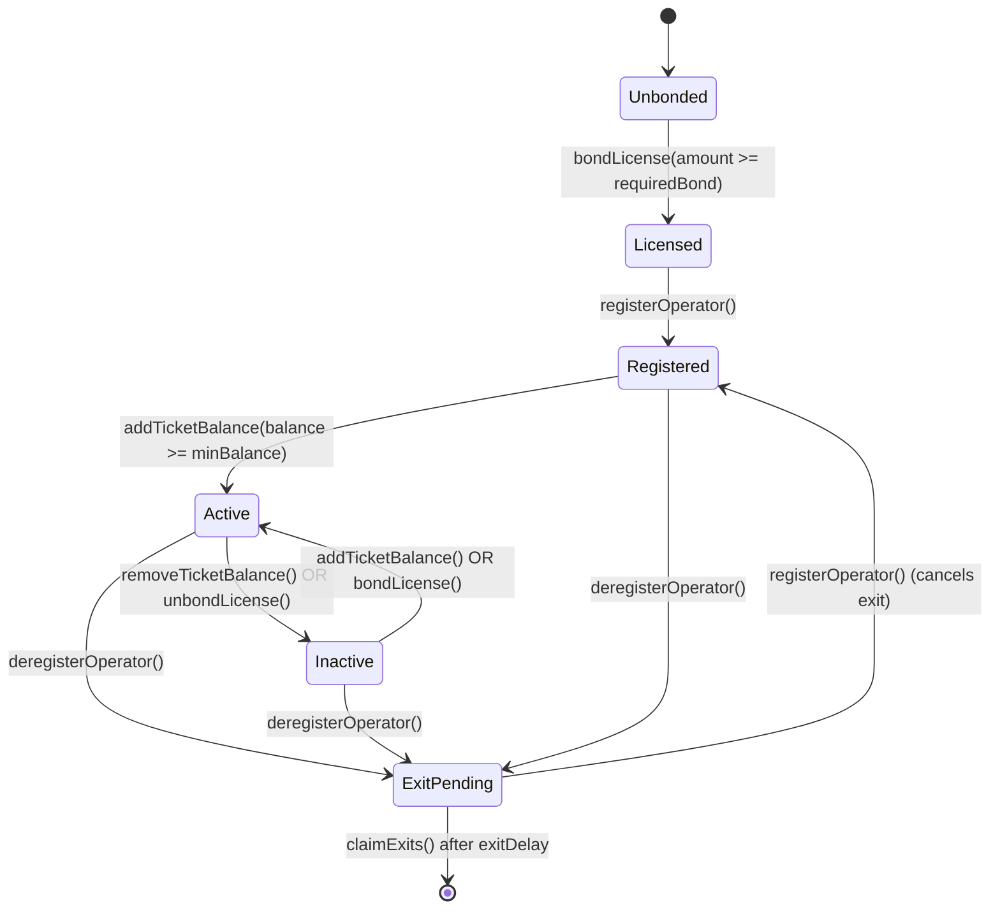

# Ciphernode Operators

Ciphernodes are the distributed workers that power the Enclave network. They participate in
threshold cryptography to enable encrypted computations (E3s) while ensuring no single party can
access the underlying data.

## What is a Ciphernode?

A ciphernode is a node operator that:

- **Generates key shares**: Creates PVSS (Publicly Verifiable Secret Sharing) key shares for each
  committee
- **Publishes public keys**: Contributes to aggregated committee public keys used for encryption
- **Produces decryption shares**: Decrypts computation outputs when the threshold is met
- **Maintains availability**: Stays online and responsive to participate in sortition and committee
  duties

Ciphernodes earn rewards for successful participation and risk slashing for missed duties or
malicious behavior.

## Contract Architecture

The Enclave protocol uses several contracts that work together:

| Contract               | Purpose                                                                        |
| ---------------------- | ------------------------------------------------------------------------------ |
| **Enclave**            | Core coordinator that manages E3 requests and computation lifecycle            |
| **CiphernodeRegistry** | Tracks registered operators and manages committee formation                    |
| **BondingRegistry**    | Handles license bonds (ENCL) and ticket balances (ETK)                         |
| **SlashingManager**    | Processes slashing proposals, appeals, and ban enforcement                     |
| **EnclaveToken**       | ENCL token used for license bonding                                            |
| **EnclaveTicketToken** | Non-transferable ETK token representing ticket balances (backed by stablecoin) |

### Sepolia Contract Addresses

| Contract             | Address                                      | Deploy block |
| -------------------- | -------------------------------------------- | ------------ |
| Enclave              | `0x01E657C16192854E8d7D7055228C7D6532E345Be` | 9761354      |
| CiphernodeRegistry   | `0x754490FF874f24fe36124006f9fE0bBaCADDd746` | 9761351      |
| BondingRegistry      | `0xA8E7583955797F4C3827eC7bf20872C687bD6313` | 9761313      |
| SlashingManager      | `0x2EA642a7431C0d4D958Ce69f0A10c64D49977127` | 9761309      |
| EnclaveTicketToken   | `0xE375634734eC04E94c77907804F8DfF2A45EcFc5` | 9761309      |
| EnclaveToken (ENCL)  | `0x8F079950F69FB1574B30737F4879F5BE620d3028` | 9761309      |
| MockUSDC (fee token) | `0x00b322ED68246EcD66069BBE4F2C5070d2973efE` | 9761309      |

> Always verify addresses from `packages/enclave-contracts/deployed_contracts.json` or your
> deployment output. Addresses differ per network.

## Operator Lifecycle

A ciphernode moves through several states during its lifecycle:

### State Descriptions

| State           | Description                                                            |
| --------------- | ---------------------------------------------------------------------- |
| **Unbonded**    | No license bond deposited; cannot register                             |
| **Licensed**    | ENCL bonded but not yet registered in the registry                     |
| **Registered**  | In the registry but lacking minimum ticket balance                     |
| **Active**      | Fully operational; eligible for committee selection via sortition      |
| **Inactive**    | Registered but below minimum requirements (tickets or license bond)    |
| **ExitPending** | Deregistration requested; waiting for exit delay before claiming funds |

## Requirements

Before operating a ciphernode, ensure you have:

| Requirement     | Details                                                                  |
| --------------- | ------------------------------------------------------------------------ |
| **ENCL Tokens** | At least `100 ENCL` for the license bond (check `licenseRequiredBond()`) |
| **Stablecoin**  | USDC (or configured fee token) for tickets; minimum 1 ticket worth       |
| **ETH**         | Gas for transactions on your target network                              |
| **Hardware**    | Linux/macOS, 4+ cores, 8GB+ RAM, stable internet with open UDP port      |
| **Software**    | Enclave CLI installed, WebSocket RPC endpoint                            |

## Getting Started

Follow these guides in order to become an active ciphernode operator:

1. **[Running a Ciphernode](./running)** - Set up your node using DappNode, Enclave CLI, or Docker
2. **[Registration & Licensing](./registration)** - Bond your license, register, and add tickets
3. **[Tickets & Sortition](./tickets-and-sortition)** - Understand how committee selection works
4. **[Exits, Rewards & Slashing](./exits-and-slashing)** - Learn about rewards and exit procedures
