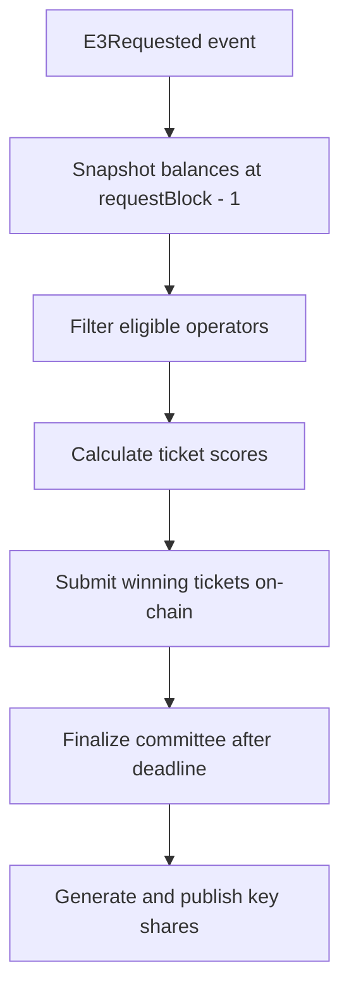

# Tickets & Sortition

Tickets determine your probability of being selected for E3 committees. This guide explains the
ticket system and sortition algorithm.

## Ticket Overview

| Token    | Purpose                                            | Transferable |
| -------- | -------------------------------------------------- | ------------ |
| **ENCL** | License bond - required to register                | Yes          |
| **ETK**  | Ticket token - determines committee selection odds | No           |
| **USDC** | Underlying asset for tickets (fee token)           | Yes          |

Tickets are priced in stablecoins and minted into non-transferable ETK balances:

```
availableTickets = floor(ticketTokenBalance / ticketPrice)
```

## Managing Tickets

### Buy Tickets

Deposit stablecoins to mint tickets:

```bash
# Buy tickets worth 100 USDC
enclave ciphernode tickets buy --amount 100
```

This:

1. Approves the ticket contract to spend your USDC (if needed)
2. Deposits the stablecoin
3. Mints equivalent ETK to your balance

### Burn Tickets

Withdraw the underlying stablecoin:

```bash
# Burn tickets and withdraw 50 USDC worth
enclave ciphernode tickets burn --amount 50
```

> Burning tickets takes effect immediately. Dropping below the minimum ticket balance makes you
> inactive until you top up again.

### Check Balance

```bash
enclave ciphernode status
```

Look for the "Ticket balance" and "available" fields in the output.

## Ticket Economics

- **Committee probability scales linearly** with your available tickets relative to other operators
- **Doubling your tickets doubles your odds** (assuming peers stay constant)
- **Balances are snapshotted** at `requestBlock - 1` - adding tickets after a request won't help
  that round
- **Idle tickets have opportunity cost** - rewards only accrue when you're selected and complete
  duties

### Rebalancing Tips

- Add tickets **one or two requests ahead** of anticipated demand to avoid gas spikes
- Keep a **small buffer** so slashing or removals don't instantly deactivate you
- Monitor `ticketPrice()` and `minTicketBalance()` before automating deposits on multiple networks

## Sortition Algorithm

The sortition process selects committees deterministically based on a random seed:



### 1. Eligibility Check

When `CommitteeRequested` fires, nodes check if they're eligible:

- Registered and not banned
- `isActive` (bond + ticket minimums satisfied)
- No exit in progress

### 2. Score Calculation

For each ticket you hold, a score is calculated:

```
score = keccak256(seed, operator, ticketNumber)
```

The same inputs always produce the same scores, so all honest nodes converge on the same committee.

### 3. Ticket Submission

Operators submit their winning tickets during the submission window (300 seconds on Sepolia):

```bash
# The CLI handles this automatically when running
submitTicket(e3Id, ticketNumber)
```

Each submission emits `TicketSubmitted(e3Id, operator, ticketNumber, score)`.

### 4. Committee Finalization

After the window closes and ≥ `threshold_m` tickets are present:

1. Anyone can call `finalizeCommittee(e3Id)`
2. Registry emits `CommitteeFinalized`
3. Selected nodes generate and publish key shares
4. Aggregated public key is published via `publishCommittee`

## Parameters

| Parameter                   | Sepolia Value | Description                         |
| --------------------------- | ------------- | ----------------------------------- |
| `ticketPrice`               | 10 USDC       | Cost per ticket                     |
| `minTicketBalance`          | 1 ticket      | Minimum to be active                |
| `sortitionSubmissionWindow` | 10 seconds    | Time to submit winning tickets      |
| `threshold_m`               | Varies        | Minimum operators needed for duties |
| `threshold_n`               | Varies        | Total committee size                |

## Monitoring

### Events to Watch

| Event                | Meaning                              |
| -------------------- | ------------------------------------ |
| `CommitteeRequested` | New committee formation started      |
| `TicketSubmitted`    | A ticket was submitted for selection |
| `CommitteeFinalized` | Committee members confirmed          |
| `CommitteePublished` | Aggregated public key ready          |

### Log Messages

Watch your node logs for:

- `sortition::submitted` - Successfully submitted tickets
- `sortition::missed` - Failed to submit in time
- `jobs::selected` - You were selected for a committee

## Troubleshooting

| Symptom                         | Possible Cause                        | Solution                         |
| ------------------------------- | ------------------------------------- | -------------------------------- |
| Never being selected            | Low ticket count relative to peers    | Add more tickets                 |
| `isActive` is false             | Below minimum tickets or license bond | Top up tickets or rebond license |
| `SubmissionWindowClosed` errors | RPC latency or slow submission        | Use faster RPC, check network    |
| Committee missing your operator | Submission didn't succeed             | Check logs, retry next round     |

## Best Practices

1. **Stagger ticket top-ups** - Avoid last-minute gas competition
2. **Alert on missed submissions** - Human intervention before committee deadlines
3. **Batch networks separately** - Run separate CLI instances per chain
4. **Track governance changes** - `sortitionSubmissionWindow`, `ticketPrice`, and
   `licenseRequiredBond` may change

## Next Steps

- **[Exits, Rewards & Slashing](./exits-and-slashing)** - Understand rewards and how to exit safely
