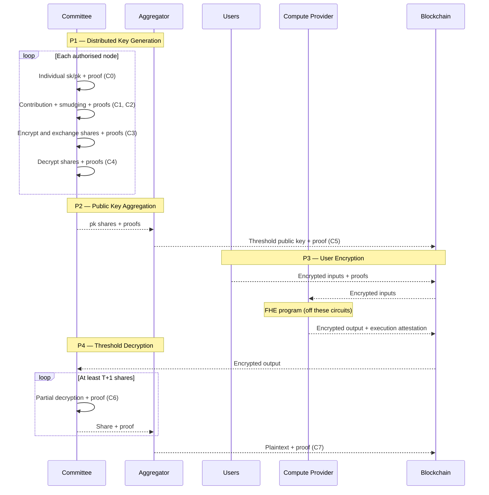

## Cryptography

This page is a guided tour of the **cryptographic foundations** behind the Interfold: how
**threshold Brakerski–Fan–Vercauteren (BFV)** encryption, **distributed key generation (DKG)**, and
**zero-knowledge proofs** fit together so that ciphernodes can run an **E3** without any single
party holding the full decryption key, while still allowing **anyone** to check that keys, shares,
and decryptions were produced honestly.

You do not need to read every section in order. If the execution model is still fuzzy, start with
[What is an E3?](/what-is-e3). When you are ready to compile circuits or inspect the tree, the
[Noir Circuits](./noir-circuits) page collects toolchain notes and repository layout.

## Overview

### Why threshold cryptography needs more than “honest majority”

When many parties jointly generate keys or decrypt, classical threshold protocols spread trust
across participants: if enough of them behave, the protocol succeeds. That works well inside a
closed group, but it leaves **observers** with little to verify—they mostly assume the right nodes
ran the right steps. The Interfold design pushes in a different direction, often summarised as the
**coordination trilemma**: keep individual data and intermediate secrets confidential, avoid giving
any one party full control over decryption, and still make each cryptographic step **publicly
checkable** without re-running the whole computation.

The protocol leans on **zero-knowledge proofs** for the “checkable” part and on **economics** (for
example slashing) so that detected misbehaviour is costly as well as visible. The aim is not to
replace engineering discipline, but to ensure that correctness rests on verifiable mathematics
rather than on blind trust in operators.

### One execution, end to end

Each confidential workload is an FHE program running inside an **E3**. After someone requests such a
computation, a committee of **N** [ciphernodes](https://blog.theinterfold.com/ciphernodes/) is drawn
using **sortition**, so membership is tied to verifiable randomness rather than to a central picker.
There is **no trusted dealer** handing out key material: every ciphernode contributes its own share
of the work and takes part in **PVDKG** (publicly verifiable DKG), producing proofs alongside
messages so that deviating parties can be identified and excluded without exposing other nodes’
secrets.

Write **A** for the **authorised** committee for that E3—initially all **N** members, then shrinking
as proofs fail and bad actors drop out of the active path. When DKG finishes, the network publishes
a **threshold public key** that serves as the reference for everyone who will encrypt inputs. The
numeric threshold **T** (how many partial decryptions you need later) is fixed at **program** level;
this page does not pin a single formula, because deployments can tune it.

From there the story is easier to tell in order. Users encrypt under the threshold key. A **compute
provider** evaluates the FHE program on those ciphertexts; in practice that step usually ships with
its own **correct execution** story (for example attested FHE inside a zkVM), separate from the Noir
circuits that handle keys and decryptions. When the job is done, at least **T+1** honest members of
**A** publish **partial decryptions**, and an **aggregator** combines them into plaintext
**without** ever reassembling the full secret key in one place.

### How the product phases line up

It helps to name four **product phases**, P1 through P4, which reappear throughout the docs and in
the implementation. Think of them as chapters in the same book: DKG establishes the committee’s
keys, aggregation turns many contributions into one public key, users encrypt, then the system
decrypts after homomorphic evaluation.

- **P1 — Distributed key generation** is the heavy chapter. Each ciphernode builds its **secret key
  contribution** and matching **public key share**, splits the sensitive parts into **Shamir**
  shares, and sends those shares encrypted under each peer’s **individual** BFV public key—because
  shares must not travel in the clear. Parallel **smudging noise** material follows the same
  pattern, since decryption later relies on noise that is also shared and proved. Proofs accompany
  generation, share computation, encryption, and the local decrypt-and-aggregate step; as they fail
  or succeed, the set **A** updates so that only honest nodes remain on the critical path.

- **P2 — Public key aggregation** is deliberately short: someone acting as aggregator sums the
  surviving public key shares into the single **threshold public key**. Circuit
  [**C5**](https://github.com/gnosisguild/enclave/tree/main/circuits/bin/threshold/pk_aggregation)
  checks that this sum matches what earlier proofs committed to.

- **P3 — User encryption** is where data providers enter. They encrypt under the aggregated
  threshold key; the in-tree packages
  [`user_data_encryption_ct0`](https://github.com/gnosisguild/enclave/tree/main/circuits/bin/threshold/user_data_encryption_ct0),
  [`user_data_encryption_ct1`](https://github.com/gnosisguild/enclave/tree/main/circuits/bin/threshold/user_data_encryption_ct1),
  and
  [`user_data_encryption`](https://github.com/gnosisguild/enclave/tree/main/circuits/bin/threshold/user_data_encryption)
  implement a **GRECO**-style proof pattern: show that the ciphertext is a valid BFV encryption
  without revealing the message or the randomness.

- **P4 — Threshold decryption** closes the loop after homomorphic evaluation. Ciphernodes in **A**
  produce partial decryptions; circuits
  [**C6**](https://github.com/gnosisguild/enclave/tree/main/circuits/bin/threshold/share_decryption)
  and
  [**C7**](https://github.com/gnosisguild/enclave/tree/main/circuits/bin/threshold/decrypted_shares_aggregation)
  prove the shares and the final recombination. The FHE evaluation itself sits **between** P3 and
  P4: it consumes user ciphertexts and yields the output ciphertext that **C6** and **C7** reason
  about. Those evaluation proofs are **not** the same Noir binaries as DKG or decryption; what you
  get depends on the FHE backend you plug in.

### Wiring phases to packages in the repository

Before any of this runs in production, a one-shot **`config`** proof (see
[`circuits/bin/config`](https://github.com/gnosisguild/enclave/tree/main/circuits/bin/config))
checks that parameter presets—CRT limbs, noise bounds, Reed–Solomon parity matrices, and the
like—match across the deployment. After that, the table below is the map most people keep open while
reading the code: it connects the narrative phases P1–P4 to the **C0–C7** labels used in issues,
logs, and the
[`circuits/README.md`](https://github.com/gnosisguild/enclave/blob/main/circuits/README.md) index.

| Phase                    | Circuits                                                                                                                                                                                                                                                                                                                                                                                                                                                                                                 | What you are looking at                                                                                       |
| ------------------------ | -------------------------------------------------------------------------------------------------------------------------------------------------------------------------------------------------------------------------------------------------------------------------------------------------------------------------------------------------------------------------------------------------------------------------------------------------------------------------------------------------------- | ------------------------------------------------------------------------------------------------------------- |
| **Config**               | [`config`](https://github.com/gnosisguild/enclave/tree/main/circuits/bin/config)                                                                                                                                                                                                                                                                                                                                                                                                                         | One-time consistency of presets before any E3.                                                                |
| **P1 — DKG**             | [**C0**](https://github.com/gnosisguild/enclave/tree/main/circuits/bin/dkg/pk), [**C1**](https://github.com/gnosisguild/enclave/tree/main/circuits/bin/threshold/pk_generation), [**C2**](https://github.com/gnosisguild/enclave/tree/main/circuits/bin/dkg/sk_share_computation), [**C3**](https://github.com/gnosisguild/enclave/tree/main/circuits/bin/dkg/share_encryption), [**C4**](https://github.com/gnosisguild/enclave/tree/main/circuits/bin/dkg/share_decryption) | Individual pk; TrBFV contribution; Shamir + parity (recursive **C2**); encrypt shares; decrypt and aggregate. |
| **P2 — Aggregation**     | [**C5**](https://github.com/gnosisguild/enclave/tree/main/circuits/bin/threshold/pk_aggregation)                                                                                                                                                                                                                                                                                                                                                                                                         | Sum honest public key shares into the threshold pk.                                                           |
| **P3 — User encryption** | [`user_data_encryption_*`](https://github.com/gnosisguild/enclave/tree/main/circuits/bin/threshold/user_data_encryption_ct0)                                                                                                                                                                                                                                                                                                                                                                             | Valid BFV encryption under the aggregated key.                                                                |
| **P4 — Decryption**      | [**C6**](https://github.com/gnosisguild/enclave/tree/main/circuits/bin/threshold/share_decryption), [**C7**](https://github.com/gnosisguild/enclave/tree/main/circuits/bin/threshold/decrypted_shares_aggregation)                                                                                                                                                                                                                                                                                       | Partial decryptions; Lagrange combination, CRT lift, decode to plaintext.                                     |

### Sequence diagram

The diagram below is the same story as a swimlane sketch: committee work, aggregation, users,
compute, then threshold decryption. It is not a substitute for the precise package list, but it
gives a sense of ordering when you read events on-chain or in logs.



## Publicly verifiable threshold BFV (PV-TBFV)

**PV-TBFV** means **publicly verifiable threshold BFV**: every sensitive step you would worry about
in a centralised system—generating key material, moving it under encryption, aggregating public
keys, taking user ciphertexts, emitting decryption shares—is backed by a statement that verifiers
can check **without** seeing the private witnesses. The DKG slice of that story is what we call
**PVDKG**; in the repository it lands in **C0** through **C4** (with
[**C1**](https://github.com/gnosisguild/enclave/tree/main/circuits/bin/threshold/pk_generation)
living under
[`circuits/bin/threshold`](https://github.com/gnosisguild/enclave/tree/main/circuits/bin/threshold)
and the rest of the DKG chain under
[`circuits/bin/dkg`](https://github.com/gnosisguild/enclave/tree/main/circuits/bin/dkg)).

Taken together, the design is aiming for a few properties that reinforce each other. **Threshold
security** means decrypting user data should require at least **T+1** cooperating honest shares for
the chosen **T**. **Public verifiability** means observers can validate each proof without
participating in the protocol. **Homomorphic evaluation** is what lets ciphertexts leave P3 and
enter the FHE engine before P4. **Robustness** means bad behaviour should show up as failing proofs,
so the protocol can update **A** and the economic layer can apply penalties when appropriate.

### Commitments and why polynomials do not land on-chain whole

BFV keys and intermediate polynomials are enormous under post-quantum parameters. Publishing them in
full for every step would be impractical on-chain, so each circuit hashes the relevant outputs into
a short **commitment** using the **SAFE** sponge (see
[`circuits/lib/src/math/safe.nr`](https://github.com/gnosisguild/enclave/blob/main/circuits/lib/src/math/safe.nr)),
built from **Poseidon2** and **Keccak256**. The story that emerges is a **chain of accountability**:
later circuits take earlier commitments as **public inputs**, re-hash the private witnesses inside
the proof, and check equality. That is how
[**C1**](https://github.com/gnosisguild/enclave/tree/main/circuits/bin/threshold/pk_generation)
connects to
[**C5**](https://github.com/gnosisguild/enclave/tree/main/circuits/bin/threshold/pk_aggregation),
and how [**C4**](https://github.com/gnosisguild/enclave/tree/main/circuits/bin/dkg/share_decryption)
hands off to
[**C6**](https://github.com/gnosisguild/enclave/tree/main/circuits/bin/threshold/share_decryption),
without ever dumping raw polynomials into calldata. Domain labels (`DS_*` in
[`commitments.nr`](https://github.com/gnosisguild/enclave/blob/main/circuits/lib/src/math/commitments.nr))
keep different commitment kinds from being confused with one another.

### Proof aggregation

> **Note:** this section describes a proposed design that has not been implemented yet. It is
> included here as the target architecture for proof aggregation and on-chain verification.

Individual circuit proofs cover each step in isolation, but the protocol must land them on-chain as
a compact, verifiable package. A naive fold of all proofs into one recursive aggregate produces an
opaque commitment that the contract cannot interpret without the original public inputs, and if
cross-circuit consistency (e.g. that
[**C2**](https://github.com/gnosisguild/enclave/tree/main/circuits/bin/dkg/sk_share_computation)'s
expected commitments match
[**C1**](https://github.com/gnosisguild/enclave/tree/main/circuits/bin/threshold/pk_generation)'s
outputs) is only checked off-chain, end-to-end correctness still depends on trusting the committee
network rather than on verifiable mathematics.

The aggregation design addresses both problems. Only **two recursive proofs** are posted on-chain
per E3 session:

1. **DKG recursive proof**: the aggregator recursively verifies every node's C0-C4 fold chain
   together with **C5**, which aggregates the public key.
2. **Decryption recursive proof**: the aggregator recursively verifies **C6** proofs from at least
   **T+1** parties together with **C7**, which reconstructs the plaintext.

Nodes do not post proofs on-chain. Each node folds its own C0-C4 chain, **signs** the fold output,
and relays it to the aggregator via P2P gossip. The recursive proof verifies each signature inside
ZK, so the aggregator cannot substitute or fabricate any node's contribution without the proof
failing. During registration the contract stores the submitting address for each `party_id`;
verification recovers the signer via `ecrecover` and checks it matches, binding each fold output to
its creator.

#### Surfaced anchor values

Instead of collapsing everything into an opaque hash, each recursive proof surfaces the values the
contract needs as **explicit public outputs**:

| Recursive proof | Surfaced outputs                                                               | Contract action                  |
| --------------- | ------------------------------------------------------------------------------ | -------------------------------- |
| DKG             | `sk_agg_commits[]`, `esm_agg_commits[]`, `party_ids[]`, `aggregated_pk_commit` | Stores at DKG completion         |
| Decryption      | `expected_sk_commits[]`, `expected_esm_commits[]`                              | Checks against stored DKG values |

The decryption recursive proof is cryptographically bound to the DKG recursive proof through these
surfaced values. The decryption proof's **C6** inputs depend on the secret-key and smudging-noise
shares that each node aggregated during DKG (in **C4**), so the proof necessarily surfaces
`expected_sk_commits[]` and `expected_esm_commits[]` as public outputs. The contract then checks
that these match the `sk_agg_commits[]` and `esm_agg_commits[]` stored when the DKG proof was
verified. If any value differs, the decryption proof is rejected. This binding means the two
recursive proofs form a single verifiable chain: the DKG proof establishes the anchor commitments,
and the decryption proof proves it operated on exactly those commitments.

No explicit session identifier is needed. The surfaced commitments are session-specific by
construction, derived from the secrets and parameters of this E3.

#### Cross-circuit consistency inside ZK

Instead of a single generic fold, each consecutive circuit pair in the chain gets a **specialised
fold** that receives the linking fields as public inputs and asserts the required equalities inside
the proof. For example, a fold spanning C1 to C2 asserts
`C1.sk_commitment == C2.expected_sk_commitment` and
`C1.e_sm_commitment == C2.expected_e_sm_commitment`. For this to work, inner circuits expose the
fields needed for linking (`pk_commitment` from C0, `sk_commitment` and `e_sm_commitment` from C1
and C4, `d_commitment` from C6) as direct public outputs rather than burying them inside opaque
wrapper hashes. This turns cross-circuit consistency from an off-chain obligation into a
cryptographic guarantee.

## Key terminology

The same **BFV** ring arithmetic appears twice in the system: once for **individual** keys that
exist only to protect share traffic during DKG, and once for the **threshold** key that users and
decryption actually rely on. Mixing those two notions is the most common source of confusion, so the
table below keeps the vocabulary straight. Treat it as a glossary you can return to while reading
logs or Noir sources.

| Term                                    | Meaning                                                                                                                                                                                                                                                                                                                                                                                                                                 |
| --------------------------------------- | --------------------------------------------------------------------------------------------------------------------------------------------------------------------------------------------------------------------------------------------------------------------------------------------------------------------------------------------------------------------------------------------------------------------------------------- |
| **Individual key pair**                 | Per-node BFV keys used **only** to encrypt **Shamir shares** in transit during DKG. [**C0**](https://github.com/gnosisguild/enclave/tree/main/circuits/bin/dkg/pk) commits the individual public key; [**C3**](https://github.com/gnosisguild/enclave/tree/main/circuits/bin/dkg/share_encryption) binds encryption to that commitment.                                                                                                 |
| **Secret key contribution**             | One node’s additive piece of the threshold secret **before** Shamir splitting in the usual DKG story.                                                                                                                                                                                                                                                                                                                                   |
| **Public key share**                    | The TrBFV public material for that contribution; [**C1**](https://github.com/gnosisguild/enclave/tree/main/circuits/bin/threshold/pk_generation) proves BFV keygen relations; [**C5**](https://github.com/gnosisguild/enclave/tree/main/circuits/bin/threshold/pk_aggregation) sums these shares.                                                                                                                                       |
| **Secret key share**                    | After P1, a node’s **Shamir** share of the threshold secret (not the same as “contribution”).                                                                                                                                                                                                                                                                                                                                           |
| **Threshold public key**                | The BFV key users encrypt to after [**C5**](https://github.com/gnosisguild/enclave/tree/main/circuits/bin/threshold/pk_aggregation); no single party holds the full matching secret.                                                                                                                                                                                                                                                    |
| **Smudging noise**                      | Noise shared across parties so decryption shares do not leak **sk**; **e_sm** in Noir; proved in [**C1**](https://github.com/gnosisguild/enclave/tree/main/circuits/bin/threshold/pk_generation)–[**C4**](https://github.com/gnosisguild/enclave/tree/main/circuits/bin/dkg/share_decryption) and used in [**C6**](https://github.com/gnosisguild/enclave/tree/main/circuits/bin/threshold/share_decryption).                           |
| **Smudging noise contribution / share** | Per-node piece of smudging material and its Shamir shares, parallel to the secret-key track ([**C2**](https://github.com/gnosisguild/enclave/tree/main/circuits/bin/dkg/sk_share_computation) / [**C3**](https://github.com/gnosisguild/enclave/tree/main/circuits/bin/dkg/share_encryption) / [**C4**](https://github.com/gnosisguild/enclave/tree/main/circuits/bin/dkg/share_decryption) smudging track). |

In Noir,
[**C1**](https://github.com/gnosisguild/enclave/tree/main/circuits/bin/threshold/pk_generation)
names the BFV encryption-error polynomial **`eek`**. Ring dimension **N**, CRT limbs **L**,
plaintext modulus **t**, and threshold **T** are fixed per deployment; the **PARITY_MATRIX** that
constrains Shamir structure in
[**C2**](https://github.com/gnosisguild/enclave/tree/main/circuits/bin/dkg/sk_share_computation)
ships inside the secure preset that
[`config`](https://github.com/gnosisguild/enclave/tree/main/circuits/bin/config) checks.

## Phases & Circuits

The phase table in **Wiring phases to packages** is the map; this section walks the same path with
implementation detail. Names and paths match
[`circuits/README.md`](https://github.com/gnosisguild/enclave/blob/main/circuits/README.md).

### P1 — Distributed Key Generation

The DKG story begins by pinning down each node’s **individual** public key: circuit
[**C0**](https://github.com/gnosisguild/enclave/tree/main/circuits/bin/dkg/pk) (`dkg/pk`) commits
that key, and later
[**C3**](https://github.com/gnosisguild/enclave/tree/main/circuits/bin/dkg/share_encryption) proves
that share ciphertexts use exactly the key material promised in that commitment.

Next,
[**C1**](https://github.com/gnosisguild/enclave/tree/main/circuits/bin/threshold/pk_generation)
(`threshold/pk_generation`) proves the TrBFV contribution satisfies BFV key generation—bounded
coefficients, Fiat–Shamir challenge points, Schwartz–Zippel style checks—and emits commitments that
feed both the share pipeline
([**C2**](https://github.com/gnosisguild/enclave/tree/main/circuits/bin/dkg/sk_share_computation),
for secret and smudging tracks) and aggregation
([**C5**](https://github.com/gnosisguild/enclave/tree/main/circuits/bin/threshold/pk_aggregation)).
At one Fiat–Shamir challenge point γ (per CRT limb), the TrBFV public key legs are checked in the
shape below (the implementation names the error polynomial **eek**):

```math
\begin{aligned}
\mathrm{pk}_0^{[\ell]}(\gamma) &= -a^{[\ell]}(\gamma)\,\mathrm{sk}(\gamma) + \mathrm{eek}(\gamma) + r_2^{[\ell]}(\gamma)(\gamma^N+1) + r_1^{[\ell]}(\gamma)\,q_\ell
\end{aligned}
```

(`pk_generation.nr`: **eek** is a **single** polynomial; **r1**, **r2** are per CRT limb; the second
public-key leg is the CRS polynomial **a**, so **pk1**[\ell] = **a**[\ell] by construction—the
circuit’s `verify_evaluations` only evaluates the **pk0** identity at γ.)

[**C2**](https://github.com/gnosisguild/enclave/tree/main/circuits/bin/dkg/sk_share_computation)
is not a single monolithic proof: the repository uses inner share-computation circuits
`sk_share_computation` and `e_sm_share_computation` to check Shamir-style sharing and Reed–Solomon
parity, and a recursive aggregation wrapper (`recursive_aggregation/c2ab_fold`)
to fold the batch proofs while keeping verifier work small. Intuitively, for each CRT limb and
coefficient column, the shares laid out as a vector **y** must satisfy parity with a fixed matrix
**H** so that only low-degree Shamir-style codewords pass (the exact **PARITY_MATRIX** is preset and
checked by `config`):

```math
\mathbf{H}_j\,\mathbf{y}_{i,j}^{\mathsf{T}} \equiv \mathbf{0} \pmod{q_j}
```

[**C3**](https://github.com/gnosisguild/enclave/tree/main/circuits/bin/dkg/share_encryption)
(`dkg/share_encryption`) then encrypts each share under the recipient’s individual key; in a fully
connected committee the proof count scales like **|A| × (|A| − 1)** per track. At a Fiat–Shamir
challenge point, the BFV encryption algebra it checks matches the usual two-leg ciphertext (per
limb), schematically:

```math
\begin{aligned}
\mathsf{ct}_0^{[\ell]}(\gamma) &= \mathsf{pk}_0^{[\ell]}(\gamma)\,u(\gamma) + e_0^{[\ell]}(\gamma) + k_1(\gamma)\,k_0^{[\ell]} + r_1^{[\ell]}(\gamma)\,q_\ell + r_2^{[\ell]}(\gamma)(\gamma^N+1) \\
\mathsf{ct}_1^{[\ell]}(\gamma) &= \mathsf{pk}_1^{[\ell]}(\gamma)\,u(\gamma) + e_1(\gamma) + p_1^{[\ell]}(\gamma)\,q_\ell + p_2^{[\ell]}(\gamma)(\gamma^N+1)
\end{aligned}
```

(`share_encryption.nr`: **k0**[\ell] are fixed scalars per limb; **e1** is one polynomial whose
evaluation is reused for every **ℓ** in the **ct1** leg, matching the witness layout in Noir.)

Finally,
[**C4**](https://github.com/gnosisguild/enclave/tree/main/circuits/bin/dkg/share_decryption)
(`dkg/share_decryption`) runs after local decryption: it proves the opened values match **C2**’s
commitments, aggregates per modulus, and forwards commitments toward threshold decryption
([**C6**](https://github.com/gnosisguild/enclave/tree/main/circuits/bin/threshold/share_decryption)).
Because the threshold secret is the sum of contributions, each node combines the decrypted shares
into per-limb aggregates that line up with that design:

```math
\mathrm{agg}[\ell][i] = \sum_{h \in \mathcal{H}} \mathsf{share}[h][\ell][i] \pmod{q_\ell}
```

### P2 — Public key aggregation

[**C5**](https://github.com/gnosisguild/enclave/tree/main/circuits/bin/threshold/pk_aggregation)
(`threshold/pk_aggregation`) is the bridge from many committed contributions to one threshold public
key: it re-checks each contribution against **C1**, then aggregates. The **first** leg is summed
across honest parties; the **second** leg is the same CRS polynomial **a** for every party, so
**pk1_agg** is **not** a sum—it must equal each party’s **pk1** (see `verify_pk_for_basis` vs
`verify_pk1` in `pk_aggregation.nr`):

```math
\begin{aligned}
\mathrm{pk}^{\mathrm{agg}}_{0}[\ell][i] &= \sum_{h \in \mathcal{H}} \mathrm{pk}_{0}[h][\ell][i] \pmod{q_\ell} \\
\mathrm{pk}^{\mathrm{agg}}_{1}[\ell] &= \mathrm{pk}_{1}[h][\ell] = a^{[\ell]} \quad \forall\, h \in \mathcal{H}
\end{aligned}
```

### P3 — User encryption

The user-encryption family proves that ciphertexts are valid BFV encryptions under the aggregated
key—implemented across
[`user_data_encryption_ct0`](https://github.com/gnosisguild/enclave/tree/main/circuits/bin/threshold/user_data_encryption_ct0),
[`user_data_encryption_ct1`](https://github.com/gnosisguild/enclave/tree/main/circuits/bin/threshold/user_data_encryption_ct1),
and
[`user_data_encryption`](https://github.com/gnosisguild/enclave/tree/main/circuits/bin/threshold/user_data_encryption)—following
a GRECO-style encryption proof pattern. Algebraically it is the same BFV encryption statement as in
**C3**, but with **pk0**, **pk1** taken from the aggregated threshold key committed by **C5**; the
split across `ct0` / `ct1` packages exists to keep witness sizes and verifier constraints
manageable.

### P4 — Threshold decryption

[**C6**](https://github.com/gnosisguild/enclave/tree/main/circuits/bin/threshold/share_decryption)
ties each partial decryption to **C4**’s aggregated material and to the homomorphic output
ciphertext.
[**C7**](https://github.com/gnosisguild/enclave/tree/main/circuits/bin/threshold/decrypted_shares_aggregation)
collects at least **T+1** such shares, applies Lagrange weights, reconstructs across CRT, and
decodes modulo **t**; it runs once at the aggregator after enough valid **C6** proofs are available.

**C6** proves a partial decryption share **d** built from the output ciphertext, the node’s Shamir
shares of the threshold secret and smudging noise (from **C4**), and reduction
quotients—schematically per CRT limb (see `verify_decryption_share_computation` in
`share_decryption.nr`):

```math
d^{[\ell]}(\gamma) = \mathrm{ct}_0^{[\ell]}(\gamma) + \mathrm{ct}_1^{[\ell]}(\gamma)\,\mathrm{sk}^{[\ell]}(\gamma) + e_{\mathrm{sm}}^{[\ell]}(\gamma) + r_2^{[\ell]}(\gamma)(\gamma^N+1) + r_1^{[\ell]}(\gamma)\,q_\ell
```

**C7** first recombines partials with Lagrange coefficients at zero for the participating party
indices **x_i**, then stitches limbs and decodes to the plaintext ring. In short:

```math
\begin{aligned}
L_i(0) &= \prod_{j \neq i} \frac{-x_j}{x_i - x_j} \pmod{q_\ell} \\
u^{(\ell)} &= \sum_i d_i^{(\ell)}\,L_i(0) \pmod{q_\ell}
\end{aligned}
```

(`decrypted_shares_aggregation.nr` computes the same **L_i(0)** values with an equivalent
product–quotient form and explicit sign handling; **u**[\ell] is then formed coefficient-wise per
`compute_crt_components`.)

CRT reconstruction checks **u**[\ell] + **r**[\ell] **q_ℓ** = `u_global` coefficient-wise, then
decoding uses the map in `verify_decoding` (BigNum mod **Q**, plaintext modulus **t**, and
`q_inverse_mod_t` as in `Configs`).

## Footnotes

Across the stack you will see the same few ideas reused in different algebraic costumes.
**Fiat–Shamir** turns interactive polynomial checks into single challenge points;
**Schwartz–Zippel** lets the circuits test identities at random points instead of
coefficient-by-coefficient. **Reed–Solomon parity** via **PARITY_MATRIX** enforces valid Shamir
structure inside
[**C2**](https://github.com/gnosisguild/enclave/tree/main/circuits/bin/dkg/sk_share_computation)
without reconstructing secrets in the clear. **CRT / RNS** arithmetic shows up everywhere in BFV,
with explicit reconstruction where the statement needs a single ring element—notably in
[**C7**](https://github.com/gnosisguild/enclave/tree/main/circuits/bin/threshold/decrypted_shares_aggregation).
Finally, **range checks** keep coefficients inside the bounds that make RLWE-style assumptions
meaningful inside a proof.

Some statements, especially the large **C2** pipeline, do not fit in one proof: the repository uses
inner UltraHonk proofs, wrapper circuits, and the folding machinery under
[`recursive_aggregation/`](https://github.com/gnosisguild/enclave/tree/main/circuits/bin/recursive_aggregation);
see [Noir Circuits](./noir-circuits) for how to build and verify them.

## Where to go next

If you are integrating proofs from Rust or following on-chain events, these entry points complement
this page: the
[`circuits/README.md`](https://github.com/gnosisguild/enclave/blob/main/circuits/README.md) index
for package names and **C0–C7** paths;
[DKG & computation](https://github.com/gnosisguild/enclave/blob/main/agent/flow-trace/04_DKG_AND_COMPUTATION.md)
for actors, gossip, and proof ordering in a running node.
