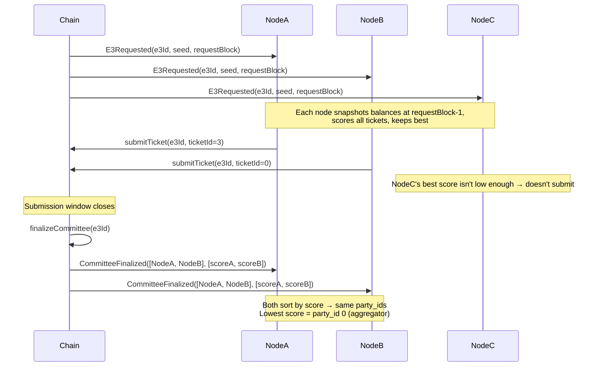

# Sortition

Sortition is the mechanism that selects a subset of registered ciphernodes to form a committee for
each E3 request. The design goals are:

- **Unpredictability** — no party can know the outcome before the request block
- **Proportionality** — selection probability scales linearly with ticket stake
- **Determinism** — every honest node independently computes the same result
- **Sybil-resistance** — splitting funds across many wallets provides no advantage
- **On-chain verifiability** — the contract enforces the same rules the nodes compute off-chain

---

## Randomness Source

The seed for every sortition round is derived from the EVM's `block.prevrandao` (EIP-4399) combined
with the E3 identifier:

```solidity
seed = uint256(keccak256(abi.encode(block.prevrandao, e3Id)));
```

`prevrandao` is the RANDAO reveal from the beacon chain. It is unpredictable before the block is
proposed but publicly verifiable afterwards. Combining it with `e3Id` ensures different rounds
produce independent seeds even within the same block.

> **Limitation:** `prevrandao` is weak against a block proposer who can selectively withhold their
> block. This is an accepted trade-off for now; future versions may use a commit-reveal scheme or an
> external VRF.

The seed is emitted with `E3Requested` and used by all nodes to deterministically compute the same
committee.

---

## Ticket Balances and Eligibility

Each operator's weight in the lottery is determined by their available ticket count at the snapshot
block:

```
availableTickets = floor(ticketTokenBalance / ticketPrice)
```

Balances are snapshotted at **`requestBlock - 1`** — the block immediately before the E3 request was
included. This prevents operators from front-running a request by depositing tickets in the same
block.

An operator is eligible if and only if:

1. They are registered in `CiphernodeRegistry` and not banned
2. `isActive == true` (bond ≥ `licenseRequiredBond` AND tickets ≥ `minTicketBalance`)
3. No exit is pending

---

## Scoring Function

For each ticket an operator holds, a score is computed as a deterministic pseudo-random number:

```
score = keccak256(abi.encodePacked(node_address, ticket_number, e3Id, seed))
```

The result is interpreted as an unsigned 256-bit integer. **Lower scores win.**

Key properties:

- The hash is computed identically on-chain (Solidity) and off-chain (Rust using `alloy`'s
  `abi_encode_packed`), so both sides always agree
- Given the same inputs, the score is always the same — there is no per-invocation randomness
- `ticket_number` is a 0-based index into the operator's ticket balance. Ticket 0, ticket 1, etc.

### One Best Ticket Per Node

Each operator computes scores for **all** of their tickets but submits only the single best
(lowest-scoring) one. This is enforced off-chain by the node software and on-chain by the contract
(which rejects duplicate submissions from the same address).

This design is critical for **sybil-resistance**: splitting 100 tickets across 100 wallets vs
holding 100 tickets in one wallet produces the same expected score distribution, because:

- A single wallet takes `min(score_0, score_1, ..., score_99)` — the minimum of 100 draws
- 100 wallets each take `min(score_i)` with 1 draw each — 100 independent draws

The minimum of N draws from a uniform distribution is dominated by the same statistics in both
cases, so there is no incentive to split.

---

## Committee Size and Buffer

The sortition selects more nodes than strictly required by the threshold parameters. For a request
with `threshold_m` (minimum signers) and `threshold_n` (nominal committee size), the total selection
size is:

```
buffer = (threshold_n - threshold_m) + safety_factor
total_selection_size = threshold_n + buffer
```

Where `safety_factor` depends on the `m/n` ratio:

| `threshold_m / threshold_n` | Safety factor | Rationale                                                                |
| --------------------------- | ------------- | ------------------------------------------------------------------------ |
| ≥ 0.8 (high threshold)      | 3             | Tight committees are vulnerable to even one dropout; more backups needed |
| ≥ 0.6                       | 2             | Moderate risk                                                            |
| < 0.6 (loose threshold)     | 1             | Plenty of slack; minimal buffer required                                 |

The extra nodes act as **standing backups**. If a selected node fails to respond during DKG, it can
be expelled and the next node in score order steps in without restarting the committee.

---

## On-chain Submission Window

After `E3Requested` is emitted, there is a fixed window (e.g. 10 seconds on Sepolia) during which
eligible operators submit their winning tickets:

```solidity
submitTicket(e3Id, ticketNumber)
```

The contract maintains a sorted top-N list of the best submissions seen so far, using a linear scan
to find the insertion point. Each submission emits:

```solidity
event TicketSubmitted(uint256 e3Id, address node, uint256 ticketId, uint256 score);
```

The contract enforces:

- Only one submission per address per E3
- The ticket number must be within the operator's balance at `requestBlock - 1`
- The score must be recomputed on-chain and match what the node claims

---

## Committee Finalization

After the submission window closes, anyone can call `finalizeCommittee(e3Id)`:

- If ≥ `threshold_n` tickets were submitted → `CommitteeFinalized(e3Id, committee, scores)` is
  emitted
- If fewer → `CommitteeFormationFailed` is emitted and the E3 fails with a refund

`CommitteeFinalized` carries the committee as an ordered list of addresses. The Rust runtime then
**normalizes** this list by **sorting it by ascending score** to produce a canonical party ordering:

```
party_id = index in score-sorted committee (lowest score = 0)
```

This normalization is done in `CommitteeFinalized::sort_by_score()` and ensures every node
independently derives the same `party_id` for each member, regardless of the order the contract
happened to emit them.

---

## Aggregator Assignment

The **active aggregator** is the node with `party_id = 0` — the node that won the lowest overall
score. It is responsible for:

- Collecting and verifying ZK proofs from all other committee members
- Aggregating decryption shares
- Submitting the final ciphertext output and proof on-chain

If the aggregator is expelled, the next non-expelled node by `party_id` takes over.

---

## Off-chain Pre-filtering

To avoid every node sending a transaction on every E3 request (which would be expensive and noisy),
each node runs the full sortition algorithm locally before deciding whether to submit:

```rust
// Pseudocode from crates/sortition/src/backends.rs
let eligible = nodes.filter(|n| n.is_active && n.available_tickets > 0);
let committee = ScoreSortition::new(total_selection_size).get_committee(eligible, e3id, seed);
if committee.contains(my_address) {
    submit_winning_ticket(e3id, my_ticket_number);
}
```

Because the scoring function is deterministic and all inputs are public (on-chain balances at a
fixed block, the seed), every honest node computes the same committee. A node that the algorithm
says should submit but doesn't is simply dropping out — it may be expelled later.

---

## Full Flow Summary



---

## Security Properties

| Property                | Mechanism                                                           |
| ----------------------- | ------------------------------------------------------------------- |
| **Unpredictability**    | `seed` derived from `prevrandao` — unknown until block proposal     |
| **Proportionality**     | Expected min-score over N tickets scales with N                     |
| **Sybil-resistance**    | Splitting tickets across wallets doesn't improve expected min-score |
| **Determinism**         | Hash function is identical on-chain (Solidity) and off-chain (Rust) |
| **Anti-frontrunning**   | Balances snapshotted at `requestBlock - 1`                          |
| **Backup availability** | Buffer nodes ensure committee can absorb dropouts without restart   |

---

## Related

- [Tickets & Sortition](../ciphernode-operators/tickets-and-sortition) — operator-facing guide on
  managing tickets and participating in committees
- [Cryptography](../cryptography) — how the selected committee runs DKG and threshold decryption
- [E3 Computation Flow](../computation-flow) — end-to-end view of the E3 lifecycle
