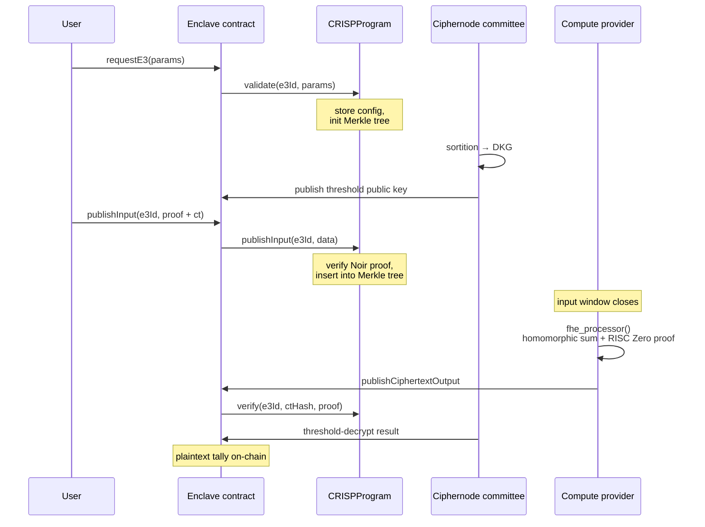

# Build a Complete E3 Program

This tutorial walks through [CRISP](/CRISP/introduction) (Coercion-Resistant Impartial Selection
Protocol), a private voting application built on the Interfold, to show how each component of an E3
program fits together. By the end, you'll understand the contract interface, FHE computation, and
verification flow well enough to build your own.

> **What you'll learn:** How the three `IE3Program` entry points fit together, what the FHE
> computation looks like inside a RISC Zero guest, and how the final proof is verified on-chain.
>
> **Time:** ~20 minutes (reading)
>
> **Prerequisites:** Familiarity with Solidity and a basic understanding of
> [what an E3 is](/what-is-e3).

---

## The IE3Program Interface

Every E3 program implements the `IE3Program` interface from `@enclave-e3/contracts`. It has three
functions that the Enclave contract calls at different stages of the E3 lifecycle:

```solidity
interface IE3Program {
  function validate(
    uint256 e3Id,
    uint256 seed,
    bytes calldata e3ProgramParams,
    bytes calldata computeProviderParams,
    bytes calldata customParams
  ) external returns (bytes32 encryptionSchemeId);

  function publishInput(uint256 e3Id, bytes memory data) external;

  function verify(
    uint256 e3Id,
    bytes32 ciphertextOutputHash,
    bytes memory proof
  ) external returns (bool success);
}
```

| Function       | When called                                    | Purpose                                                                                                           |
| -------------- | ---------------------------------------------- | ----------------------------------------------------------------------------------------------------------------- |
| `validate`     | When someone requests a new E3                 | Validate parameters and initialise round state. Returns the encryption scheme ID (e.g. `keccak256("fhe.rs:BFV")`) |
| `publishInput` | Each time a user submits encrypted data        | Validate the input (e.g. check a ZK proof, verify eligibility) and store it                                       |
| `verify`       | When the compute provider publishes the result | Verify the computation proof and confirm the ciphertext output is correct                                         |

---

## Step 1: validate — Initialise the Round

When a new E3 is requested, the Enclave contract calls `validate` on your program. This is where you
parse parameters, set up state, and decide whether the request is valid.

CRISP's implementation (`CRISPProgram.sol`):

```solidity
function validate(
  uint256 e3Id,
  uint256,
  bytes calldata e3ProgramParams,
  bytes calldata,
  bytes calldata customParams
) external returns (bytes32) {
  if (msg.sender != address(enclave) && msg.sender != owner()) revert CallerNotAuthorized();
  if (e3Data[e3Id].paramsHash != bytes32(0)) revert E3AlreadyInitialized();

  // Decode voting parameters from customParams
  (, , uint256 numOptions, CreditMode creditMode, ) = abi.decode(
    customParams,
    (address, uint256, uint256, CreditMode, uint256)
  );

  // Store round configuration
  e3Data[e3Id].numOptions = numOptions;
  e3Data[e3Id].creditMode = creditMode;
  e3Data[e3Id].paramsHash = keccak256(e3ProgramParams);

  // Initialise the Merkle tree that will track vote commitments
  e3Data[e3Id].votes._init(TREE_DEPTH);

  return ENCRYPTION_SCHEME_ID; // keccak256("fhe.rs:BFV")
}
```

Key points:

- Only the Enclave contract (or the program owner) can call `validate`
- `customParams` carries application-specific configuration — CRISP uses it for voting options and
  credit mode
- The function returns an encryption scheme identifier so the Enclave contract knows which scheme
  the ciphernodes should use

---

## Step 2: publishInput — Validate User Inputs

Each time a user submits encrypted data to the E3, the Enclave contract calls `publishInput`. This
is where you enforce application-specific rules.

CRISP's `publishInput` does several things:

1. **Checks the E3 stage** — only accepts inputs after the committee's public key is published
2. **Checks the input window** — rejects submissions before `inputWindow[0]` or after
   `inputWindow[1]`
3. **Decodes the payload** — unpacks the Noir proof, slot address, commitment, and ciphertext
4. **Processes the vote slot** — inserts or overrides the voter's entry in the Merkle tree
5. **Verifies a ZK proof** — calls an on-chain Honk verifier to prove the vote was encrypted
   correctly and the voter is eligible (see [Custom Noir Circuits](./custom-zk-circuits))

```solidity
function publishInput(uint256 e3Id, bytes memory data) external {
  E3 memory e3 = enclave.getE3(e3Id);

  // Stage and window checks
  if (enclave.getE3Stage(e3Id) != IEnclave.E3Stage.KeyPublished) revert KeyNotPublished(e3Id);
  if (block.timestamp > e3.inputWindow[1]) revert InputDeadlinePassed(e3Id, e3.inputWindow[1]);
  if (block.timestamp < e3.inputWindow[0]) revert E3NotAcceptingInputs(e3Id);
  if (e3Data[e3Id].merkleRoot == 0) revert MerkleRootNotSet();
  if (data.length == 0) revert EmptyInputData();

  (
    bytes memory noirProof,
    address slotAddress,
    bytes32 encryptedVoteCommitment,
    bytes memory encryptedVote
  ) = abi.decode(data, (bytes, address, bytes32, bytes));

  (uint40 voteIndex, bytes32 previousCommitment) = _processVote(
    e3Id,
    slotAddress,
    encryptedVoteCommitment
  );

  // Build the Noir public inputs (order must match the circuit)
  bytes32[] memory publicInputs = new bytes32[](7);
  publicInputs[0] = previousCommitment;
  publicInputs[1] = bytes32(e3Data[e3Id].merkleRoot);
  publicInputs[2] = bytes32(uint256(uint160(slotAddress)));
  publicInputs[3] = bytes32(uint256(previousCommitment == bytes32(0) ? 1 : 0));
  publicInputs[4] = bytes32(e3Data[e3Id].numOptions);
  publicInputs[5] = encryptedVoteCommitment;
  publicInputs[6] = e3.committeePublicKey;

  if (!honkVerifier.verify(noirProof, publicInputs)) revert InvalidNoirProof();

  emit InputPublished(e3Id, encryptedVote, voteIndex);
}
```

> Only the Enclave contract ever calls `publishInput` — the Enclave coordinator enforces that at the
> protocol level, so your program doesn't need an explicit `msg.sender` check here.

Every E3 program should verify that the submitted ciphertext is correctly encrypted under the
committee's threshold public key. Beyond that baseline, your `publishInput` can add
application-specific checks — CRISP adds eligibility (Merkle membership), vote validity (balance
checks), and signature verification. Simpler programs may only need the encryption validity check.

---

## Step 3: The FHE Computation

After the input window closes, the compute provider runs the E3 program over the collected encrypted
inputs. For CRISP, this is a RISC Zero guest that sums all encrypted votes homomorphically:

```rust
pub fn fhe_processor(fhe_inputs: &FHEInputs) -> Vec<u8> {
    let params = decode_bfv_params_arc(&fhe_inputs.params).unwrap();

    // Start with a zero ciphertext
    let mut sum = Ciphertext::zero(&params);

    // Homomorphically add every encrypted vote — no decryption needed
    for ciphertext_bytes in &fhe_inputs.ciphertexts {
        let ciphertext = Ciphertext::from_bytes(&ciphertext_bytes.0, &params).unwrap();
        sum += &ciphertext;
    }

    // Return the encrypted tally
    sum.to_bytes()
}
```

This is the core of what makes FHE powerful: the compute provider processes encrypted data without
ever seeing the plaintext. The `+=` operator performs homomorphic addition — when the ciphernode
committee later decrypts the sum, the result is the sum of all the original votes.

The RISC Zero guest generates a ZK proof that this computation was performed correctly. In
development, set `RISC0_DEV_MODE=1` to skip real proof generation.

---

## Step 4: verify — Confirm the Result

After the compute provider publishes its result, the Enclave contract calls `verify` on your
program. CRISP's implementation checks the RISC Zero proof:

```solidity
function verify(
  uint256 e3Id,
  bytes32 ciphertextOutputHash,
  bytes memory proof
) external returns (bool) {
  if (msg.sender != address(enclave)) revert CallerNotAuthorized();

  // Reconstruct the expected journal from known values
  bytes memory journal = abi.encodePacked(
    ciphertextOutputHash,
    e3Data[e3Id].paramsHash,
    e3Data[e3Id].votes._root(TREE_DEPTH)
  );

  // Verify the RISC Zero proof
  risc0Verifier.verify(proof, imageId, sha256(journal));

  return true;
}
```

The journal reconstruction is critical — it binds the proof to the specific inputs (via the Merkle
root) and parameters (via the params hash) for this E3. A proof generated for different inputs or
parameters would fail verification.

---

## Putting It Together

The full lifecycle for a CRISP voting round:



---

## Building Your Own

To create a new E3 program:

1. **Implement `IE3Program`** — start from the
   [MockE3Program](https://github.com/gnosisguild/enclave/blob/main/packages/enclave-contracts/contracts/test/MockE3Program.sol)
   for a minimal example, or study `CRISPProgram.sol` for a full implementation
2. **Write your FHE computation** — implement the `fhe_processor` function for your use case
   (aggregation, comparison, etc.)
3. **Choose your validation strategy** — decide what `publishInput` should check (ZK proofs, token
   balances, allow-lists, or nothing)
4. **Set up verification** — implement `verify` to check the compute provider's proof

See [Writing the E3 Program Contract](/write-e3-contract) and
[Writing the Secure Process](/write-secure-program) for more details on each step.
