# Enclave: A Protocol for Encrypted Execution Environments (E3)

  
[Auryn Macmillan](mailto:auryn@gnosisguild.org)
{' '}
  
[Nathan Ginnever](mailto:nathan@gnosisguild.org)

  
[Marvin Lin](mailto:marv@gnosisguild.org)

## Abstract

This whitepaper introduces Enclave, an open-source protocol for Encrypted Execution Environments (E3). By integrating fully homomorphic encryption (FHE) with a novel combination of zero-knowledge proofs (ZKPs) and distributed threshold cryptography (DTC), Enclave enables secure computations on multiple private inputs using a decentralised network of nodes that decrypts only the verified outputs from the requested FHE program. This privacy-preserving framework relies on a stakeholder-driven consensus mechanism, providing strong economic and cryptographic guarantees around data privacy, data integrity, and correct execution. 

Enclave's trust assurances enable a new class of applications characterised by liability-free access, collaborative data analysis, and provably legitimate outcomes. The latter use case is demonstrated through Enclave’s flagship application CRISP (Coercion-Resistant Impartial Selection Protocol), a secret ballot protocol aimed at preventing coercion and mitigating vulnerabilities in digital decision-making. The paper concludes by exploring how Enclave can be implemented in other sectors, from finance and healthcare to AI and beyond.

## Introduction

In our increasingly data-driven environments, the lack of robust data security and computational integrity poses significant challenges. Organisations risk privacy breaches or legal liabilities when leveraging sensitive data, while applications that require guarantees around data privacy and correct execution are either constrained by trust or simply non-existent. Current solutions are traditionally dependent on trusted operators or trusted hardware (begging the question of trust-dependent supply chains), introducing untenable counterparty risk for many applications. This can force a trade-off between data utility and regulatory compliance, leaving valuable data either vulnerable, underutilised, or unused.

Enclave addresses these challenges with Encrypted Execution Environments (E3), enabling secure computations on multiple private inputs secured by a decentralised network of nodes. By integrating fully homomorphic encryption (FHE) with a novel combination of zero-knowledge proofs (ZKPs) and distributed threshold cryptography (DTC), Enclave’s nodes are designed to decrypt only the verified outputs from the requested FHE program, providing strong cryptographic guarantees around data privacy, data integrity, and correct execution. This computational infrastructure allows organisations to both safeguard and leverage sensitive data, opening new opportunities for innovation that preserve privacy and ensure compliance.

E3 is designed to handle any use case where it is valuable to aggregate or compute over multiple inputs from various sources, guaranteeing that inputs and intermediate states remain private, computations are secure, and outputs are verifiable. Due to Enclave's modular and composable design, E3 is compatible with a wide variety of encryption schemes and can securely execute arbitrary computations over encrypted data. The protocol's ephemeral execution further minimises risks, while single-use keys eliminate the underlying vulnerabilities and economic inefficiencies that exist with global keys controlled by a single party. While leveraging blockchain technology to inherit some of its desirable properties (censorship resistance, verifiability, and data availability), Enclave’s infrastructure is broadly applicable both within and beyond the web3 ecosystem.

Enclave’s use cases can be categorised into three main classes:

1. Provably Legitimate Outcomes: Enclave enhances the legitimacy of outcomes by eliminating the need for a trusted operator (e.g. an auctioneer) or trusted hardware (Trusted Execution Environment) to compute over multiple private inputs. Examples include secret ballots and sealed-bid auctions.

2. Liability-Free Access: Enclave facilitates secure computations over sensitive data using FHE, reducing liability and increasing data accessibility. This is critical for applications like medical research and financial data analysis, where privacy and compliance are critical.

3. Collaborative Data Analysis: Enclave allows multiple entities to collectively compute on encrypted data without sharing raw datasets, preserving the privacy of sensitive or proprietary information. This innovation enables fields like genomics and climate science to securely collaborate on data while maintaining full confidentiality of their inputs.

At the heart of Enclave's operational model is a decentralised network of staked nodes responsible for overseeing data processing. Through a multiphase process, these data-processing enclaves ensure the correct execution of computations and the confidentiality of private data through a consensus mechanism driven by stakeholder participation. The strategic use of proportional fees, punitive measures, and staking mechanisms increase transparency and accountability, pairing strong economic guarantees with cryptographic guarantees around privacy, liveness, and integrity.

In this whitepaper, we delve into Enclave's core principles, technical details, and functionalities, highlighting flagship application CRISP (Coercion-Resistant Impartial Selection Protocol), which utilises E3 to enable verifiable secret ballots. By exploring the design of CRISP, we demonstrate how Enclave’s modular framework can be adapted to various use cases and needs, maximising the value of sensitive data while enhancing privacy, integrity, and trust.

## Overview

Enclave is an open-source protocol for coordinating the various actors and composing the various components necessary to create Encrypted Execution Environments (E3). These novel execution environments secure computations using fully homomorphic encryption (FHE) and other advanced cryptographic techniques, like zero-knowledge proofs (ZKPs) and distributed threshold cryptography (DTC). Unlike Trusted Execution Environments (TEEs), which rely on trusted hardware and can be vulnerable to side-channel attacks and validation weaknesses, Enclave's decentralised architecture, advanced cryptography, and privacy-preserving mechanism design provide strong economic and cryptographic guarantees around data privacy, data integrity, and correct execution.

The efficacy of these guarantees stems largely from Enclave’s distinct modular architecture, which allows for adaptable and resilient computation across a variety of use cases. By leveraging a network of staked nodes that participate in a multiphase computational process, Enclave integrates a sophisticated economic model featuring staking mechanisms, proportional fees, and punitive measures to incentivize correct behaviour. This design not only mitigates the risks associated with trusted systems but also provides a versatile foundation for building privacy-preserving applications tailored to various sectors, ensuring that organisations can leverage sensitive data without compromising security or compliance.

## Actors in Enclave

Enclave enables secure, privacy-preserving computations on encrypted data through the coordination of three distinct Actors within the protocol. The following is a description of each role and its contribution to the process:

### 1. Requesters 

Requesters initiate the process and define the parameters for secure computation. Any individual or organisation can request an E3 from the Enclave network by calling the corresponding smart contract entrypoint and depositing a bond proportional to the number of nodes, threshold levels, and duration of the E3 requested. 

### 2. Data Providers 

Data Providers are individuals or systems that supply the data inputs for a requested E3. Their plaintext data is encrypted using a public threshold key generated by and published on chain by the requested E3, ensuring the data remains secure and private throughout the process.

### 3. Encrypted Execution Environments (E3) 

E3s are the core units that execute secure computations on encrypted data, requested from and coordinated via the Enclave protocol. E3s use a decentralised network of nodes to decrypt only the verified outputs from the requested FHE program. This guarantees that computations are performed while keeping data private and secure. 

## E3 Architecture

E3s consist of several modular components that ensure secure and verifiable computations on encrypted data. These components are designed to maintain data privacy and computational integrity, mitigating risks associated with trusted solutions. 

Each E3 is composed of the following key components:

### Ciphernode Committee (CiCo) 

A selected group of Ciphernodes responsible for both distributed key generation and decrypting the ciphertext output published by the Compute Provider. Nodes are selected for committees using a randomised sortition, enhancing security by distributing trust. This decentralised approach ensures that no single node has complete control, eliminating the risk of data breaches or tampering.

### E3 Program (E3P) 
The specific set of instructions that defines the computation to be performed. The E3 Program takes ciphertexts published onchain as inputs and produces plaintext outputs, ensuring the confidentiality of both data and results. E3Ps are designed to be versatile, supporting various computations while maintaining security.

### Secure Process (SP) 
An E3P component dedicated to running FHE computations and executed by the Compute Provider. Unlike other system components managed by the protocol, Ciphernodes, or Data Providers, the Secure Process runs exclusively on the verifiable component of the Compute Provider, which delivers onchain proof or validation of an SP’s correct execution.

### Compute Provider (CP)
The platform executing the Secure Process in an E3. The Compute Provider is implicitly trusted to report back the correct ciphertext outputs as a result of the Secure Process running over the published inputs for the given E3. CPs can be categorised into proof-based and oracle-based systems: Proof-based providers (RISC Zero[^1], Succinct’s SP1[^2], Jolt[^3], Nexus[^21]) offer cryptographic guarantees of correct execution, while oracle-based providers (Multisigs, Reality.eth[^4], Kleros Court[^5], API3[^6]) use consensus or economic mechanisms for validation. This modularity allows E3s to select the most appropriate CP based on the specific cost, security, and trust requirements.

## How Enclave Operates

Enclave facilitates secure, decentralised computation through a structured multiphase process involving the various Actors and E3 components. This process guarantees correct execution while safeguarding privacy. Figure 1 is a visual depiction of these interactions.

```mermaid
sequenceDiagram
    actor Requester
    actor Data Sources
    participant E3
    participant Ciphernode Committee
    participant Ciphernodes
    participant E3 Program
    participant Compute Provider

    loop Each computation request
        Requester ->> E3: Request computation
        activate E3
            E3 ->> Ciphernode Committee: Select Committee
            activate Ciphernode Committee
                Ciphernode Committee -->> Ciphernodes: Key Setup
                activate Ciphernodes
                    Ciphernodes -->> Ciphernode Committee: Publish shared key
                deactivate Ciphernodes
                Ciphernode Committee -->> E3: Publish Committee
            deactivate Ciphernode Committee

            loop Each input
                Data Sources ->> E3: Publish inputs
                E3 ->> E3 Program: Validate inputs
                activate E3 Program
                    E3 Program -->> E3: 👌
                deactivate E3 Program
            end

            E3 ->> Compute Provider: Request execution
            activate Compute Provider
            Compute Provider -->> E3: Publish ciphertext output
            deactivate Compute Provider

            E3 -->> Ciphernodes: Request plaintext output
            activate Ciphernodes
                Ciphernodes ->> E3: Publish plaintext output
            deactivate Ciphernodes

            Requester -->> E3: Get plaintext
            E3 -->> Requester: Returns plaintext
        deactivate E3
    end
```

### Phase 1: Request

Anyone can initiate a computation request from Enclave at any time. This request must specify the following:

1. The FHE computation to be performed.
2. The choice of Compute Provider and associated parameters.
3. The number of Ciphernodes required.
4. The threshold for each type of node needed for output validation.
5. The timestamp for Input Deadline, after which no new inputs will be accepted.
6. The duration for which the nodes must be available.

To initiate a request, a deposit proportional to ensure a minimum reward for the requested nodes for performing their duties is required. The deposit amount can be increased by other participants up until the final phase, Decryption.

### Phase 2: Node Selection

When a computation is requested, the required number of Ciphernodes are selected to form a Ciphernode Committee through a random process called sortition. The selected Ciphernodes immediately generate and publish shared public keys with the requested thresholds. This securely establishes the cryptographic framework for the computation.

### Phase 3: Input Window

Once the selected Ciphernode Committee has published their shared public key, the Input Window opens. During this phase, Data Providers can submit their inputs for the computation, which are encrypted to the public key to ensure confidentiality. Each input requires a corresponding zero-knowledge proof (ZKP) to ensure the Data Provider knows the preimage to their input, as well as that the input is correctly formed, cannot be used in any other context, and passes any other validation logic required by the selected computation.

### Phase 4: Execution

After the Input Window closes, the selected Compute Provider executes the predefined E3 Program, including the Secure Process that runs the FHE computation, using the encrypted inputs. The Compute Provider then generates and publishes ciphertext outputs, ensuring that the computation's integrity remains intact throughout the process.

### Phase 5: Decryption

Once the selected Compute Provider publishes the ciphertext outputs of the requested computation, a threshold of the Ciphernodes must collectively decrypt and publish the output of the computation as reported by the Compute Provider. After the plaintext of the computation output is published, Ciphernode duties are complete. Each node can then claim its proportional share of the bond and should dispose of the keys used for this committee, treating them as toxic waste.

## Incentives and Penalties

To maintain integrity and encourage correct behaviour, Enclave utilises a system of incentives and penalties.

### Staking

Anyone can register a new Ciphernode by staking an amount[^7] of Enclave tokens. After registration, new nodes must wait for a registration delay period[^8] before they can be selected for Ciphernode duties. The registration delay period enables Requesters to reasonably predict the current Ciphernode set when requesting a computation. This economic stake aligns their interests with the security of the system.

Nodes can request to be decommissioned at any time. Prior to being decommissioned, nodes must remain active for a decommission delay period[^9], after which they will no longer be selected for duties. Nodes must also remain active to complete any duties for which they have been selected. Once its decommission delay has passed and all assigned duties have been completed, a node may be decommissioned, and its staking deposit will be returned.

### Fees

When requesting a computation from Enclave, Requesters must deposit a fee proportional to the number and threshold of Ciphernodes requested, the duration for which they are required to be available, and any additional costs required by the selected Compute Provider. This deposit reserves the requested Ciphernodes, providing an economic guarantee that they will be online to decrypt the output of the requested computation. However, the deposit does not pay for the computation itself. Different Compute Providers will have different fee structures which are levied outside of the Enclave protocol. 
 
Ciphernodes are subject to a penalty and forcefully decommissioned if they are proven to have provided their share of the decryption data from any input or intermediate states for a computation on which they were a committee member. To ensure there is a long-term disincentive for intermediate decryption, even for decommissioned Ciphernodes, a portion of the Ciphernode rewards are paid out immediately after Decryption, with the remaining portion subject to a cliff and vesting schedule[^10], along with slashing conditions.

### Penalties

Malicious behaviour or failure to adhere to protocol rules results in penalties, ranging from loss of rewards for a given duty round to forced decommissioning. This disincentivizes actions that could compromise data security or computational integrity. The cases and penalties are detailed here:

* **Inactive Node:** Ciphernodes that fail to provide their share of the data necessary for decrypting a requested computation forfeit their share of the decryption fee. They are also subject to a small penalty[^11] used to cover the additional gas cost incurred due to their missing signature.
* **Failure To Report Outcome:** If the selected Compute Provider does not provide the ciphertext output of the requested computation in a timely manner[^12], the computation request is cancelled. In this case, a small portion of the bond[^13] is paid out to the selected Ciphernode Committee, while the remainder of the bond for the computation is returned to the Requester.
* **Failure To Decrypt:** If the selected Ciphernode Committee does not provide the decrypted plaintext from the ciphertext output agreed on by the selected Compute Provider in a timely manner[^14], the computation request is cancelled. In this case, the bond for the computation is returned to the Requester. Any nodes not providing their share of the decryption data are subject to a penalty and are forcefully decommissioned. Penalties collected are split proportionally between the remaining members of the selected Ciphernode Committee.
* **Non-Deterministic Computation:** In order for nodes to reach consensus on the output, a requested computation must be deterministic[^15]. Suppose the selected Compute Provider reports that the requested computation has a non-deterministic output. In that case, the bond for that output is partially distributed between the selected nodes and partially used to purchase and burn tokens.

* **Intermediate Decryption:** Maintaining the privacy of all encrypted inputs and intermediary states is a critical feature of Enclave. Attempts to decrypt anything encrypted to a Ciphernode Committee, except the agreed upon output of a requested computation, is punishable by forced decommissioning, along with slashing[^16] a portion of the offending node’s stake. A portion of the slashed stake is burned, while the remaining portion is allocated to the account that notified the network of the slashable offence.

* **Forced Decommissioning:** If a node’s effective stake is ever reduced to half of the minimum stake, it is immediately decommissioned and will no longer be selected for duties. However, nodes must also remain active to complete any duties for which they had already been selected. Once all assigned duties have been completed, a forcefully decommissioned node may claim the remainder of its staking deposit.

## Enclave Governance

Enclave is governed by its token holders, who serve as the top-level decision-making body. They are responsible for setting protocol parameters, overseeing protocol upgrades, and facilitating dispute resolution, among other duties. Enclave has several variables that may require periodic adjustments to maintain the protocol's fairness, performance, and responsiveness to evolving requirements.

The responsibilities of Enclave token holders include:

* Protocol Management
* Protocol Upgrades
* Dispute Resolution
* Parameter Settings
* Cancellation Burn Percentage
* Staking Deposit Amounts
* Registration Delay Period
* Decommission Delay Period
* Inactive Node Penalty Amounts
* Intermediate Slashing Penalty and Burn Ratio

## Flagship Use Case: Secret Ballots

Contemporary decision-making systems are often compromised by issues such as coercion, data breaches, and privacy violations. These vulnerabilities undermine the integrity and effectiveness of governance and decision-making systems, creating a need for a secure and reliable solution.

The Coercion-Resistant Impartial Selection Protocol (CRISP) addresses these challenges by ensuring decision-making systems remain secure and equitable through Enclave’s advanced cryptography. Serving as a modern embodiment of the secret ballot, CRISP is a secure protocol for digital decision-making, leveraging FHE and threshold cryptography to enable verifiable secret ballots; a critical component for democracies and many other decision-making applications. This establishes a robust framework to safeguard decision-making processes against both external and internal threats, not only removing the need for trust among participants, but also preserving the confidentiality and integrity essential for democratic decision-making environments.

### Structure of CRISP Secret Ballots

This section details the components built atop Enclave’s general-purpose core in order to enable modern, coercion-resistant ballots. This includes smart contracts that mediate Requester and Data Provider interactions with Enclave, along with a vote-tallying computation to be run via Enclave.

The CRISP implementation includes a Zodiac[^17]-compatible module that can be used to control any contract account that conforms to the Zodiac IAvatar interface; a Safe[^18], for example.

#### Setup

To enable a compatible account for control by CRISP secret ballots, one must deploy a CRISP module and activate it on the account to be controlled. This process involves specifying the following:

1. The account to be controlled by the module.
2. The ID of the designated vote-tallying computation.
3. The designated execution environment, along with any additional parameters.
4. The required number and threshold of Ciphernodes.
5. The duration for each poll.
6. The address of a voter registry contract.

The specific steps for enabling a module on a smart contract account may differ between implementations and are not detailed in this document. Once the CRISP module is enabled on the account, it can be utilised to create polls that can ultimately trigger the account to make any arbitrary call.

#### Poll Creation

Anyone can propose a transaction to be executed by a smart contract account with a CRISP module enabled. To do so, one must call a function on the CRISP module and provide the following: the hash of the proposal description, the hash of the transaction payload, and the bond for the computation required by the CRISP network.

This will register the proposal in the CRISP module and request the computation from the CRISP network using the threshold and duration parameters defined in the CRISP module’s setup.

#### Voter Registration

In each poll, every voter must have a cryptographic keypair to cast their vote, which must be registered in a Voter Registry smart contract. This contract is responsible for:

- Specifying the necessary proof for validating messages in the FHE computation.
- Enforcing any voter eligibility criteria mandated by the poll.
- Determining the vote weight for each registered voter.

For example, a Voter Registry may require that voters hold a minimum amount of a token or be provably a member on a predefined list of eligible voters. Importantly, voting keys are distinct from the keypairs a voter might use to otherwise interact onchain; voting keys are single-use keys specific to the current poll, disposable once the poll concludes, and should not be reused for other polls or contexts.

#### Voting

Votes are submitted directly to the CRISP smart contract as ciphertext encrypted to the shared key provided by the selected Ciphernodes, along with a zero-knowledge proof that the encrypted message represents a valid vote format was signed by a registered voter and cannot be reused in any other proposal. This setup allows any account to submit a vote message on behalf of any user.

Voters have the option to change their vote at any time prior to the Input Deadline by submitting an encrypted message to the CRISP smart contract. Only the latest message will be counted in the tallied results.

#### Key Switching

Voters have the option to change their voting keys at any time prior to the Input Deadline by submitting a correctly formatted key change message to the CRISP smart contract, encrypted to the private key provided by the selected Ciphernodes. Only messages signed by a voter’s most recent valid key will be counted in the tallied results.

#### Computing and Publishing Results

Once the Input Deadline has passed, the selected Compute Provider will compute the tally ciphertext, and the selected Ciphernodes will both decrypt the output and post the hash of plaintext results onchain.

#### Triggering Onchain Actions

Once the selected Ciphernodes post the hash of the plaintext results onchain, anyone can call a function to execute the attached transaction payloads. This execution requires providing proof of the results supplied by the selected Ciphernodes.

### Mitigation of Common Attacks

Our voting system built on CRISP is designed to be resilient against a host of practical and theoretical attacks. This section details several of these attack vectors, along with the corresponding mitigations in our voting implementation.

In each scenario, Alice and Bob are both registered voters. Alice and Bob are both outspoken supporters of the Banana Party.

Chuck runs the web service through which voters submit their votes in polls and supports the Durian Party. Other characters may also be introduced.

#### Censorship

Knowing that Alice and Bob will each likely vote for the Banana Party, Chuck chooses to ignore Alice’s and Bob’s votes when they are submitted to his web service via the voting application, neglecting to post the votes on chain.

As Chuck was unable to provide a valid transaction receipt to Alice and Bob, showing that their votes had been submitted onchain, Alice and Bob can choose to post their votes directly to the CRISP contract without permission or censorship from any intermediaries, like Chuck. By submitting their votes directly or via an alternate relaying service, Alice and Bob can circumvent Chuck’s attempt to censor their votes.

Chuck could also attempt to mount a similar attack attempting to deny voter registration for any given poll, but the mitigation would be similar.

#### Receipt Sharing

Knowing that Alice and Bob will each likely vote for the Banana Party, Chuck decides to offer Alice a bribe to vote for the Durian Party, rather than her original preference.

Alice’s optimal behavior is to accept the bribe from Chuck, vote in the same way they would have without the bribe, and simply supply Chuck with a fake proof that is indistinguishable from a legitimate vote. To do this, Alice could vote for the Durian party, then submit a keychange message to change their voting key, invalidating their previous vote, and then finally cast a vote for the Banana party with the new key. Alice can share the receipt of the first vote with Chuck. However, Chuck has no way of guaranteeing whether the key used to cast the vote was Alice’s valid voting key. So Chuck must simply take Alice’s word for it.

#### Proxy Voting

Knowing that Alice and Bob will each likely vote for the Banana Party, Chuck decides to offer Alice a bribe to vote for the Durian Party, rather than her original preference. Chuck offers to pay the bribe to Alice on the condition that Chuck is granted permission to cast Alice’s vote. To comply, Alice must submit a key change message switching her voting key to one supplied by Chuck.

As with the case of receipt sharing, Alice’s optimal behaviour is to accept Chuck’s bribe and to share the receipt of a corresponding key change message with Chuck, after having already switched voting keys to another key unknown to Chuck. Unfortunately for Chuck, there is no way to ensure that Alice has not previously registered or switched to a different voting key, and no way to determine if the message to change keys to Chuck’s voting key is in fact invalid.

#### Forced Abstention

Knowing that Alice and Bob will each likely vote for the Banana Party, Chuck decides to force both Alice and Bob to abstain from voting (either by bribery or more coercive forms of collusion). To comply with Chuck’s demand, Alice and Bob must not be caught registering for or casting a vote in
the poll.

Alice and Bob’s optimal behaviour is to vote as normal, while taking care to not leave any identifiable traces. When registering and submitting votes onchain, Alice and Bob can submit messages through a relayer other than the one controlled by Chuck or from a fresh address which cannot be linked to their identity. Registration involves providing a proof that the voter is on the registry, but does not require the voter to identify themselves in plaintext or submit the
registration message from a specific account. Similarly, when casting a vote, nothing identifiable is published in plaintext, and no ciphertext aside from the result will ever be decrypted by the Ciphernodes.

### Limitations

#### Corrupt Registry

Like any other voting implementation, CRISP is dependent on a functioning voter registry. If the voter registration process is compromised, allowing an attacker to either deny registration or take control of a voter’s account before they select their voter keys, then the attacker can successfully corrupt the system.

The latter type of attack could be mitigated in a variety of ways, depending on the scope and trust assumptions appropriate for a given poll. However, a general rule of thumb is to ensure enough other value is associated with each voter's account that they would be unwilling to share the credentials with a third party. At the very least, this makes such attacks more costly and less scalable.

### Comparison to MACI

CRISP’s design is heavily inspired by MACI[^19], a protocol initially proposed by Vitalik Buterin[^20] for coercion-resistant voting leveraging zero-knowledge proofs (ZKPs). CRISP differs from MACI primarily by employing fully homomorphic encryption (FHE) and threshold cryptography. This approach allows CRISP to establish an arbitrarily large network of nodes for trust distribution, contrasting with MACI's reliance on a single trusted coordinator.

While MACI relies on an honest coordinator assumption for privacy, meaning the coordinator has unrestricted access to all of the inputs and intermediate states and is trusted not to divulge them, CRISP provides strong economic guarantees around privacy, as Ciphernodes are subject to slashing if anyone can prove that they have attempted to decrypt any input or intermediate ciphertext in a computation.

## Exploration of Potential Use Cases

The following list is an exploration of potential use cases for Enclave.

### Sealed-Bid Auctions

An auction type where all participants submit bids without knowing the bids of the other participants. The highest bid wins, but the amount of the winning bid is only revealed after all bids are submitted.

Benefits: ensures fairness and confidentiality, prevents coercion and bid manipulation

### Receipt-Free Delegation

A voting system where voters can delegate their votes without revealing their choice(s).

Benefits: protects voter privacy and encourages people to participate in democratic processes

### Research on Private Medical Data

A method of analysing sensitive medical records and health data from multiple sources for research purposes.

Benefits: advances medical research securely, compliant with regulations, and preserves patient privacy

### Training AI Models on Multiple Private Datasets

A system that allows training AI models using sensitive datasets from multiple sources without exposing the raw data.

Benefits: enhances AI capabilities and ensures privacy and regulatory compliance

### Collaborative Data Analysis

A method of jointly analysing datasets from multiple organisations without sharing proprietary, sensitive, or private data.

Benefits: enables new collaborative possibilities between private/public institutions, maintains competitive advantage, preserves data privacy

### Privacy-Preserving Surveys

A way to conduct surveys that ensures the anonymity of respondents and the confidentiality of their responses.

Benefits: increases participation by guaranteeing privacy, encourage honesty without fear of retaliation

### Collective Climate Modelling

A method for organisations, NGOs, and governments to collaborate on climate models, especially in cases where sensitive internal datasets — such as proprietary models or competitive data — need to be kept private for whatever reason.

Benefits: enables cross-border collaborations, protects proprietary models and competitive information, maintains integrity and accuracy of climate modelling.

### Score Aggregation Systems

A system for aggregating scores or ratings in contexts like credit scores, product reviews, Michelin stars, or web-of-trust networks, without relying on a central operator or exposing individual inputs.

Benefits: ensures privacy, prevents coercion and manipulation, and increases the legitimacy of outcomes in scoring and rating systems.

### Federated Learning Across Multiple Servers

A method of training AI models across decentralised devices or servers with local data samples ensures the computation process is encrypted and decentralised.

Benefits: leads to more comprehensive models, addresses remaining privacy/security concerns for Federated Learning, maintains data privacy

## Contributors

A special thank you to the following people for their early contributions to and reviews of the Enclave whitepaper: *Alex Espinosa, Anthony Leutenegger, Casey Gardiner, Daniel Ospina, Disruption Joe, Gabriel Shapiro, Giacomo Corrias, Koh Wei Jie, Mike Chan, Pandy Marino, Vitalik Buterin, Yuet Loo Wong*

---

[^1]:
    RISC Zero is a general-purpose, zero-knowledge virtual machine.
    [Learn more](https://risczero.com)

[^2]:
    SP1 is Succinct's zero-knowledge virtual machine. [Learn more](https://succinct.xyz/)

[^3]:
	Jolt is an extensible zero-knowledge virtual machine by a16z. [Learn more](https://github.com/a16z/jolt)

[^4]:
	Reality.eth is a crowd-sourced on-chain smart contract oracle system by Reality Keys. [Learn more](https://realitio.github.io/docs/html)

[^5]: 
	Kleros Oracle is a product that combines Kleros's dispute resolution system with Reality.eth's cryptoeconomic mechanism for verifying real world events on-chain. [Learn more](https://kleros.io/)

[^6]:
	API3 creates decentralized APIs for web3. [Learn more](https://api3.org/)

[^7]: Staking deposit amounts are set by Enclave governance.

[^8]: Registration delay period is set by Enclave governance.

[^9]: Decommission delay period is set by Enclave governance.

[^10]: Ciphernode cliff and vesting schedule is set by Enclave governance.

[^11]: Inactive Node penalty amounts are set by Enclave governance.

[^12]:
    Time required to provide the ciphertext output is constrained by the complexity of the
    computation, the way the computation scales, and the number of inputs.

[^13]: Failure to Report percentage is set by Enclave governance.

[^14]:
    Ciphernodes must provide the decrypted output within a fixed window of time after the output
    ciphertext has been posted by the selected Coordinator Nodes.

[^15]: The same inputs must always produce the same outputs.

[^16]: The intermediate slashing penalty, along with its burn ratio, is set by Enclave governance.

[^17]:
    Zodiac is a standard for modular and composable smart contract accounts, specified in
    [ERC-5005](https://eips.ethereum.org/EIPS/eip-5005).
    [A library and implementation can be found on GitHub](https://github.com/gnosisguild/zodiac).

[^18]:
    Safe is the most widely used smart contract account implementation,
    [the code for which can be found on GitHub](https://github.com/safe-global/safe-smart-account).

[^19]: [Minimal Anti-Collusion Infrastructure](https://github.com/privacy-scaling-explorations/maci)

[^20]:
    [https://ethresear.ch/t/minimal-anti-collusion-infrastructure/5413](https://ethresear.ch/t/minimal-anti-collusion-infrastructure/5413)

[^21]:
	Nexus is a modular, extensible, open-source, highly-parallelized, prover-optimized zkVM. [Learn more](https://nexus.xyz)
