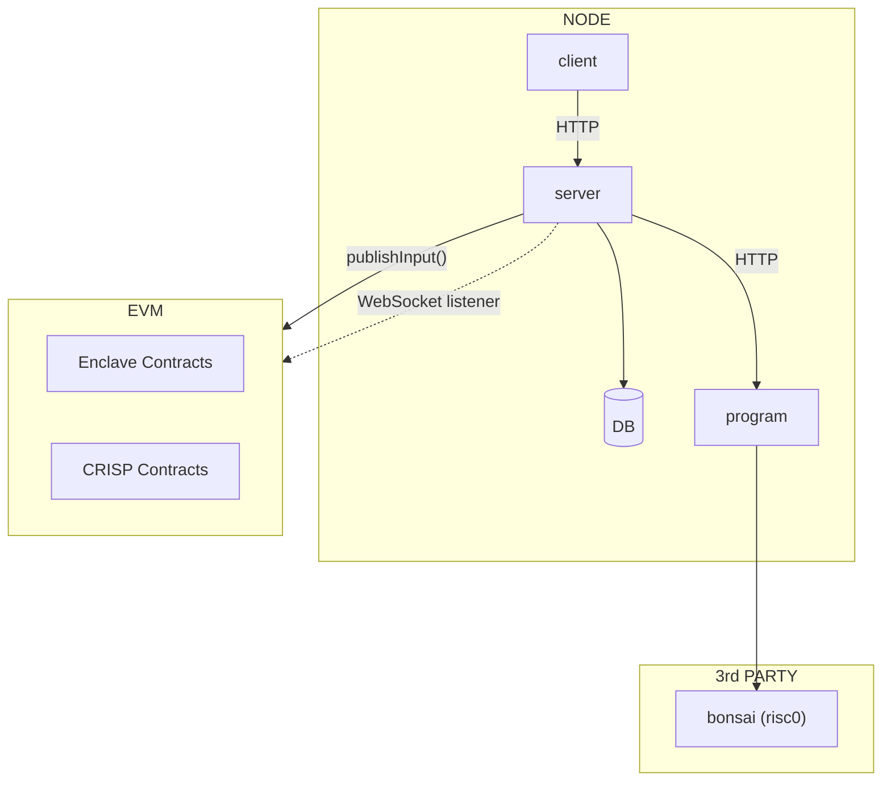

# Program

This module does the following:

- Listens for Enclave `events` from the blockchain
- Manages `risc0` computations
- Persist processed `events`

This is the program component for our architecture here.

