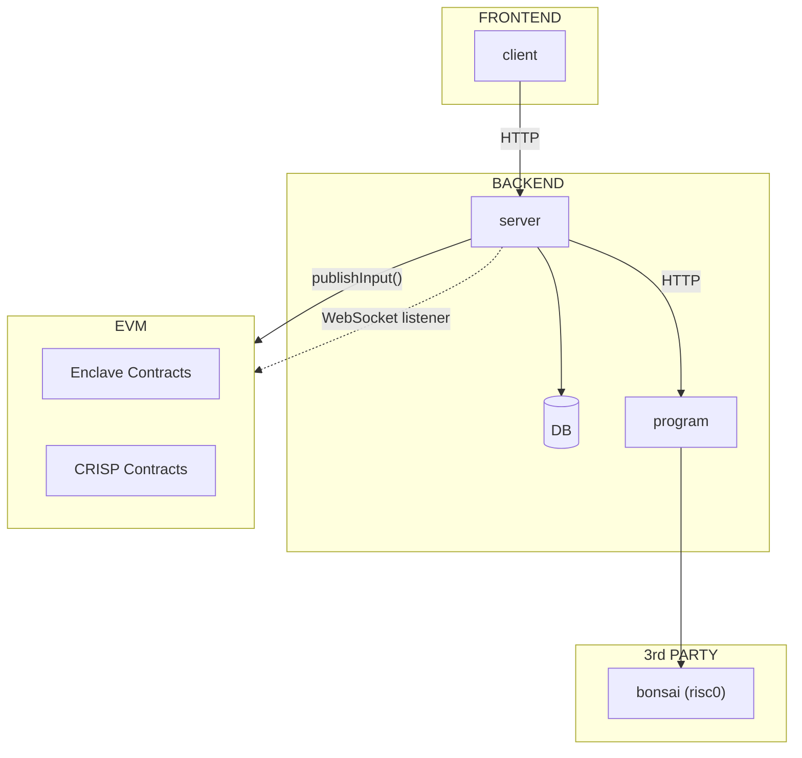

# Program

This module does the following:

- Run a local webserver that accepts calls from the client
- Run computations using risc0

This is the program component for our overall CRISP architecture:

# Structure

This package consists of the following components:

- **`app`**: The webserver used to accept calls from the client
- **`client`**: A library to used externally in order to make calls to the program
- **`core`**: The FHE program we are trying to run as an universal module (runs in risc0 but also outside of risc0)
- **`host`**: The function that actually runs the FHE program in the risc0 VM
- **`methods/guest`**: The entry point that risc0 uses to load and run the `core` module

