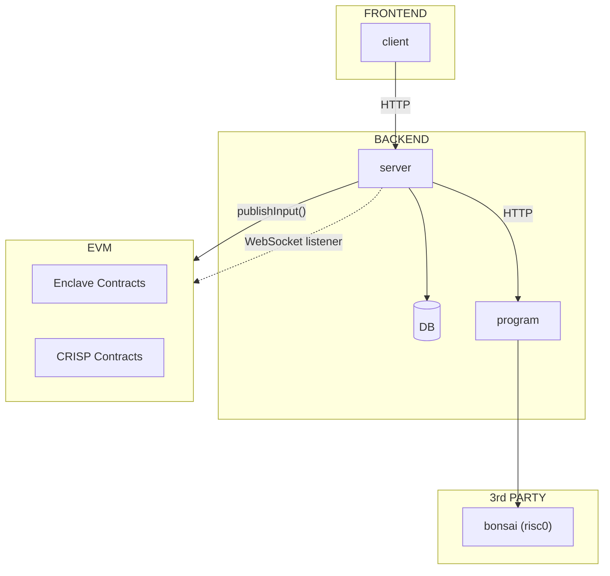

# Program

This module does the following:

- Run an FHE computation given some inputs 

This is the program component for our overall CRISP architecture:

```mermaid
graph TD
  subgraph frontend["FRONTEND"]
    client
  end
  subgraph ec2_1["BACKEND"]
    server["server"] --> db
    db[(DB)]

    server --HTTP--> program
  end
  subgraph thirdparty["3rd PARTY"]
    bonsai
  end
  client --"HTTP"--> server
  program ---> bonsai

  bonsai["bonsai (risc0)"]

  server --"publishInput()"--> evm
  subgraph evm["EVM"]
    esol1["Enclave Contracts"]
    csol1["CRISP Contracts"]
  end
  server -. "WebSocket listener" .-> evm
```

