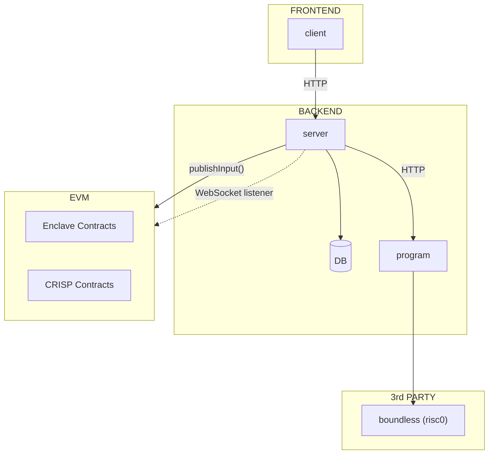

# CRISP Program

The program module runs the FHE computation at the heart of CRISP: it aggregates encrypted votes,
produces a Risc0 ZK proof of correct execution, and submits the result back to the on-chain CRISP
contract via the coordination server.

## Architecture



## What it computes

CRISP uses BFV fully homomorphic encryption to tally votes without revealing individual inputs:

1. The server collects BFV-encrypted vote ciphertexts from participants.
2. The program homomorphically adds all ciphertexts together to produce an encrypted tally.
3. A Risc0 guest program proves the aggregation was performed correctly.
4. The proof and ciphertext output are submitted on-chain; the Enclave ciphernode committee then
   threshold-decrypts the result.

## E3 Program Entry Points

The CRISP Solidity contract implements `IE3Program` with three functions called by the Enclave
contract:

| Function        | When called              | What it does                                                       |
| --------------- | ------------------------ | ------------------------------------------------------------------ |
| `validate`      | On E3 request            | Validates request parameters (e.g. duration, eligible voters)      |
| `validateInput` | On each input submission | Checks that the submitted BFV ciphertext is well-formed            |
| `verify`        | On output publication    | Verifies the Risc0 proof and that the ciphertext output is correct |

## Proof Generation

Proof generation is delegated to [Boundless](https://boundless.xyz) (a Risc0 proving service):

- **Development / local:** The program can run the Risc0 guest directly (no Boundless needed).
- **Production:** Set the `BOUNDLESS_RPC_URL` and `BOUNDLESS_PRIVATE_KEY` environment variables to
  submit jobs to the Boundless network. See [Boundless configuration](../README.md#configuration) in
  the CRISP root README.

## Environment Variables

| Variable                | Required   | Description                                                   |
| ----------------------- | ---------- | ------------------------------------------------------------- |
| `RISC0_DEV_MODE`        | Dev only   | Set to `1` to skip real proof generation (fast local testing) |
| `BOUNDLESS_RPC_URL`     | Production | RPC endpoint for Boundless proof submission                   |
| `BOUNDLESS_PRIVATE_KEY` | Production | Private key for paying Boundless proving fees                 |
| `PINATA_JWT`            | Production | JWT for uploading the compiled guest binary to IPFS           |
| `PROGRAM_URL`           | Production | IPFS URL of the uploaded guest binary                         |

## Running locally

```bash
# From the CRISP root
pnpm dev:program
```

This starts the program HTTP server (default port 3001). The coordination server calls it when a new
E3 computation request arrives.
